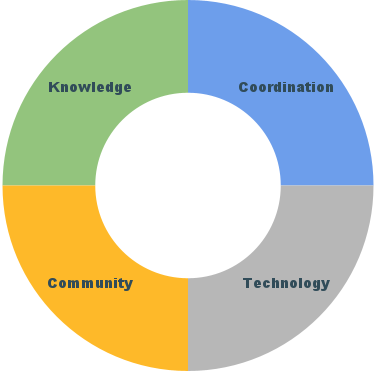

# Committees

## Executive Committee

Our Executive Committee represents the strategic and financial interests of participating institutions through executive oversight of the project.

**Members**

* Lisa German- Dean of Libraries & University Librarian, University of Minnesota - Chair
* Faye Chadwell - Dean of Libraries and Scholarly Communications, Pennsylvania State University
* Claire Stewart - Dean of Libraries and University Librarian, University of Illinois
* Cody Hanson (ex-officio)- IT Director, University of Minnesota Libraries
* Maurice York (ex-officio)- Director of Library Initiatives, Big Ten Academic Alliance

---

## Program Committees

<figure markdown="span">
  
  <figcaption>Our 4 program committees work independently and collaborate on overlapping issues.</figcaption>
</figure>

-    #### Knowledge Committee

    *Enhancing our professional community*
    
    !!! abstract "Mission"
    
		The Knowledge Committee will identify and implement strategies for knowledge sharing internally among BTAA Geospatial Information Network members and externally with the broader map and geospatial librarian community. We will do this by establishing research agendas, coordinating research, and reporting/publishing on topics relevant to the geospatial librarian field and the BTAA-GIN. 

    * Milan Budhathoki
    * Sandi Caldrone
    * Catherine Hodge
    * Josh Sadvari (Co-Chair)
    * Amanda Tickner (Co-Chair)
    * Wenjie Wang

-    #### Coordination Committee

    *Organizing our program*

    !!! abstract "Mission"
    
	    The Coordination Committee is responsible for coordinating the work of the other committees, ensuring communication between committees, defining and tracking annual program goals, and overall strategic planning.

    * Ryan Mattke (Chair)
    * Karen Majewicz
    * Rotating members of other committees

-    #### Community Engagement Committee

    *Connecting with the public*
    
    !!! abstract "Mission"
    
	    The mission of the Community Engagement Committee is to promote and enhance the visibility and utilization of the BTAA Geoportal, as well as public and shared geospatial data and technology, among GIN (Geospatial Information Network) members and Geoportal users. Our committee is committed to fostering inclusivity and promoting diversity and equity in geospatial resources. We achieve this by expanding the community of Geoportal users through the inclusion and promotion of new and existing resources.
 
    * Tara Anthony
    * Jay Bowen (Co-Chair)
    * Méch	 Frazier
    * Laura McElfresh
    * Sue Oldenburg (Co-Chair)
    * Nicole Scholtz
    * Rob Shepard
    * Kathleen Weessies

-    #### TECHnology Committee

    *Building the Geoportal*
    
    !!! abstract "Mission"
    
		The TECH Committee strives to enhance the BTAA Geoportal to improve the discoverability, accessibility, and usability of geospatial information. This enhancement is achieved through continual research, guidance, and contributions in metadata creation, interface design, and application development.

    * Daniel Dotson
    * Caroline Kayko
    * Melinda Kernik
    * Shirley Li
    * Karen Majewicz (Co-Chair)
    * Jaime Martindale
    * Meg Mering  (Co-Chair)
    * Ronda Sewald

---

!!! tip "Latest activities"

	Browse our [monthly project updates](../../updates) to find about about recent activites.

