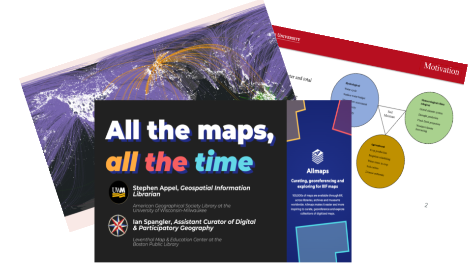
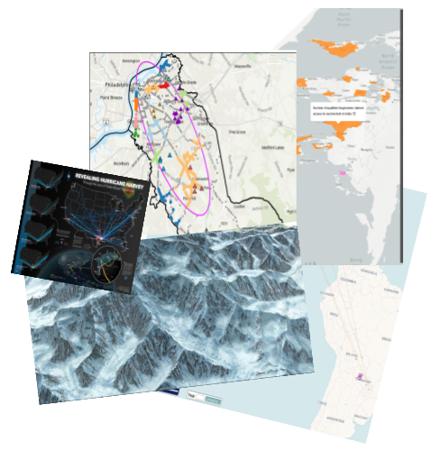

# Big Ten Academic Alliance (BTAA) GIS Conference

!!! info

	The 5th BTAA GIS Conference will take place in the spring of 2025.  More information will be announced soon.

## Promoting collaborations

Established in 2020, the BTAA GIS Conference is a virtual event organized by geospatial information users and educators in Big Ten institutions to present their work, exchange information, and develop potential collaborations. It is open to all participants, including those outside of the BTAA network. 

-    ### Sharing research

    { width="200px" align=left}
    
    Our presentation and lightning talk sessions feature a range of topics and approaches related to GIS, maps, & spatial data.
    
-    ### Showcasing projects

    { width="150px" align=left}

    Our ongoing [map gallery ↗](https://geobtaa.github.io/Map-Gallery-Update/) features dozens of entries and showcases both interactive maps & standalone cartography.

## Keynote speeches from Past Conferences

-   ## [2023](2023.md)

    ###  Reading Maps: Making, Searching, and Interpreting Text on Maps by Kate McDonough
    
    <iframe width="560" height="315" src="https://www.youtube.com/embed/vDi-5DYTtFU?si=fbd4H-j7-2erPaGQ" title="YouTube video player" frameborder="0" allow="accelerometer; autoplay; clipboard-write; encrypted-media; gyroscope; picture-in-picture; web-share" allowfullscreen></iframe>
    
    

    ---
 
   

    
-   ## [2022](2022.md)

    ### Our Home on Native Land: Connecting People and Stories using Indigenous Geographies by Tanya Ruka and Rudo Kemper, Native Land Digital
    
    <iframe width="560" height="315" src="https://www.youtube.com/embed/ATUgXF1C-bI?si=Wt18uoquZ0WFd3mH" title="YouTube video player" frameborder="0" allow="accelerometer; autoplay; clipboard-write; encrypted-media; gyroscope; picture-in-picture; web-share" allowfullscreen></iframe>

    ---
    
 

-   ## [2021](2021.md)

    
    ### American Domesday by Dr. Robert Lee
    
    <iframe width="560" height="315" src="https://www.youtube.com/embed/Bdn1MmmC-yo?si=D72IkokqL4PZxfD_" title="YouTube video player" frameborder="0" allow="accelerometer; autoplay; clipboard-write; encrypted-media; gyroscope; picture-in-picture; web-share" allowfullscreen></iframe>
    
    
    ### The Population Data Buffet: Choosing the right data for your project by Dr. Tracy Kugler
    
    <iframe width="560" height="315" src="https://www.youtube.com/embed/M9qf5xALEIU?si=SCErNgHTS-AWb8tY" title="YouTube video player" frameborder="0" allow="accelerometer; autoplay; clipboard-write; encrypted-media; gyroscope; picture-in-picture; web-share" allowfullscreen></iframe>
    
 

  
!!! tip "More videos"

    Visit [past conference pages](2023.md) to see the full playlists from each event.