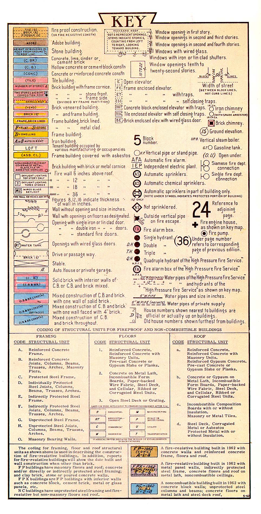

# Fire Insurance Maps Research Guide

## What are Fire Insurance maps?

!!! quote

	“The Sanborn map collection consists of a uniform series of large-scale maps, dating from 1867 to the present and depicting the commercial, industrial, and residential sections of some twelve thousand cities and towns in the United States, Canada, and Mexico. The maps were designed to assist fire insurance agents in determining the degree of hazard associated with a particular property and therefore show the size, shape, and construction of dwellings, commercial buildings, and factories as well as fire walls, locations of windows and doors, sprinkler systems, and types of roofs. The maps also indicate widths and names of streets, property boundaries, building use, and house and block numbers.”  -- [Sanborn Fire Insurance Maps, Library of Congress ](https://www.loc.gov/rr/geogmap/sanborn/san4a1.html)

Each city coverage begins with a graphic index to guide the user to the correct page with each page only covering a few blocks. The original paper maps used color to indicate building materials such as yellow for wood construction and pink for brick.  Some newer maps have “paste on” updates or corrections applied to a base map.  Note the correction record on the index key page for dates.  While Sanborn maps do not show property owner names, they can show business names.  For more information, see the [Library of Congress’ Introduction to the Sanborn Collection](https://www.loc.gov/rr/geogmap/sanborn/san4a1.html).

<figure markdown>
  { width="400" }
  <figcaption><a href = "https://geo.btaa.org/catalog/3021452d-cd87-4683-9115-15dcbcee6ddf">Sanborn Fire Insurance map for Bellefonte, PA, 1922, sheet 4.</a></figcaption>
</figure>

                                    
## How to Read Sanborn Maps

### Key to colors and symbols
<figure markdown>
  { width="400" }
  <figcaption><a href = "https://guides.lib.berkeley.edu/ld.php?content_id=56535040">Sanborn Map key, Courtesy of UC Berkeley Libraries.</a></figcaption>
</figure>

### Abbreviations

* [MIT's Sanborn abbreviations and descriptions](http://web.mit.edu/thecity/resources/abbreviations_for_sanborn_maps.pdf)

* [UC Berkeley's extensive list of Sanborn Map abbreviations](https://guides.lib.berkeley.edu/ld.php?content_id=51241834)

### Tutorials

This excellent tutorial from the Kansas City Public Library gives a quick history and how to use the indexes, key maps and the color key. [https://kchistory.org/sites/default/files/UsingSanborns.pdf](https://kchistory.org/sites/default/files/UsingSanborns.pdf)

## How can I find maps in the BTAA Geoportal?

Because they are a popular research resource, fire insurance maps have been scanned and made available in a variety of ways, some under commercial license provided by a library purchase or subscription. Additionally, some libraries have scanned and made their own maps freely available.  

* In the Geoportal search box, search for your town name.
* Then select “Fire insurance maps” in the Resource Type facet in the left ribbon.

### Which Platform Should I Use? 

There is no single resource that has all the maps in one location.  Penn State University Libraries has made all their maps of Pennsylvania available through the Geoportal. Additional free resources are described below.

For other states, you will get an entry point to two state level subscription products: Digital Sanborn Maps (Black & White): 1687-1970 and Fire Insurance Maps Online (FiMO). Your institution may or may not subscribe to the product listed. If you do not have subscription access through your institution, try the [Library of Congress Sanborn map collection](https://www.loc.gov/collections/sanborn-maps) or your state library may have a subscription.

If your town name search doesn’t turn anything up in the geoportal, you can still try searching by state and then seeing if the town shows up geographically where you would expect it to.  Remember, only town centers (i.e. populated places) and industrial sites were mapped, but also that smaller towns or neighborhoods may be mapped with larger towns.  For example, East Lansing, MI is in the Lansing Sanborn map, but not listed as an East Lansing map.  

### Sanborn maps in the Geoportal (comparison): 

<table>
  <tr>
   <td>
   </td>
   <td><strong>ProQuest Digital Sanborn Maps1</strong>
   </td>
   <td><strong>Historical Information Gatherers Fire Insurance Maps Online (FIMO)2</strong>
   </td>
   <td><strong>Penn State University Libraries’ Sanborn digital collection3</strong>
   </td>
  </tr>
  <tr>
   <td>Indexed or scans to towns?
   </td>
   <td>Indexed only
   </td>
   <td>Indexed only
   </td>
   <td>Scans
   </td>
  </tr>
  <tr>
   <td>Geographic Extent
   </td>
   <td>Varies by subscription
   </td>
   <td>Varies by subscription
   </td>
   <td>Pennsylvania only
   </td>
  </tr>
  <tr>
   <td>Color
   </td>
   <td>Black and white
   </td>
   <td>Color
   </td>
   <td>Color
   </td>
  </tr>
  <tr>
   <td>Copyright status of original materials
   </td>
   <td>Both out of copyright and in copyright maps are included
   </td>
   <td>Out of copyright maps
   </td>
   <td>Out of copyright maps
   </td>
  </tr>
  <tr>
   <td>Browse and search capabilities
   </td>
   <td>Choose city/town from dropdown and use index map to find map sheets

No map search capability
   </td>
   <td>Search by address, coordinates, or clickable map interface, as well as city/town dropdown lists
   </td>
   <td>Browse or search for town/city name
   </td>
  </tr>
  <tr>
   <td>Source of paper maps
   </td>
   <td>Library of Congress Sanborn Map Collection
   </td>
   <td>Most content is from the Library of Congress, including Sanborn Collection and other atlases
   </td>
   <td>Library of Congress duplicates and recent purchases
   </td>
  </tr>
  <tr>
   <td>Adding new maps?
   </td>
   <td>No
   </td>
   <td>Yes, from additional sources besides Library of Congress
   </td>
   <td>Yes
   </td>
  </tr>
  <tr>
   <td>Freely available or subscription only?
   </td>
   <td>Check for institutional access
   </td>
   <td>Check for institutional access
   </td>
   <td>None needed - freely available to all
   </td>
  </tr>
</table>

1The ProQuest Digital Sanborn Maps description:  This resource provides detailed information about city properties including all the buildings, their addresses, and in commercial areas the type of business establishment in each building. Each town center was mapped one or even several times between 1870-1960. Each volume begins with a graphic index to guide the user to the correct page; each page only covers a few city blocks. This database is black-and-white only, while the original paper maps used color to indicate building materials.

2Fire Insurance Maps Online (FIMO) Database description: This resource contains full color detailed maps of numerous towns and cities, however generally of only the more densely settled parts of each place. They contain detailed information about city properties including building characteristics, their

addresses, and in commercial areas the type of business establishment in each building. Each

town center was mapped one or even several times between 1870-1960. Most content is from

the Sanborn Fire Insurance Company, but this growing database will continue to add fire

insurance maps from other publishers and other large scale maps. The database is searchable

by address, by coordinates, or by a clickable map interface.

3Penn State University Libraries’ Sanborn digital collection: The University Libraries' Center for Maps and Geospatial Information has a near complete collection of Sanborn Fire Insurance maps for the state of Pennsylvania. The digital collection will continue to grow as maps come out of copyright.  As not all maps have been loaded into the geoportal, the entire collection can be accessed at[ Penn State University Libraries](https://libraries.psu.edu/about/collections/sanborn-fire-insurance-maps).

### Still can’t find what you are looking for?

* [Scanned Sanborn Fire Insurance maps at the Library of Congress \
](https://www.loc.gov/collections/sanborn-maps/)Search by state or town name. Not all maps have been scanned and added to this online collection. They are adding maps slowly. Consult the checklist below if you can't find what you are looking for.
* [Sanborn Fire Insurance Maps Online Checklist [Library of Congress] \
](http://www.loc.gov/rr/geogmap/sanborn/)The Sanborn Fire Insurance Maps Online Checklist provides a searchable database of the fire insurance maps published by the Sanborn Map Company housed in the collections of the Geography and Map Division. The online checklist is based upon the Library's 1981 publication Fire Insurance Maps in the Library of Congress and will be continually updated to reflect new acquisitions. The online checklist also contains links to existing digital images from their collection and will be updated as new images are added.
* [Union List of Sanborn & Other Fire Insurance Maps](https://www.lib.berkeley.edu/EART/sanborn_union_list)

    Find other resources for Sanborn maps. This list is sorted first by state, then by town.  Holding institutions of each year are shown.  Search the “Owning Institution” link for the holding institution.  Links to scanned collections are shown, but if not shown, contact them to see if they will scan what you need.  Be sure to check below for a list of digitized collections.

* [List of Sanborn online collections by state](https://guides.library.uwm.edu/c.php?g=824760&p=5887796)

    University of Wisconsin-Madison has compiled a list of digitized collections by state.

* Sanborn maps on Microfilm.  These maps are in black and white and are the same maps found in the Digital Sanborn Maps subscription.  Requests can be made for duplication from microfilm depending on your library.  You can also request reels of microfilm from other library (such as Center for Research Libraries) through your library’s Interlibrary Loan service.   See the guides listed below for more information and to contact your library.   
* For advice on other large-scale maps and images, contact your local map library.

### Big Ten Institution-specific guides for more information

[University of Illinois](https://digital.library.illinois.edu/collections/6ff64b00-072d-0130-c5bb-0019b9e633c5-2)

[Indiana University](https://libraries.indiana.edu/sanborn-fire-insurance-maps-history)

[University of Iowa](https://www.lib.uiowa.edu/maps/sanbornmaps/)

[University of Maryland Libraries](https://lib.guides.umd.edu/c.php?g=327204&p=2195554)

[University of Michigan](https://guides.lib.umich.edu/c.php?g=283053)

[Michigan State University](https://libguides.lib.msu.edu/sanborn)

University of Minnesota

University of Nebraska-Lincoln

[Northwestern University](https://libguides.northwestern.edu/c.php?g=114914&p=747589)

[Ohio State University](https://guides.osu.edu/c.php?g=903688&p=6504405)

[Pennsylvania State University](https://libraries.psu.edu/about/collections/sanborn-fire-insurance-maps)

Purdue University

[Rutgers University-New Brunswick](https://www.libraries.rutgers.edu/indexes/sanborn_maps_nj)

[University of Wisconsin-Madison](https://www.sco.wisc.edu/maps/historic-sanborn-fire-insurance-maps/)

### Search Tips

Occasionally a suburb will not be mapped as its own town but will be included in the back volumes of the larger city. Make sure you check nearby town names if you aren’t finding the one you are searching for.

Large cities will be mapped over many, many volumes.  Each volume will begin with an index showing what is included in that volume.
