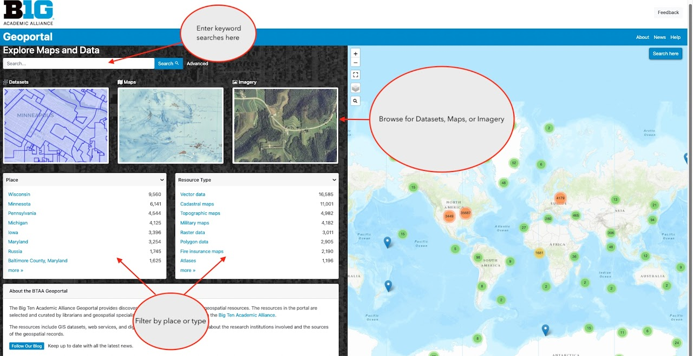
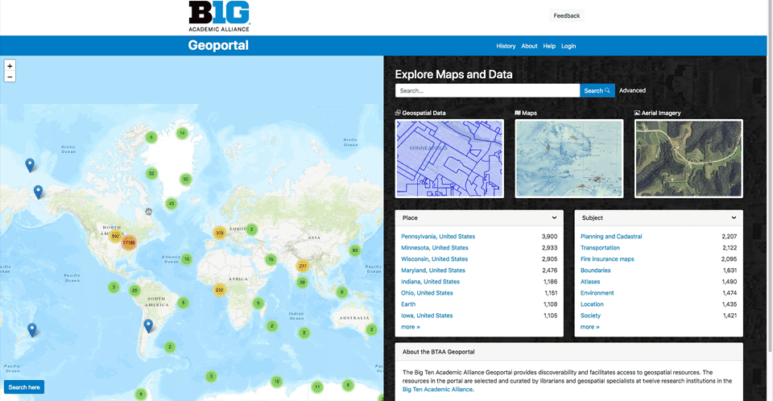

# BTAA Geoportal search strategies

## Text searches

The homepage and the search results page feature a text search box that will scan the metadata for all of the items. 

### Wildcards

Searching with either an asterisk `*` or a question mark `?` in your query is a way to capture more results and cast a wider search net. 

### Truncation

The asterisk * will search for any number of characters after your initial phrase, including zero. For example, `india*` retrieves India, Indiana, Indianapolis, the Indian Ocean, etc.

### Wildcard

The question mark `?` will represent any single character and must be repeated to represent multiple characters in a query.
For example, india? will only retrieve Indian, while india* above retrieved any number of characters after india. 

Similarly, a search for `india???????` will retrieve only Indianapolis because we put 7 question marks after india and therefore any results must be words 12 characters long.

find out more information about an item?
Look at the Links box on the right side of the item page.

## Facets

The facets on the homepage and search results page can filter results by various categories.

* Place: a text  filter for place names that were assigned to the resource by a cataloguer
* Resource Class: allows users to filter by only Datasets, Maps, Web Services, Imagery, Websites, Collections, or Other.
* Resource Type: a further refinement that describes geometry type for datasets and cartographic genres for maps
* Year: a widget that a user can limit years by typing in a start and/or end date
* Time Period: an aggregated grouping of dates by century, half-century, decade, or half-decade
* Language: the language(s) of the map or dataset
* Creator: a person or organization that directly developed the resource. For maps, in may include the surveyor, cartographer, and lithographer.  For geospatial data, it can include names of specific individuals or agencies.
* Provider: The source, host, or distributor of the resource
* Public/Restricted: Public records can be accessed by anyone. Restricted records require an institutional login or authentication protocal to access.
* Institutional Access: This facet filters the restricted records by which institutions subscribe and provide access.

## Advanced search

The Advanced search page facilitates combining multiple keywords and facetted searches.  To open an advanced search, look for the word "Advanced" next to the text search box.

## Map search

### Option 1: Browse for records using a geographic extent

The interactive world map on the homepage supports map-based searches for specific places. One way to conduct a map-based search is to locate all items within a geographic extent. A user can pan the map with the mouse and zoom with the controls in the upper left corner. When the desired area is in view, click the blue Search here button at the lower left. Items that are within the geographic extent will display in the search results. Only part of an item needs to be in the geographic extent to appear in the search results. 

### Option 2: Drill down using the cluster and marker icons

A second option for map-based searching is to click on the icons that appear on the map as you pan and zoom. Blue marker icons show the center point of a single item record. Cluster icons represent many item records. Click or zoom in on clusters to display blue markers corresponding to specific items. Click on a single blue marker icon, and then click the link in the popup to display that specific item record. 

