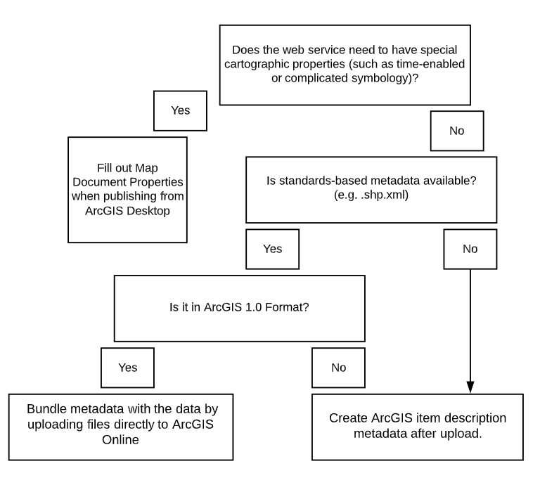
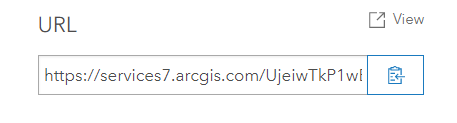

---
tags:
- '2020'
- reports
---

!!! abstract

	This report was created by the Web Services Working Group in 2020.

# Web Services ArcGIS Online Pilot

May 2020

## Introduction

The ArcGIS Enterprise Organization Working Group (a.k.a the Web Services Working Group) has continued to explore the implementation of web services technology for geospatial datasets within the BTAA Geoportal. This document serves as a follow-up to [our initial report](webServicesReport.md) issued in October 2019 and outlines additional details surrounding the deployment of web services for data files stored in institutional repositories across the BTAA Geoportal task force institutions. For this work we focused on geospatial data (not scanned maps) and used the Esri ArcGIS platform for our testing environment.

#### Centralized vs. Distributed Models

In our initial report, we characterized the distinction between centralized and distributed models for authoring web services. A centralized model would involve sharing data to a central repository where project staff would manage the data and create web services. A distributed model would mean selected university-affiliated dataset(s) would be stored at the home institution (or in a third-party, disciplinary repository) and the web services would be authored by task force members.  

##### Distributed Model & Testing Environment 

Our test environment for creating web services, documenting example workflows, and providing recommendations is based on a distributed model. In our model testing environment it is assumed individual task force institutions would utilize the Big Ten Academic Alliance Geoportal Project’s ESRI ArcGIS organizational account to publish services. While it is likely that many participating institutions have their own ESRI ArcGIS Organizational Accounts, we feel that for the longevity of the web services work would be most successful if a common platform is used.

##### Centralized Model

While not a focus of this pilot project, it is important to note that setting up a centralized environment for hosting data and creating web services could be possible \- and could benefit task force institutions (both current and future members). An open source solution such as GeoServer (and an associated relational database to manage content) would eliminate reliance on ESRI ArcGIS for this work.

## Details of the pilot

For this pilot, we focused on University research geospatial data for several reasons: 

1. To highlight data that was housed at member institutions, rather than ‘public data’ created by state or local governments already published elsewhere;   
2. To focus on content that likely does not already have associated web services;   
3. To strategize about how to advertise web services as a way to get data out to a wide audience when communicating with campus researchers.

Different data sources come with unique challenges. For research data, there is significant heterogeneity in data formats and subject matter between datasets in the same repository, limiting the possibility of automated workflows. Academic researchers are more likely to want an active role in the representation of project data. This increases the amount of time required per dataset to generate web services, as much of this time would involve appropriately communicating with researchers early in the data selection process.  

For public data, additional challenges may occur in dealing with datasets that are being frequently updated over time or originally hosted as a web service by another organization.  Exploring these challenges was out of scope for our pilot.

For this pilot, we also only looked at the workflows for hosted feature layers. For a more detailed explanation of hosted feature layers and other layer types, see the associated [ArcGIS Online documentation](https://doc.arcgis.com/en/arcgis-online/manage-data/hosted-web-layers.htm).

**Testing Environment**

The BTAA Geoportal has a dedicated ESRI ArcGIS organizational account ([http://geobtaa.maps.arcgis.com/](http://geobtaa.maps.arcgis.com/)). The account provides:

- cloud storage for data and web services in ArcGIS Online  
- the ability to make data available publicly through an ArcGIS Hub site  
- access to ArcGIS products for task force members if they do not have it through their home institution 

Logins are available to any member of the BTAA Geoportal task force. 

Other options for hosting geospatial web services (i.e. Geoserver) require substantial set-up and IT support. For the purpose of this pilot and for short-term web service needs of the geoportal, ArcGIS was selected as the most viable option. 

The overarching steps outlined below describe platform-agnostic actions needed to create geospatial web services, while the subpoints provide specific considerations for hosting research data in ArcGIS Online.

## Example Workflow(s)

### Step 1: Identify if the data layer would be a good candidate for a web service

* Is it archived in a repository or institutionally managed long-term storage space with downloadable data?   
  * Is it a small enough file size to display quickly and well?  
  * Has it been assigned a creative commons license (or similar) that allows for redistribution?  
  * Would it be of interest to a broad audience such that it is worth the time and resources necessary to create a web service?  
  * Does the researcher need to make the data available as part of grant or publication requirements?

### Step 2: Communicate with the researcher / data creator(s) (when appropriate)

* Ensure that a web service does not already exist for the resource  
  * Ask about preferred symbolization 

### Step 3: Choose the best format for the web service layer

* Hosted feature layer   
  * Users can fully interact with data including changing symbology and filtering values  
  * Map service   
    * Tiling capabilities allow for quick rendering of larger datasets and images  
  * Time-enabled layer  
    * Web service can be used to display change over time

### Step 4: Assess format and completeness of metadata

	  
The main documentation for the data should be available from the institutional repository/storage space and the main discovery metadata will be the Geoblacklight record in the BTAA geoportal.  That said, there is no method for creating publicly visible web services in ArcGIS Online without also making them searchable through the ArcGIS platform. To remain a trustworthy entity for providing geospatial data, some metadata must be uploaded with the data or manually created for the web service. 

The flowchart below suggests how to proceed in order to most efficiently create minimal metadata for the web service: 

When manually adding metadata, we recommend including a (non-hyperlinked) URL to the more complete documentation for the hosted data or to the geoblacklight item page in the “Description” element. For additional best practices, see [Item Description in ArcGIS Hub](https://sites.google.com/umn.edu/geospatial-metadata/best-practice-guides/item-description-in-arcgis-hub).

### Step 5: Choose an upload method based on functionality needed in the resulting web service

#### Option1: Adding zip files to ArcGIS Online from the content pane

   *Recommended for most items*  
     
   One way to create a web service is by compressing a geospatial data file (.zip) and uploading it directly to ArcGIS Online. While straightforward, this process limits any cartographic styling that might be necessary to represent the data in an appropriate way. When a zip file is uploaded, ArcGIS Online requires entries for the service title, ISO topic category, and associated tags. There is no official controlled vocabulary for the “tag” entries. Best practices may suggest the use of existing controlled keywords or subject headings in the tags field. If metadata exists already, a file can be included, however, the only acceptable form is an.xml file in the ArcGIS Format schema.     
   

#### Option 2: Publishing a web service from data in ArcGIS Desktop

   *Best choice for items with complicated cartographic styling*  
     
   Another way to create a web service in ArcGIS Online is to add the data to ArcMap or ArcGIS Pro and publish from there. The advantage of this approach is that the new web service inherits the cartographic styling of the original data source. The disadvantage is that the workflow to add appropriate metadata is more complicated. Through testing a number of different workflows in both ArcMap and ArcGIS Pro, we discovered that only one resulted in full metadata functionality (in line with what is achieved by directly uploading data to ArcGIS Online). The steps used in this workflow were:   
1. add original data to ArcMap  
2. use the Export Metadata tool to create a new .xml file   
3. publish the hosted feature layer  
4. import the new .xml file into ArcGIS Online’s metadata web editor using the Overwrite function (Note: The organization must have “Metadata enabled” for this online metadata editor to be available).

   This could be an appropriate alternate workflow in cases where the cartographic styling of the original data is particularly important to its interpretation, sharing, and reuse, but is certainly more time intensive than adding zip files directly to ArcGIS Online. Further investigation would be necessary to determine if a comparable workflow exists in ArcGIS Pro, as one was not identified through this preliminary investigation.

### Step 6: Create Geoblacklight metadata or link to the web service from an existing geoportal record.

Share the web service publicly and then copy the URL from the bottom of the page.  

1. If the web service will be associated with a new record in the geoportal: 

Complete the elements requested in Web Servies tab of [this CSV template](https://z.umn.edu/b1g-template).

2. If a record already exists for the data layer in the geoportal: 

   Request a CSV spreadsheet of Geoblacklight metadata for geospatial data items contributed by your institution. Find the relevant item and add the copied web service URL into the “FeatureServer” column.

   

## Key Considerations 

#### Scope

Our pilot focused on web services created by BTAA partner institutions/task force members for their university-affiliated research data.  More automated workflows would need to be considered in order to implement web services for public data or for additional academic institutions outside the BTAA Geoportal task force.

#### Time

Since not all task force members routinely work with the ArcGIS platform, time would need to be spent building capacity around workflows. Responsibility and demands on time for task force members and project staff will have an impact on the ability to successfully create web services. This may vary from one institution to the next.

#### Metadata

In many cases, the metadata that describes a web service must be completed separately from the metadata that accompanies the data file(s). Taskforce members will need to generate descriptive metadata for the Esri platform as well as complete Geoblacklight metadata for use in the BTAA geoportal.  We explored the possibility of creating an ArcGIS Hub Site to leverage our existing automated processes. This would create an additional access point to the data  however \- increasing the complexity of the metadata that should be included in ArcGIS Online and all of the associated workflows. For research data (lower volume and more heterogeneous projects), we recommend manually creating the Geoblacklight metadata. 

#### Data rights/access constraints

If the data is stored in an institutional (or third-party, disciplinary) repository, it is important to understand any usage or access restrictions placed on the content either by the data producer or the institution.  This information should be displayed within the Geoportal whenever possible.

#### Cartography

Understanding how best to represent a specific dataset cartographically can be a challenge. Characteristics like temporal coverage can complicate this even further.

#### Communication with researchers

To author web services in the most responsible way, it may be necessary to communicate directly with the researcher who created the data. The researcher may be the best resource for providing information on how best to display the data cartographically, or if there are special considerations for particular dataset(s).

#### Data size/format limitations

Understanding the limitations of the ArcGIS platform can help determine whether a service can be generated or not. If a dataset is too large, it will fail. There may be a need for further guidance for task force members in situations where the dataset they are working with includes more than one layer (e.g., a map package or geodatabase).

#### Technology

Some workflows for creating web services require knowledge of software like ArcMap and an understanding of the structure of the data files. This may be a barrier to task force members wanting to move forward with web services. Training will likely be required and more detailed instructions created.

#### Additional opportunities

It could be possible to target web service creation as part of the research data management process. If researchers understand the possibilities of web services earlier in their process,  it might offer a new way of sharing their data beyond simple raw data downloads. While valuable, raw data downloads may lack a certain level of context within the larger research project. The ability to publish a cartographic visualization might enhance a user’s understanding of individual data elements as they relate to the research project as a whole.

## Conclusion / Recommendation

Based on our pilot, ArcGIS Online could be a feasible option for taskforce members interested in hosting web services for select research data. Due to challenges with the scalability of publishing workflows and the heterogeneous nature of research data, this method would likely not work for harvesting large batches of data from an institutional partner or possible external universities.