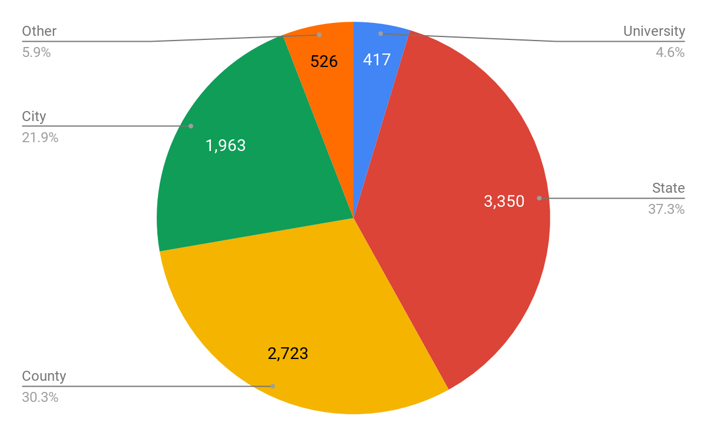
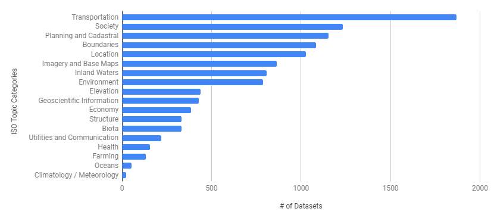
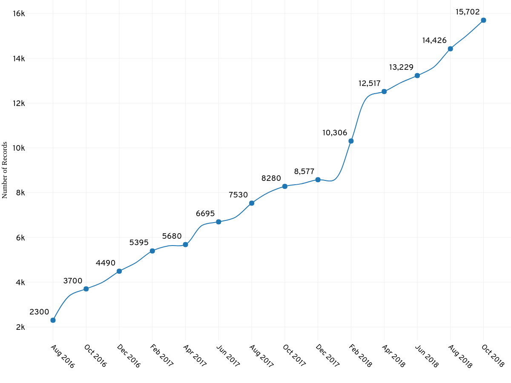
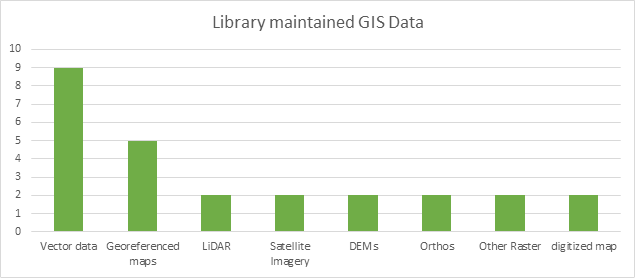

---
tags:
  - proposals
  - '2019'
---

# Continuation Proposal 2019

Proposal for Funding for Years 5 & 6 (July 2019 - June 2021)

## Proposal

Continuing to build on the successes of the Big Ten Academic Alliance Geospatial Data Project in its first four years, we propose an investment of $15,000 per institution for each of the next two years (with twelve participating institutions, this would total $180,000 per year). The next two years will solidify operations of an established and sustainable production service, continue the growth of the collection of geospatial metadata records, and complete exploration of expanded strategic directions. This expansion may require an increase in funding beyond the requested two-year investment, which would be presented in a revised Year 6 budget proposal.

## Project Context

The Big Ten Academic Alliance Geoportal is one of a handful of geoportals maintained by academic institutions across the United States. Others include [OpenGeoportal](http://data.opengeoportal.org/), [Earthworks](https://earthworks.stanford.edu/), and [NYU Spatial Data Repository](https://geo.nyu.edu/). As of October 2018, the BTAA project has contributed nearly 9,000 metadata records to [OpenGeoMetadata](https://github.com/OpenGeoMetadata), a large-scale aggregation of geospatial metadata from many different institutions. By participating in the broader geospatial metadata ecosystem, these records can now be utilized by other geoportals to allow discovery and access for geospatial data resources from nine states within the Big Ten Academic Alliance. 

## Assessment of project to date and emerging areas of focus 

Geospatial data are notoriously hard to find using standard web search engines. The main barrier is that the user needs to know who generates the type of data they are looking for and seek out that entity’s website to find datasets. With the Geoportal, a user does not need to know who created the data in order to find it. Users can focus on searching by What, When, and Where. They do not have to worry about Who or Why. The Geoportal has already made significant progress in this regard, having aggregated metadata from nearly 80 different data portals and map collections and augmented it by assigning subjects, dates, place names, and bounding box coordinates to each record. 

There are three concerns in the project as currently scoped that present opportunities for increased focus for the next two years:

### 1. The Geoportal is not yet a well-known resource, because it has not been effectively promoted.

Addressing this issue would not necessitate an expansion in project scope. The Task Force members plan to focus on outreach and promotion by creating and implementing a detailed Communications Plan, and by working directly with communications professionals and subject liaisons at participating BTAA institutions. They will also gather focused input from faculty, researchers, students, and other user communities.

### 2. Public geospatial data are alarmingly unstable. 

Government data providers regularly migrate, update, delete, and re-publish data. These practices result in broken access links in the Geoportal. One solution to this problem to be explored is archiving and preserving the data in a spatial data repository to ensure stable and persistent access. Addressing this issue would necessitate an expansion in project scope (see below).

### 3. Expected changes in the technology development and support personnel for the BTAA Geoportal. 

The University of Minnesota expects a significant reduction in the availability of the Geoportal's lead (but part-time) developer in early 2019. This has prompted opportunity to take stock of the project's technology support needs moving into the next few years. Maintaining high technical reliability and performance alongside accelerated feature and service development are priorities. To do so, Minnesota plans to combine its current in-kind funding commitment for a part-time developer (at the 0.35FTE to 0.50FTE level) with the project's accrual of budgeted technology funds for contracted software development to appoint a 0.75FTE to 1.0FTE GeoBlacklight developer over the next two years (see Project Budget section for detailed numbers). This will increase the technology support capacities of the project without increasing costs to participating institutions.

## Continuing exploration of a strategic expansion in scope

### 1. Archiving and preservation.

Although the project has compiled information on the spatial data archiving and preservation capabilities at participating universities, it is not clear where the priority rests for developing such a capability BTAA-wide, and/or for creating it for the institutions that currently lack it. To determine this, additional conversations are needed, including with libraries administrations. This will also provide an opportunity to interface and collaborate with local, county, regional, and state government agencies who produce the geospatial data. Creating formal archiving agreements with government data providers would enhance reliability, but add complexity. 

### 2. Web services.

The project’s stakeholders have expressed enthusiasm for developing a collaborative solution to provide online geospatial web services. These would allow users to access and visualize geospatial data in a web browser or mapping application without the need for specialized software. 

### 3. Licensed data. 

Many participating institutions hold licensed geospatial data that they wish to submit to the geoportal. Incorporating these types of resources would present challenges in terms of enabling multiple institutional authentication protocols that will require specialized technical research. One possibility would be the Shared Big Data Gateway project (CADRE).

## Progress towards Years 3 & 4 project goals

Progress on goals to guide new development of program areas, in addition to continued support and refinement of established operations (see Appendices C & D for additional details): 

### 1. Sustainability, Maturation, and Strategic Planning

* reorganized governance to appoint a UMN Product Owner, to create more structured topical committees, and to charge short term working groups 
* created a [Technology Stack Matrix](https://docs.google.com/document/d/1q5ZMF4k1s3rfcl3A2qY6hiPBCd-IstdAf_huQwtl9hY/edit?usp=sharing) identifying the existing technology infrastructure at each institution for data archiving, preservation, and discovery services
* convened a Strategic Leadership Group 
* Project Lead convened a series of meetings involving geoportal representatives from NYU, Princeton, and Stanford

    
### 2. Collection Development

* drafted a [Collection Development Policy](https://drive.google.com/open?id=1NBDEAZA88LET4g2ZsfrmfTwIUoVJHepv) and [Collections Strategic Work Plan](https://drive.google.com/open?id=1n9rg7x7jeEO3TkppJOIMogO6S8M9SWWq) 
* conducted an updated inventory of open data portals/websites across the Big Ten 
* grew the collection to over 15,000 records (see Appendix A)

### 3. Geospatial community outreach and education

* presented geospatial metadata workshops at local and national conferences, including collaboration with librarians from Stanford and NYU
* 4 published articles and 16 presentations or posters at national or international conferences (see Appendix B)
* Product Owner facilitated monthly GeoBlacklight Developer Meetings 
* participated in GeoBlacklight Community Code Sprints
* contributed significant code and documentation to the GeoBlacklight code base 
* gathered [user stories](https://docs.google.com/document/d/1Ixn9e3cRsswztf8NlhKPcMM9Tnm2JPlHX1ScHwvSs-g/edit?usp=sharing)

## Project Budget

Year 5 (July 2019 - June 2020) and Year 6 (July 2020 - June 2021)

!!! question ""

	Detailed budget documents available upon request.

## Appendices

??? info "Appendix A: Geoportal Statistics"

	#### Geoportal use statistics (August 2016 - September 2018):
	
	* Unique users: 13,074
	* Page views: 125,541
	* Sessions: 20,458
	* Downloads: 4,261
	
	#### City location of users (13,074 unique users)
	
	* Users from 2,176 different cities in 111 countries
	* Top cities: Minneapolis, Ann Arbor, Madison, Unknown, Chicago, Ashburn, Paris, State College, Columbus, New York, Bloomington, St. Paul, College Park, East Lansing, Philadelphia, West Lafayette, Washington, Iowa City, Champaign
	
	#### Search terms (4,640 unique searches)
	
	* Top terms: water, minnesota, asia, parks, chicago, census, health, ann arbor, lakes, wisconsin, michigan, indiana, india, minneapolis, ohio, parcels, ypsilanti, detroit, population.
	
	#### Downloads (4,261)
	
	* 1,449 different data sets downloaded
	* Top downloads:
	    * [Census Tracts: Hennepin County, Minnesota, 2010](https://geo.btaa.org/catalog/62bf3dd96fda4bd49e40574ccbaa7653_1)
	    * [City of Ann Arbor, Washtenaw County Michigan](https://geo.btaa.org/catalog/c0b81609-f233-4004-a5de-6e86ebdace1e)
	    * [Campus Facilities - UMD Buildings: Maryland](https://geo.btaa.org/catalog/796da1bbb93e4f65a796de7dba4ba5b9_2)
	    * [C-04 Geologic atlas of Hennepin County, Minnesota](https://geo.btaa.org/catalog/d1316ee8-8968-4156-9185-87a9433fe9ba)
	    * [Agricultural Chemical Incidents: Minnesota](https://geo.btaa.org/catalog/8f9c3446-00cc-409d-bddd-c87231d3dc94)
	
	#### Number of data sets and scanned maps by source
	
	* Geospatial data sets: 8,979
	    * Dataset sources:
	        * University Library/Repository: 417
	        * State: 3,350
	        * County: 2,723
	        * City: 1,963
	        * Other: 526
	* Scanned maps: 6,178
	    * From nine institutional repositories
	* Number of sources (portals/libraries): 76
	
	#### Proportion of Geospatial Data Records in the Geoportal by Administration Source
	
	
	
	#### Number of Geospatial Datasets in the Geoportal by Subject Category
	
	
	
	#### Total Number of Records in the Big Ten Academic Alliance Geoportal 
	
	(August 2016-October 2018)
	
	
	
	
	#### Survey of participating institutions indicating types of geospatial data maintained in their library
	
	

??? info "Appendix B: Geoportal Scholarship"

	Scholarship involving the BTAA Geospatial Data Project has resulted in an initial white paper, four published articles, and 16 presentations or posters at national or international conferences. 
	
	Scholarly Articles:
	
	* Battista, A., Majewicz, K., Balogh, S., & Hardy, D. (2018). Consortial Geospatial Data Collection: Toward Standards and Processes for Shared GeoBlacklight Metadata. Journal of Library Metadata, 1-18. DOI:[ https://doi.org/10.1080/19386389.2018.1443414](https://doi.org/10.1080/19386389.2018.1443414)
	* Blake, M. Majewicz, K. Mattke, R. & Weessies, K. W. (2017) "A Spatial Collaboration: Building a Multi-Institution Geospatial Data Discovery Portal," Collaborative Librarianship: Vol. 9 : Iss. 3 , Article 7. Available at:[ https://digitalcommons.du.edu/collaborativelibrarianship/vol9/iss3/7](https://digitalcommons.du.edu/collaborativelibrarianship/vol9/iss3/7)
	* Blake, M., Majewicz, K. L., Tickner, A., Lam, J. (2017). Usability Analysis of the Big Ten Academic Alliance Geoportal: Findings and Recommendations for Improvement of the User Experience. Code4lib Journal, 38.[ http://journal.code4lib.org/articles/12932](https://journal.code4lib.org/articles/12932)
	* Weessies K., Wilson, K. (2016) The long road to map discovery: two multi-institutional projects. Digital Approaches to Cartographic Heritage Riga 2016 Conference Proceedings. Edited by Evangelos Livieratos. [Link](https://drive.google.com/file/d/0Bzey4db5I-ovMkNHNUxrM0xfS0E/view)
	* Bidney, M., Mattke, R. & Weessies, K. (2012). A Collaborative Vision for Spatial Scholarship Across the CIC. (white paper). [Link](https://drive.google.com/file/d/0Bw-n3BDfLcu8eXBOWi1yWGJ4ajQ/view)
	
	Selected Presentations
	
	2018
	
	Reed, J. (Stanford University), Cramer, T. (Stanford University), Majewicz, K. (University of Minnesota). “Changing the Geospatial Data Landscape in Libraries.”, Coalition for Networked Information (CNI) Fall Meeting (forthcoming).
	
	Majewicz, K. (University of Minnesota). “The Evolution of a Geospatial Metadata Workflow for the Big Ten Academic Alliance Geoportal.” Digital Library Federation (DLF) Annual Meeting.
	
	Majewicz, K. (University of Minnesota), Durante, K. (Stanford University), Battista, A. (New York University), Hixson, T. (New York University). “Challenges in Harmonizing Geospatial Metadata.” IASSIST & CARTO Annual Conference.
	
	Weesies, K. (Michigan State University), Kiser, T. (Michigan State University), Smeltekop, N. (Michigan State University), Tickner, A. (Michigan State University). “A Collaborative Geoportal for the Big Ten Region.”IASSIST & CARTO Annual Conference.
	
	2017
	
	Piekielek, N. (The Pennsylvania State University), Martindale, J. (University of Wisconsin), O’Neal, K. (University of Maryland). “BTAA Geoportal: An Update on Collections, Metadata and Interface Design.” North American Cartographic Information Society (NACIS).
	
	Blake, M. (University of Michigan). “Big Ten Academic Alliance GeoBlacklight Interface and Usability Assessment.” Geo4LibCamp2017.
	
	Majewicz, K. (University of Minnesota). “The Big Ten Academic Alliance Geospatial Data Project.” Geo4LibCamp2017.
	
	Blake, M. (University of Michigan), Mattke. R. (University of Minnesota). “Building and evaluating the user experience of an Open Source geoportal: the Big Ten Academic Alliance Geoportal.” FOSS4G International Conference.
	
	2016
	
	Martindale, J. (University of Wisconsin), Majewicz, K. (University of Minnesota). “Transforming Geospatial Metadata for a Collaborative Geoportal.” Upper Midwest Geospatial Conference.
	
	Kong, N. (Purdue University). “A Multiple Institutional Collaboration Project toward Geospatial Data Discovery.” Coalition for Networked Information (CNI) Spring Meeting
	
	Weesies, K. (Michigan State University), Wilson, K. (Michigan State University). “The Long Road to Map Discovery: Two Multi-institutional Projects.” Digital Approaches to Cartographic Heritage / Map & Geoinformation Curators Group
	
	Parker, B. (University of Maryland), Majewicz, K. (University of Minnesota). “Implementing Collaborative Metadata Workflows for the Geospatial Data Discovery Project.” Digital Library Federation (DLF) Annual Meeting.
	
	2015
	
	Mattke. R. (University of Minnesota). “CIC Geospatial Data Discovery Project.” North American Cartographic Information Society (NACIS)
	
	Posters presented at National and International Conferences
	
	2017
	
	“Lessons in Collaboration: Building a Multi-Institution Geospatial Data Discovery Portal.” Association of College & Research Libraries (ACRL)
	
	2016
	
	“A Multi-institutional Geoportal to Enhance Geospatial Data Discoverability and Increase Accessibility.” American Association of Geographers Annual Conference
	
	“The CIC Geospatial Data Discovery Project: A Multi-Institution Project to Create an Open-Source Discovery Portal for Geospatial Data Resources.” IASSIST Annual Conference and Charleston Conference

??? info "Appendix C: Key Project Milestones"

	**Year 1**
	
	July 2015: Kickoff Meeting for Task Force 
	
	October 2015: Hired Metadata Coordinator
	
	November 2015: First in-person project summit
	
	December 2015: Developed framework and identified tools for metadata workflow
	
	January 2016: Metadata Committee formed
	
	January 2016: Created a beta version of the GeoBlacklight geoportal
	
	**Year 2**
	
	July 2016: Indiana University joined
	
	August 2016: Launched BTAA Geoportal with over 2,300 geospatial data records
	
	August-October: Collection Development and Interface Committees formed
	
	November-December 2016: Completed first round of usability testing for geoportal
	
	December 2016: Began adding scanned map records to the geoportal
	
	February 2017: Geoportal record count hit 5,000
	
	April 2017: Completed Metadata Workflow Handbook 1.0 
	
	May 2017: Charged Strategic Leadership Group
	
	May 2017: Began hosting and facilitating monthly meetings with GeoBlacklight developers
	
	**Year 3**
	
	July 2017: Chicago and Ohio State joined 
	
	July-August 2017: Participated in GeoBlacklight Summer Code Sprint
	
	December 2017: Second in person project summit; created new governance model
	
	January 2018: Participated in GeoBlacklight Winter Code Sprint
	
	January 2018: Communications Committee formed
	
	February 2018: Geoportal record count hit 10,000
	
	May 2018: Conducted second round of usability testing
	
	**Year 4**
	
	July 2018: Participated in GeoBlacklight Summer Code Sprint
	
	August 2018: Completed Metadata Workflow Handbook 2.0
	
	September 2018: Geoportal record count hit 15,000

??? info "Appendix D: Project Staffing "

	Strategic Leadership Group:
	
	* UMN BTAA:GDP Project Lead
	    * Ryan Mattke - Minnesota
	* BTAA:GDP Task Force Members
	    * Jaime Martindale - Wisconsin
	    * Nicole Kong - Purdue
	* Senior-level representatives 
	    * Claire Stewart- Minnesota, SLG Chair
	    * Jon Dunn - Indiana
	    * Karen Estlund - Penn State
	    * Karen Hogenboom - Illinois 
	* Field specialists
	    * Len Kne - Minnesota (GIS specialist, associate director of U-Spatial, member of statewide geospatial advisory council)
	    * Oya Rieger - Cornell (specialist in sustainability models)
	    * Jack Reed - Stanford (GeoBlacklight)
	* Ex Officio
	    * John Butler - Minnesota (division head overseeing technology for lead institution)
	    * Karen Majewicz - Minnesota (Product Owner and interim for Mattke during research leave)
	
	BTAA Geospatial Task Force Members (2019):
	
	* Cecilia Smith, GIS and Maps Librarian, Chicago
	* Sam Brown, Map Collection Manager, Chicago
	* [Karen Hogenboom, Head, Scholarly Commons ] - Illinois
	* Jennifer Liss, Monographic Image Cataloging Librarian - Indiana
	* Theresa Quill, Social Sciences Librarian (GIS/Maps) - Indiana
	* Cathy Hodge, Monograph & Cartographic Resources Cataloging Librarian - Iowa
	* Rob Shepard, GIS Specialist - Iowa
	* Kelley O'Neal, GIS, Geography, and Maps Librarian - Maryland
	* Bria Parker, Metadata Librarian - Maryland
	* Nicole Scholtz, Spatial & Numeric Data Librarian - Michigan
	* Kathleen Weessies, Geosciences Librarian - Michigan State
	* Amanda Tickner, GIS Specialist - Michigan State
	* Ryan Mattke, Map & Geospatial Information Librarian - Minnesota
	* Melinda Kernik, Spatial Data Analyst & Curator - Minnesota
	* Karen Majewicz, Geospatial Project Metadata Coordinator - Minnesota
	* Danny Dotson, Head - Library of Geology & Map Room, Ohio State
	* Josh Sadvari, GIS Librarian, Ohio State
	* Linda Ballinger, Metadata Strategist - Penn State
	* Nathan Piekielek, Geospatial Services Librarian - Penn State
	* Paige Andrew, Maps Cataloging Librarian - Penn State
	* Nicole Kong, GIS Specialist - Purdue
	* Shirley Li, GIS Analyst - Purdue
	* Jaime Martindale, Map and Geospatial Data Librarian - Wisconsin
	* Jim Lacy, Associate State Cartographer - Wisconsin
	
	UMN Project Staff
	
	* Karen Majewicz, Project Metadata Coordinator & Product Owner
	* Melinda Kernik, Spatial Data Analyst & Curator
	* Eric Larson, Lead Application Developer
	* Paul Bramscher, Linux Systems Administrator and Software Administrator
	* Michael Berkowski, Web Applications Developer