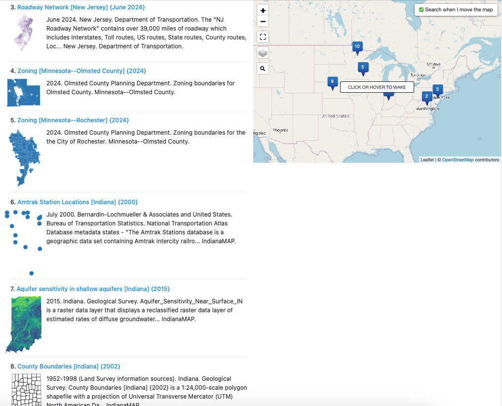
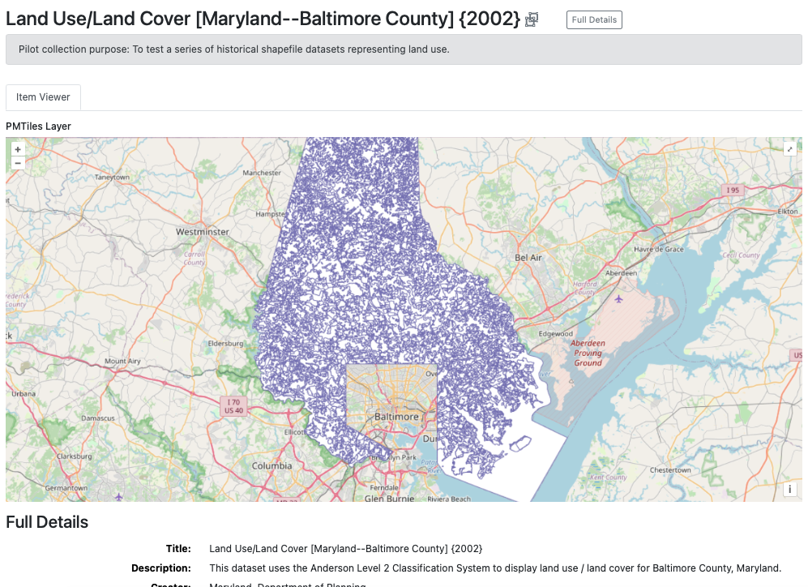
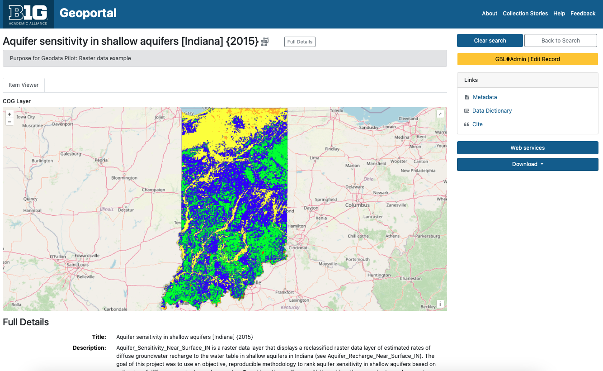
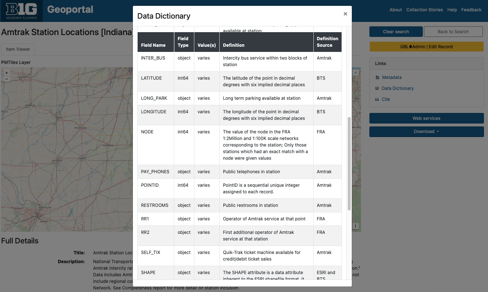
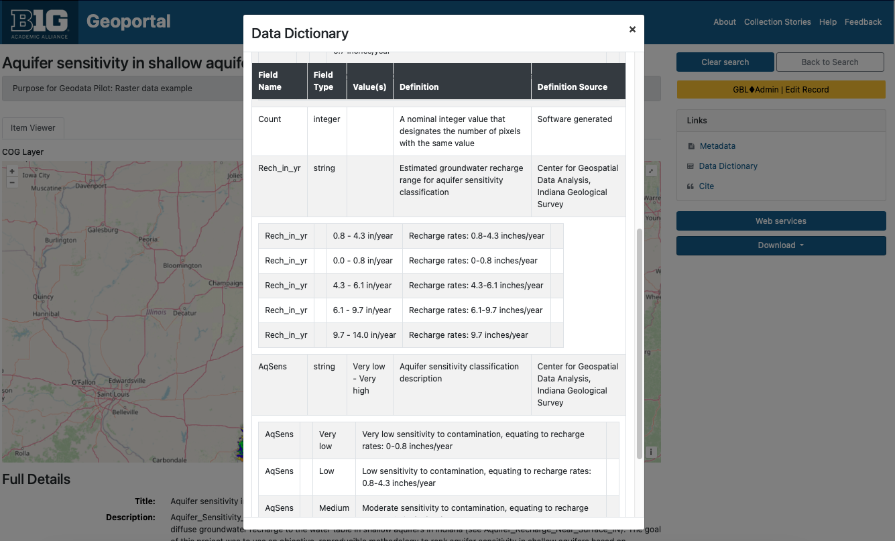

# **BTAA-GIN Geodata Collection**

**Groundwork Phase Report**

This document reports on the progress of the BTAA-GIN Geodata Collection as of February 2025\.  

## Executive Summary

The BTAA-GIN Geodata Collection Groundwork Phase (Q1 2024- Q1 2025\) established the technical and metadata infrastructure required for a scalable geospatial data repository. This phase focused on pilot collection development, metadata expansion, workflow refinement, and platform enhancements.

### Outcomes

* We curated a pilot collection of [35 datasets](https://geodev.btaa.org/?f%5Bpcdm_memberOf_sm%5D%5B%5D=btaa-074bc4ad-ed3d-4fe7-8339-562bc1109cb3) on our development site to test our processes for gathering, describing, and sharing geospatial information.  
* We added new metadata fields and entry guidelines to provide technical and administrative documentation for datasets.  
* We created new methods for programmatically generating metadata and derivative files from collected datasets.  
* We introduced new ways for users to evaluate datasets with visual previews and data dictionaries.

### Next Steps: The Foundation Phase (2025–2026)

* **Partnerships:** We will partner with data providers to develop a process for exchanging resources.  
* **Technology:** We will continue to enhance the BTAA Geoportal and backend management tools.  
* **Collections:** We will curate real-world data submissions to build our first official collections.  
* **Curation Plan:** We will release a formal plan that documents our goals, workflows, and guidelines.

### Full Report Contents

1. **Pilot Working Group Final Report:** Outlines the scope and major outcomes of our initial pilot, along with challenges encountered.  
2. **New Developments:** Describes what changed in our metadata standards, data access features, and overall workflow.  
3. **Pilot Collection Inventory:** Provides a list of the sample datasets curated for this phase, published on our development geoportal.  
4. **Next Steps:** Recommends actions for the next phase based on what we learned during the pilot.  
5. **Roadmap:** Presents our longer-term goals and milestones through 2027\.

## BTAA-GIN Geodata Pilot Workgroup Report

The BTAA-GIN Geodata Pilot Workgroup met from Q1 2024-Q1 2025 to develop preliminary recommendations for building a geodata collection. The workgroup laid the groundwork for a geodata collection program, focusing on technical infrastructure, metadata standards, and workflows.

### Scope

The Workgroup prioritized technical and metadata development over policy discussions, such as data provider agreements, which were assigned to a future group.

We realized that collecting the data provided an opportunity to expand our metadata documentation. Instead of relying solely on discovery and descriptive metadata fields, we introduced fields for technical and administrative metadata. By examining and running scripts on the downloaded data, we documented elements such as file size, resolution, and projection. As part of a processing workflow, we further added information about the provenance of the dataset.

This proactive approach will allow us to document as much as possible at the outset, minimizing the need to revisit datasets for additional information later. While our metadata profile does not currently conform to established standards such as ISO 191xx, we established a framework that captures the majority of information such standards require. This positions us well for future crosswalking to internationally recognized standards.

### Activities

* Expanded and refined the metadata profile to support more detailed documentation.

* Oversaw the implementation of asset storage and data ingest functionality into the technology stack.

* Vetted Python scripts for automating metadata extraction, data processing, and technical validation.

* Established a plan to use web-friendly data derivatives, such as Cloud Optimized GeoTIFFs (COGs), PM Tiles, and visual thumbnails to enhance accessibility.

* Assembled a pilot collection of 35 curated items, showcasing diverse formats and the implementation of new metadata features. This collection will be used as a proof of concept when communicating with potential partners.

* Developed a prototype model for documenting dataset fields and values in simple tables based on the “Entity and Attributes” section of the FGDC standard.

### Challenges

* Meeting user needs for metadata with the varying quality of documentation from data providers.

* Applying single-layer archiving principles to multipart items, such as Geodatabases.

* Addressing the verbosity of certain metadata fields, such as lineage or contact information, which are difficult to reformat into lightweight Solr fields as key:value pairs.

* Providing data previews for static downloads in the absence of a dedicated geospatial web service platform, such as GeoServer or ArcGIS.

* Ensuring users have access to data dictionaries. Although few standards exist for structuring this information and it is rarely included in geodata metadata, these details are essential for evaluating the dataset’s contents. Only the legacy FGDC metadata standard provides a structured place for data dictionaries.

### Models and Tools

Whenever possible, we built on existing models and tools to avoid reinventing the wheel, leveraging prior art to inform and streamline our work.

* The BTAA Geoportal uses a local profile of OGM Aardvark metadata, which already provides a strong foundation for geospatial metadata. Following Aardvark’s established guidelines, we extended the profile with additional fields from DCAT and Dublin Core. In particular, we integrated elements from:  
  * [DCAT-3 US Profile](https://doi-do.github.io/dcat-us/): A schema tailored for the United States, designed for interoperability.  
  * [GeoDCAT](https://semiceu.github.io/GeoDCAT-AP/drafts/latest/): A geospatial adaptation of DCAT, incorporating several geospatial-specific fields.

* Insights from Jaime Martindale’s work at UW-Madison’s Robinson Map Library provided valuable insights, including establishing minimum metadata requirements and best practices for engaging with data providers.

* For metadata processing, we adapted scripts based on existing tools:  
* [GeoDCT](https://github.com/mkernik/geodct) by Melinda Kernik: For creating file inventories and documenting fields.  
* [Geospatial Metadata Toolkit](https://github.com/kimdurante/Geospatial-Metadata-Toolkit) by Kim Durante: For extracting technical metadata values.

### Areas of Discussion and Decisions

#### What datasets to include in the pilot collection

The workgroup considered what kind of data would be included in the pilot collection to be test and represent our goals. They scanned multiple data clearinghouses and portals and chose resources with a range across the following characteristics:

* Geographic coverage: Maryland, New Jersey, Indiana, Illinois, and Minnesota  
* Administrative levels: State, county, and municipal  
* Temporal coverage: Current (2024) and historical (1970s, 2000s)  
* Formats: Vector, raster, and databases  
* Theme: Foundational layers (such as roads, parcels, and zoning) and high value layers (land cover/land use).

#### What to use for a staging area

A Box account was established as the primary staging area for data processing and temporary storage. While this solution provided an immediate workspace, discussions highlighted the need for a scalable and sustainable staging infrastructure to support long-term data management.

#### How to approach geodata processing 

To maintain data integrity, the workgroup decided to retain datasets in their original formats, avoiding reprojections or format conversions whenever possible. Additionally, new Python scripts were reviewed to facilitate the extraction of technical metadata, including file attributes, coordinate systems, and bounding box information, ensuring that essential metadata could be captured efficiently.

#### What additional metadata to generate or collect

Metadata discussions emphasized the importance of incorporating technical and administrative details, such as projections and data sources. Several new fields were proposed to enhance metadata completeness:

* Provenance (`dct_provenanceStatement_sm`)  
* Coordinate reference system (`dct_conformsTo_sm`)  
* Spatial resolution (`dcat_spatialResolutionInMeters_s`)   
* Scale (`geocat_spatialResolutionInText_sm`)  
* Geographic extent (`b1g_dct_extent_sm`)

The group noted that numeric spatial resolution might only be useful for raster formats, as vector data often lacks standardized measurement criteria. For vector data, they approved a plain text field to hold scale descriptions. The group also explored strategies for organizing records into dataset series based on geographic coverage or temporal range, but did not recommend a formal solution.

#### How to enhance GeoBlacklight (GBL) Admin

The workgroup evaluated improvements to GBL Admin that introduced new functionalities for uploading, attaching, and managing files through Amazon S3. They also identified elements to be included in a user download package, including the original dataset, metadata, and optional data dictionaries.

#### How well the pilot collection represents our capabilities

The group conducted a final review of the pilot collection within the development geoportal to determine if it demonstrated our core capabilities. The workgroup assessed field structures and labels, making recommendations for refinements to improve clarity and usability. 

#### Next steps

With the pilot phase concluding, the workgroup recommended sunsetting its activities and transitioning to a new phase. The "Foundations" phase, set to begin in early 2025, will focus on collaborating with data providers to establish exchange workflows and build an initial collection. The new workgroup will explore potential partnerships with other institutions to expand and strengthen the collection.

## Program Enhancements Overview

We have implemented several enhancements to our geodata management program to improve metadata quality, user experience, and operational efficiency. 

### 1. New Metadata Fields

We have introduced seven new metadata fields designed to capture spatial information, provenance, and more precise documentation. 

### 2. Updated Metadata Entry Guidelines

To accommodate the new metadata fields and improve overall consistency, we have augmented our Metadata Entry Guidelines. The revised guidelines offer instructions on populating the new fields and provide updated recommendations for existing fields, especially for internal assets. 

### 3. Derivatives

To enhance the user experience, we are now generating derivative files for our datasets

* **Thumbnails** provide visual previews in search results, helping users quickly assess the relevance of a dataset.  
* **PMTiles** offer web-friendly, single-file archives of tiled vector data, allowing integration into web maps without the need for complex geospatial servers.  
* **Cloud Optimized GeoTIFFs (COGs)** enable efficient streaming and visualization of raster data directly in web browsers, eliminating the need for specialized servers.

### 4. Data Dictionaries

To improve resource interpretation, we have added data dictionaries as supplemental tables.  The dictionaries include field names, types, definitions, and definitions sources. The tables also support nested values.

### 5. New Processing Recipes

We have developed several Python scripts to automate metadata extraction and data processing tasks. Key capabilities include:

* Extracting technical metadata from various geospatial formats.  
* Generating thumbnails and other derivative files.  
* Creating PMTiles and COGs for web-friendly data access.  
* Managing data dictionaries for improved metadata documentation.

### 6. GBL Admin Enhancements

To support the expanded scope of our program, we have enhanced the GeoBlacklight (GBL) Admin tool. Originally designed for flat tables of metadata, GBL Admin now includes functionality to:

* **Upload and Manage Assets**: Integrated with Amazon S3 for storage and management of files, including the ability to upload assets directly through the interface.  
* **Centralize Distribution Links**: Consolidated all external and internal links into a unified Distributions table, improving organization and aligning our terminology better with metadata standards like ISO and DCAT.  
* **Data Dictionaries**: Enabled the storage and management of data dictionaries within the relational database, allowing for dynamic updates and customized views.

## New Metadata Fields

We added new fields to our metadata application profile for more thorough documentation. These fields bring us into closer alignment with existing metadata standards, including the ISO 191xx series and the DCAT-3 US Profile.

### **New Spatial/Technical Fields**

| Label | URI | Description | Source/alignment | Example |
| :---- | :---- | :---- | :---- | :---- |
| **Conforms To** | `b1g_dct_conformsTo_sm` | The coordinate reference system expressed as a resolveable URI.   | This field is from Dublin Core. Our usage aligns with the DCAT-3 profile | Minnesota--Itasca County. (2025). *Forest Inventory \[Minnesota--Itasca County\] {2025}*. BTAA-GIN. (dataset) [https://geodev.btaa.org/catalog/btaa\_a42e393b-287e-401c-9c16-64e36dbd6ff5](https://geodev.btaa.org/catalog/btaa_a42e393b-287e-401c-9c16-64e36dbd6ff5) |
| **Spatial Resolution in Meters** | `b1g_dcat_spatialResolutionInMeters_sm` | The resolution of a raster dataset  | This is a custom DCAT-3 field | Indiana. Geological Survey. (2015). *Aquifer sensitivity in shallow aquifers \[Indiana\] {2015}*. BTAA-GIN. (dataset) [https://geodev.btaa.org/catalog/btaa-0d1f5c0e-f93f-4889-be34-16104f9c6927](https://geodev.btaa.org/catalog/btaa-0d1f5c0e-f93f-4889-be34-16104f9c6927) |
| **Spatial Resolution as Text** | `b1g_geodcat_spatialResolutionAsText_sm` | A description of the resolution for any resource. Can be a scale, distance measure, or other free text.  | This is from GeoDCAT, a geospatial profile of DCAT | Indiana. Geological Survey. (2002). *County Boundaries \[Indiana\] {2002}*. BTAA-GIN. (dataset) [https://geodev.btaa.org/catalog/btaa-6b8461b9-040c-4a7c-b09b-fde0c886c7f2](https://geodev.btaa.org/catalog/btaa-6b8461b9-040c-4a7c-b09b-fde0c886c7f2) |
| **Extent** | `b1g_dct_extent_sm` | A calculation in kilometers squared of the area covered. We intend to use this to classify the resource by geographic size. | This is a Dublin Core field. Our use of it aligns with their general description, but is somewhat unique. | Olmsted County Planning Department. (2024). *Zoning \[Minnesota--Rochester\] {2024}*. BTAA-GIN. (dataset) [https://geodev.btaa.org/catalog/btaa\_a0f42bcd-4108-4526-b6a7-611913f99e5e](https://geodev.btaa.org/catalog/btaa_a0f42bcd-4108-4526-b6a7-611913f99e5e) |

### **New Administrative Fields**

| Label | URI | Description | Source/alignment | Example |
| :---- | :---- | :---- | :---- | :---- |
| **Provenance Statement** | `b1g_dct_provenanceStatement_sm` | This is a free text, repeatable field for logging accessions, processing activities, and data sources. | This is a Dublin Core field that has been adopted by DCAT-3. It is a crosswalk from the lineage element in ISO 19139\. | New Jersey. Department of Transportation. (2024). *Roadway Network \[New Jersey\] {June 2024}*. BTAA-GIN. (dataset) [https://geodev.btaa.org/catalog/btaa-be6ed641-1e9a-4d4d-932e-97637df152b2](http://geodev.btaa.org/catalog/btaa-be6ed641-1e9a-4d4d-932e-97637df152b2) |
| **Admin Tags** | `b1g_adminTags_sm` | This is to store local tags to aid in finding and filtering items. Examples are for records cleaned during sprints and metadata updates | This is a custom field that is only useful locally and not intended to be interoperable. |  |

### **New Categorization Fields**

| Label | URI | Description | Source/alignment | Example |
| :---- | :---- | :---- | :---- | :---- |
| **In Series** | `b1g_dcat_inSeries_sm` | This string value links items in a subcollection or series together. | This is a DCAT-3 field. Our usage aligns, except that we are using it as a string instead of a nonliteral. | Maryland. Department of Planning. (2003). *Land Use/Land Cover \[Maryland--Allegany County\] {2002}*. BTAA-GIN. (dataset) [https://geodev.btaa.org/catalog/ba024c69-4738-4bd8-8500-e3e3846a0f85](https://geodev.btaa.org/catalog/ba024c69-4738-4bd8-8500-e3e3846a0f85)  |

## Updated Metadata Entry Guidelines

The input guidelines for items in the BTAA Geodata Collection differ from the general registry collection.

* All records for the GeoData Collection will have an **ID** prefixed by “btaa\_”. This will help identify them and differentiate them from the ID of the original source record.

* The **Subject** field is reserved for Library of Congress authority terms only.

* The **Description** field no longer needs to have the scale, spatial resolution, or provenance concatenated, as special fields are now dedicated to that.

* **Geometry** will reflect the outline of the dataset instead of a duplication of the bounding box

* **Provenance Statement** should indicate when the resource was obtained and from where

* **Publisher** (previously unused for datasets) will be the original distributor/provider

* **Provider** will be Big Ten Academic Alliance Geospatial Information Network (or BTAA-GIN during the pilot)

* Internal assets should always have a value for the following fields: (unlike external assets, for which this information is optional or difficult-to-fill)
     * **Resource Type**
     * **Subject**
     * **GeoNames**
     * **File Size**

     
## Derivatives

As we expand our geodata collection and storage capabilities, creating derivative files has become an integral part of our workflow. Derivatives enhance the user experience by offering streamlined access and improved visualization of datasets. These files can be batch-generated using desktop scripts, making the process efficient and scalable. The following derivatives will be created:

### 1. Thumbnail Images

* Format: PNG or JPEG  
* Purpose: Thumbnails provide a quick visual preview of a dataset, displayed directly on the search results page. These images help users assess the relevance of a dataset at a glance, improving discovery and usability.  
* Although we have had thumbnail functionality available for scanned maps and some web services, we have generally not been able to provide them for external datasets.

|  |
| :---: |
| Search page providing thumbnail previews. |

### 2. PMTiles

#### *What Are PMTiles?*

PMTiles is a single-file archive format designed for storing pyramids of tiled geospatial data. The format supports datasets addressed by Z/X/Y coordinates, including vector tiles, imagery, and remote sensing data. PMTiles archives can be hosted on platforms like Amazon S3, where they are accessed via HTTP range requests. This enables low-cost, zero-maintenance web mapping applications by minimizing the overhead of traditional web servers.

#### *Why Use PMTiles?* 

PMTiles allows us to create web-friendly datasets that can be embedded into web maps without requiring users to download the data. Unlike traditional geospatial web servers like GeoServer or ArcGIS, PMTiles simplifies deployment and management.

#### *Current Limitations* 

While GeoBlacklight can display PMTiles as overlays, features such as styled layers or querying datasets are not yet supported. These enhancements are part of GeoBlacklight’s future development roadmap.

|  |
| ----- |
| PM Tile showing an overlay visualization of the dataset. Maryland. Department of Planning. (2003). *Land Use/Land Cover \[Maryland--Baltimore County\] {2002}*. BTAA-GIN. (dataset) [https://geodev.btaa.org/catalog/141123e4-d0db-4212-ba04-a30696ffeba8](https://geodev.btaa.org/catalog/141123e4-d0db-4212-ba04-a30696ffeba8) |

### 3. Cloud Optimized GeoTIFFs (COGs)

#### *What Are COGs?*

A Cloud Optimized GeoTIFF (COG) is an enhanced version of the standard GeoTIFF format. It is internally organized to optimize data access in cloud environments, leveraging features like tiling, overviews, and streaming capabilities. Clients can retrieve only the parts of a file they need using HTTP range requests, which improves performance and reduces bandwidth.

#### *Why Use COGs?* 

COGs serve the same purpose as PMTiles for raster datasets, enabling browser-based visualization without the need for a dedicated web server. They are ideal for high-resolution imagery and other large raster files.

#### *Key Features*

* Backward compatibility: All COG files are valid GeoTIFFs.  
* Open standard: Developed by the Open Geospatial Consortium (OGC), the COG specification is free to use and implement.

|  |
| :---- |
| Cloud Optimized GeoTIFF for a raster dataset Indiana. Geological Survey. (2015). *Aquifer sensitivity in shallow aquifers \[Indiana\] {2015}*. BTAA-GIN. (dataset) [https://geodev.btaa.org/catalog/btaa-0d1f5c0e-f93f-4889-be34-16104f9c6927](https://geodev.btaa.org/catalog/btaa-0d1f5c0e-f93f-4889-be34-16104f9c6927) |

## Data Dictionaries

The Geodata Collection initiative has allowed us to address a long-standing concern: documenting data dictionaries. Often referred to as attribute table definitions or codebooks, data dictionaries describe a dataset's internal structure and provide information for understanding its contents.

In the past, our efforts have focused on descriptive metadata–titles, authors, dates, subjects, etc.–to help users find resources. We have devoted less attention to helping users evaluate resources. However, user feedback has consistently shown that data dictionaries are highly desired. Many users even assume this information is already included in metadata, leading to confusion when it is not readily available.

The challenge of documenting data dictionaries has persisted for years. The earlier geospatial metadata standard, FGDC, provided a structured format for this information through its Entities and Attributes section. However, the subsequent ISO 191xx standards replaced this section with ISO 19110, a standalone format for data dictionaries. Despite this shift, ISO 19110 files remain rare, likely because tools like ArcGIS do not export field definitions in this format. One exception is Stanford Libraries, which include ISO 19110 files in their dataset downloads. However, these files are not available as previews in their geoportal and are encoded in XML, making them difficult for users to read.

Accessing data dictionaries is often a frustrating process for users, as the information is inconsistently stored across FGDC files, plain text files, or external websites. To address this, we have consolidated the information into a standardized table format. Users can now access data dictionaries directly from the item view page via a clearly labeled link—eliminating the need to search through XML files or external sources. 

Our data dictionary format is modeled on the FGDC standard. Using Python scripts, we extract field information from datasets or existing FGDC files and document it in simple CSV files. These CSVs are designed to accommodate nested entries by including a parent field identifier.

While this approach has improved accessibility, many of our data dictionaries remain incomplete. In cases where field definitions are unavailable, we at least provide field names and types as extracted by our scripts. By storing this information in tables rather than static files, we retain the flexibility to update the dictionaries as new information becomes available. Even in their current state, these tables help users gain a clearer understanding of a dataset’s contents simply by browsing the field names.

|  |  |
| :---- | :---- |
| Screenshot of Data Dictionary preview ([https://geodev.btaa.org/catalog/btaa-e4a8461e-6cd1-4c45-b6e8-5838bfe6bde3](https://geodev.btaa.org/catalog/btaa-e4a8461e-6cd1-4c45-b6e8-5838bfe6bde3)) | Screenshot of data dictionary with nested values. ([https://geodev.btaa.org/catalog/btaa-0d1f5c0e-f93f-4889-be34-16104f9c6927](https://geodev.btaa.org/catalog/btaa-0d1f5c0e-f93f-4889-be34-16104f9c6927)) |

## New Processing Recipes

We developed several Python scripts to enhance metadata and data processing capabilities. These tools support the collection, documentation, and curation of geospatial datasets, aligning with geospatial metadata standards and improving user experience.

### 1\. Extract Technical Metadata

* Modules Used: `geopandas`, `pandas`, `rasterio`, `shapely`  
* Recipe: [Extract Technical Metadata](https://github.com/geobtaa/harvesting-guide/blob/main/recipes/R-16_extract/R-16_extract-geopandas.ipynb)

This script extracts spatial metadata from geospatial datasets stored in a directory and exports the results as a CSV file.

Supported Geospatial Formats:

* Vector: Shapefiles, GeoJSON  
* Raster: GeoTIFF  
* Geodatabases and Geopackages (records file name and size only)

Metadata Extracted:

* File folder and name  
* File size (as Kb or Mb)  
* Resource (geometry) type (i.e. “Point data”)  
* Coordinate reference system (CRS) as a URI  
* Bounding box (rectangular extent)  
* Geometry shape as WKT outline  
* Area (square kilometers, calculated from bounding box)  
* Spatial resolution (meters, for raster datasets)

Additionally, for shapefiles and GeoJSONs:

* Extracts attribute field information, generating a CSV file for each dataset with:  
  * Field label  
  * Field type  
  * Values  
  * Field definition  
  * Definition source

---

### 2. Generate Derivative Files

#### 2.1 Generate Thumbnails

* Modules Used: `geopandas`, `matplotlib.pyplot`, `rasterio`  
* Recipe: [Thumbnail Generator](https://github.com/geobtaa/harvesting-guide/blob/main/recipes/R-16_extract/Get%20Thumbnail.ipynb)

This script generates thumbnail images for geospatial datasets. It processes files (Shapefiles, GeoJSONs, or GeoTIFFs) in a folder and outputs configurable images (width, height, and DPI).

#### 2.2 Create PMTiles

* Modules Used: `GDAL`  
* Recipe: [PMTiles Generator](https://github.com/geobtaa/harvesting-guide/blob/main/recipes/R-16_extract/create_pm-tiles.ipynb)

This script creates PMTiles for vector datasets, with an intermediate step to reproject to EPSG:4326 (required for web visualization). The minimum and maximum zoom levels are configurable.

#### 2.3 Create Cloud Optimized GeoTIFFs (COGs)

* Modules Used: `GDAL`  
* Recipe: [COG Generator](https://github.com/geobtaa/harvesting-guide/blob/main/recipes/R-16_extract/create_COGs.ipynb) and [Create COG with 3 Bands](https://github.com/geobtaa/harvesting-guide/blob/main/recipes/R-16_extract/Create_COG-3Band.ipynb)

This script processes GeoTIFFs, reprojects them to EPSG:3857, and outputs Cloud Optimized GeoTIFFs (COGs), optimized for web browser compatibility.

---

### 3. Helper Scripts

To ensure data consistency and compatibility, these scripts address common preprocessing needs.

#### 3.1 Add Projection Files

* Recipe: [Add Projection Script](https://github.com/geobtaa/harvesting-guide/blob/main/recipes/R-16_extract/Add%20projection.ipynb)

This script inserts `.prj` (projection) files into shapefiles within a directory. The projection must be defined in the script and is essential for extracting CRS, bounding box, geometry, area, and spatial resolution values.

#### 3.2 Attribute Table Definitions

* Recipe: [Extract Attribute Definitions](https://github.com/geobtaa/harvesting-guide/blob/main/recipes/R-16_extract/Add%20projection.ipynb)

This script parses FGDC metadata fields to extract attribute labels, definitions, and sources into a CSV. These results can optionally merge with tables generated by the Extract Technical Metadata script.

## GeoBlacklight (GBL) Admin Enhancements

To support the collection, storage, and management of geodata, we enhanced the GeoBlacklight (GBL) Admin tool. Originally designed for metadata workflows, GBL Admin now includes functionality to upload and manage assets, centralize access links, and document data dictionaries. These improvements address the expanded needs of our program and align with best practices for geospatial data management.

The enhancements fall into three key areas:

| Asset Upload and Management | Integration with Amazon S3 enables storage and management of assets, including uploads, file-level documentation, and thumbnail harvesting. |
| :---- | :---- |
| **Dedicated Distribution Table for Links** | A new “Distributions” table consolidates all external and internal links. This improves organization and provides administrative fields for custom labels. |
| **Data Dictionaries** | A new table for data dictionaries provides users with immediate access to attribute table definitions. It also allows administrators to dynamically update the field-level metadata instead of relying upon static documents. |

### 1\. Asset Upload and Management

To enable asset management, we implemented a new workflow for uploading, attaching, and managing files. Key enhancements include:

* **Amazon S3 Integration**  
  * Established a new Amazon S3 storage account for secure and scalable storage.  
  * Connected GBL Admin to the S3 bucket, supporting uploads of datasets and supplemental metadata.  
  * Migrated existing thumbnails from web server storage to Amazon S3.  
* **File Management and Background Processing**  
  * Developed an initial `AssetsController` with accompanying views to manage file assets in S3.  
  * Updated the file upload interface to:  
    1. Allow identification of each file's associated reference type (`dct_references_s`).  
    2. Enable uploads without a corresponding document, with assignment possible at a later time.  
  * Implemented a batch process to harvest thumbnails from remote sources into S3.  
  * Introduced a lower priority tier for background jobs to maintain application performance.

#### **How It Works**

1. From an item page, click **“Additional Assets”** to view attached assets.  
2. Click the **“Upload Assets”** button.  
3. Upload a file from your desktop and attach it to the record.  
4. Select one of the following reference types:  
   * Cloud Optimized GeoTIFF (COG)  
   * Data dictionary/documentation  
   * Download  
   * Image file  
   * Metadata in FGDC, HTML, ISO 19139, or MODS  
   * OpenIndexMap  
   * PMTiles  
5. The uploaded asset is stored in S3, and its link is added to the `dct_references_s` field in Geoportal metadata.

### 2\. Dedicated Distribution Table for Links

To streamline the management of access links (referred to as "References" in GeoBlacklight), we created a dedicated **Distributions** table. This unified approach replaces scattered interface views across:

* Main record views for external links.  
* A secondary table for "Multiple Downloads."  
* The new assets panel for uploading and attaching files.

#### **Benefits**

* **Alignment with Standards**: Renaming this part of the metadata as “Distributions” aligns with terminology in the ISO metadata standard as well as the DCAT profile.  
* **Improved Import/Export**:  
  * Links are now stored separately, facilitating batch updates to descriptive metadata without affecting links.  
  * Simplified CSV imports/exports, with smaller metadata files and the ability to handle arrays and multiple values for more fields.

#### **How It Works**

#### *Option 1: Manual Entry*

1. From the item page, click **“Distributions.”**  
2. Navigate to the **External – Document Distributions** section.  
3. Enter the reference type and URL.  
4. Click **“Create Download URL.”**

#### *Option 2: Batch Upload*

1. Prepare a CSV with the following columns:  
   * `friendlier_id`: ID of the main record.  
   * `reference_type`: One of the reference codes (see table below).  
   * `distribution_url`: The asset’s URL.  
   * `label` (optional): Custom label for the Download button.  
2. From the item page, click **“Distributions.”**  
3. Select **“Upload a CSV”** and upload your file.

#### **Reference codes**

* `arcgis_dynamic_map_layer`: ArcGIS DynamicMapLayer  
* `arcgis_feature_layer`: ArcGIS FeatureLayer  
* `arcgis_image_map_layer`: ArcGIS ImageMapLayer  
* `arcgis_tiled_map_layer`: ArcGIS TiledMapLayer  
* `cog`: COG  
* `documentation_download`: Data dictionary / documentation download  
* `documentation_external`: Full layer description  
* `download`: Direct download file  
* `iiif_image`: IIIF Image API  
* `iiif_manifest`: IIIF Manifest  
* `image`: Image file  
* `metadata_fgdc`: Metadata in FGDC  
* `metadata_html`: Metadata in HTML  
* `metadata_iso`: Metadata in ISO 19139  
* `metadata_mods`: Metadata in MODS  
* `oembed`: oEmbed  
* `open_index_map`: OpenIndexMap  
* `pmtiles`: PMTiles  
* `thumbnail`: Thumbnail file  
* `tile_json`: TileJSON  
* `tile_map_service`: Tile Map Service  
* `wcs`: Web Coverage Service (WCS)  
* `wfs`: Web Feature Service (WFS)  
* `wmts`: WMTS  
* `wms`: Web Mapping Service (WMS)  
* `xyz_tiles`: XYZ Tiles

### 3\. Data Dictionaries

Data dictionaries are essential for documenting field names, types, and values. Previously, these were only stored as static files (e.g., XML, CSV). With the enhancements to GBL Admin, data dictionaries can now be managed in a relational database, offering flexibility and improved displays.

#### **Benefits**

* **Editable and Dynamic**: Data dictionaries can be updated in the database as new information becomes available.  
* **Enhanced Presentation**: Information can be displayed dynamically on item pages.  
* **Export Options**: Users can export the data dictionary in a structured format.

#### **How It Works**

1. Prepare a CSV with the following headers:  
   * `friendlier_id`: ID of the parent record.  
   * `label`: Field label.  
   * `type`: Field type.  
   * `values`: Sample or defined values.  
   * `definition`: Field definition.  
   * `definition_source`: Source of the definition.  
   * `parent_field`: The parent field's name  
2. From the item page, click **“Data Dictionary.”**  
3. Provide a title and optionally a description of the data dictionary.  
4. Select **“Upload a CSV”** and upload your file.

Once the data dictionary has been created, administrators can add, edit, or delete the fields.

## Workflow Steps for Processing Metadata and Derivatives

This is an initial framework for the steps needed to process datasets for inclusion in the collection.

1\. **Metadata harvest**: Use the [BTAA-GIN Harvesting Guide recipes](https://github.com/geobtaa/harvesting-guide/tree/main/recipes) to parse metadata from APIs, individual files, and HTML sites.

2\. **Download data**: Download datasets manually or with a batch download tool like [WGET](https://en.wikipedia.org/wiki/Wget)

3\. **Extract technical metadata**: Use the new [extraction scripts](https://github.com/geobtaa/harvesting-guide/tree/main/recipes/R-16_extract) for spatial and technical metadata

4\. **Merge metadata**: Merge the metadata output from step 1 and step 3\. Review and clean the values as needed.

5\. **Generate derivatives**: Use the new [generator scripts](https://github.com/geobtaa/harvesting-guide/tree/main/recipes/R-16_extract) to create thumbnails, PMTiles, and/or COGs

6\. **Upload packages**: Upload the metadata, datasets, and derivatives to GBL Admin.

## Pilot Collection Inventory

Link to full collection: [https://geodev.btaa.org/?f%5Bpcdm\_memberOf\_sm%5D%5B%5D=btaa-074bc4ad-ed3d-4fe7-8339-562bc1109cb3](https://geodev.btaa.org/?f%5Bpcdm_memberOf_sm%5D%5B%5D=btaa-074bc4ad-ed3d-4fe7-8339-562bc1109cb3)

### Table 1: Standalone items

| Title | Purpose | Format | PM Tiles | COG | Thumbnail | Data Dict | Code- book | Original Supplemental metadata |
| :---- | :---- | :---- | ----- | ----- | :---: | :---: | :---: | ----- |
| [Amtrak Station Locations \[Indiana\] {2000}](https://geodev.btaa.org/catalog/btaa-e4a8461e-6cd1-4c45-b6e8-5838bfe6bde3) | Point data example | Shapefile | x |  | x | x (extract from FGDC) |  | FGDC as HTML |
| [Aquifer sensitivity in shallow aquifers \[Indiana\] {2015}](https://geodev.btaa.org/catalog/btaa-0d1f5c0e-f93f-4889-be34-16104f9c6927) | Raster data example | GeoTIFF |  | x | x | x  | nested in data dict. | FGDC as HTML |
| [County Boundaries \[Indiana\] {2002}](https://geodev.btaa.org/catalog/btaa-6b8461b9-040c-4a7c-b09b-fde0c886c7f2) | Polygon data example with scale info | Shapefile | x |  | x | x (extract from FGDC) |  | FGDC as HTML |
| [Dams \[Nebraska\]](https://geodev.btaa.org/catalog/btaa_06028e0343764fcb9370dc5a4bf53dc7) | Point data from an ArcGIS Hub with generated ISO metadata | Shapefile | x |  | x | x no definitions |  | ISO as HTML |
| [Forest Inventory \[Minnesota--Itasca County\] {2025}](https://geodev.btaa.org/catalog/btaa_a42e393b-287e-401c-9c16-64e36dbd6ff5) | Geodatabase example | Geodatabase | x |  | x |  | part of FGDC | FGDC as XML and HTML |

### Table 2: Related items

| Title | Purpose | Format | PM Tiles | COG | Thumbnail | Data Dict | Code- book | Original Supplemental metadata |
| :---- | :---- | :---- | :---: | ----- | :---: | ----- | ----- | :---- |
| [Roadway Network \[New Jersey\] {2023}](https://geodev.btaa.org/catalog/btaa-0455acb7-7784-4e05-a381-3fc41ec20baf) | Line data; recent version of high priority transportation layer | Shapefile | x |  | x |  |  |  |
| [Roadway Network \[New Jersey\] {June 2024}](https://geodev.btaa.org/catalog/btaa-be6ed641-1e9a-4d4d-932e-97637df152b2) | Line data; Current version of high priority transportation layer | Shapefile | x |  | x |  |  |  |
| [Zoning \[Minnesota--Olmsted County\] {2024}](https://geodev.btaa.org/catalog/btaa_5c94615c-6d9d-478f-bfb3-5bf2df834783) | County dataset with thumbnail. Download is filename, not format name | Shapefile | x |  | x |  |  |  |
| [Zoning \[Minnesota--Rochester\] {2024}](https://geodev.btaa.org/catalog/btaa_a0f42bcd-4108-4526-b6a7-611913f99e5e) | City dataset with thumbnail | Shapefile | x |  | x |  |  |  |

### Table 3: Dataset series

| Title | Purpose | Format | PM Tiles | Thumbnail | Data Dict | Codebook | Supplemental metadata |
| :---- | :---- | :---- | :---: | :---: | :---: | :---: | :---- |
| [Land Use/Land Cover \[Maryland\] {1973}](https://geodev.btaa.org/catalog/8392faf3-3316-4d87-8b6d-5f3c9d1651da) | Combines a dataset series into one parent record with multiple downloads attached  | Shapefile | x | x | x | 2 options available: plain text or nested in data dict. | FGDC as text |
| [Land Use/Land Cover \[Maryland--Allegany County\] {2002}](https://geodev.btaa.org/catalog/ff19893a-138a-4332-b4d3-3cad9f661b35) | Connects a dataset series with one parent record and individual records linked as children | Shapefile | x | x |  | same document attached to all records | FGDC as text for parent record only |

## Next Steps

With the Geodata Pilot Collection Workgroup concluding, we are moving into the **Foundation Phase (Phase 2\)** of the program. This stage marks a transition from internal experimentation to external collaboration and public-facing operations. We will focus on four key areas: partnerships, collections, technology, and the publication of our first formal Curation Plan.

### 1. Partnerships

The primary goal for this phase is to collaborate with at least two data providers to establish a sustainable workflow for dataset exchange and curation. These partnerships may inform the creation of sharing agreements that ensure clear expectations and communication. By working directly with data providers, we will also gain practical insights into their needs, which will help us refine our metadata guidelines, data ingestion workflows, and curation strategies.

### 2. Technology

We will continue to iteratively improve our technology. On the front end, this will include BTAA Geoportal enhancements to item view pages. On the backend, we will implement batch ingest functionality.

### 3. Collections

In collaboration with our data provider partners, we curate our first public-facing collections.

### 4. Curation Plan

The Foundation Phase will result in the development and publication of Version 1 of the Curation Plan. This document will outline the collection’s scope, metadata framework, and workflows, serving as a reference for both internal and external stakeholders.

## Geodata Collection Roadmap

The Geodata Collection Roadmap includes five overlapping phases. 

### Phase 1: Blueprints (2015–2023)

* Conduct geodata archiving research.  
* Publish scholarly articles and proposals.  
* Environmental scan by the BTAA-GIN Geodata Archive Working Group.  
* Approval of the BTAA-GIN Geodata Collection Strategic Plan.

### Phase 2: Groundwork (2024–2025)

* **2A. Setup (Q1–Q2 2024\)**  
     * Form Pilot Working Group.  
     * Establish S3 storage and basic ingest tools.  
     * Create and test sample datasets.  
     * Publish the Geodata Collection Implementation Plan.  
    
* **2B. Pilot (Q3 2024–Q1 2025\)**  
     * Build a pilot collection and test workflows.  
     * Enhance metadata and technology tools.  
     * Onboard new hire for Program & Outreach Coordinator.  
     * Publish a final report on pilot activities.

### Phase 3: Foundation (2025–2026)

* **3A. Partnerships & Technology (Q1–Q3 2025\)**  
     * Begin partnerships with initial data providers.  
     * Develop workflows and data agreements.  
     * Redesign Geoportal interface for downloads and metadata.  
     
* **3B. Collection & Curation Plan (Q3 2025–Q1 2026\)**  
     * Collect and curate datasets from partners.  
     * Test batch ingest functionality.  
     * Publish Curation Plan Version 1\.

### Phase 4: Framework (2026)

* **4A. Expand (Q1–Q4 2026\)**  
     * Expand partnerships and collections.  
     * Incorporate additional and multipart formats  

* **4B. Curate (Q1–Q4 2026\)**  
     * Establish regular cycles for collection.  
     * Implement additional batch processing techniques  
     * Publish Curation Plan Version 2\.

### Phase 5: Lantern (2026-27)

* **5A. Outreach (Q1–Q4 2026\)**  
     * Launch outreach and communication strategies.  
     * Present at conferences and host webinars.  
     * Highlight project benefits through materials.  
* **5B. Evaluation**  
     * Gather stakeholder feedback.  
     * Assess impact and refine workflows.  
     * Evaluate long-term sustainability.
