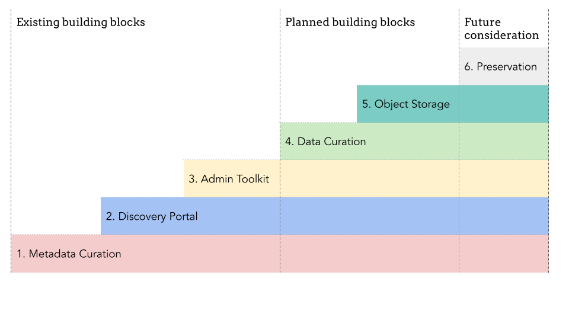
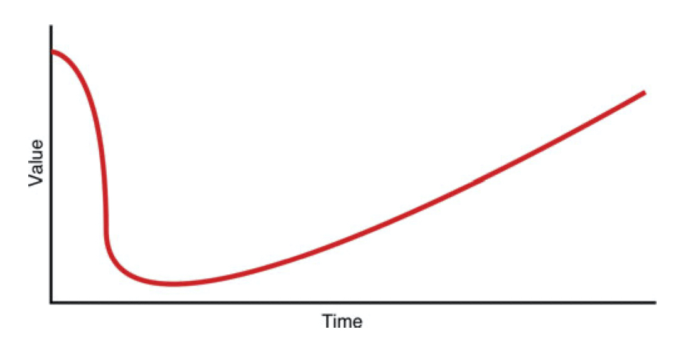

---
tags:
- '2024'
- program-guidelines
---

# The BTAA-GIN Geodata Collection
**A Strategic Plan (2024-2026)**

Prepared for:
Big Ten Academic Alliance  Library Directors

Prepared by:
Big Ten Academic Alliance  Geospatial Information Network 
Geodata Collection Working Group
October 2023
Revised February 2024

## 1. SUMMARY
This document describes the BTAA-GIN Geodata Collection Strategic Plan for 2024-2026, including an overview of the expanded scope and the technology building blocks needed to meet this vision. 

!!! info "Key Takeaways"

	* New Scope: evolving from exclusively a metadata catalog to include selective geodata curation with operational cloud storage.
	* Increased Staff: a new full-time Program and Outreach Coordinator, an increase in hours for our Lead Developer, and consultation sessions with a Cloud Solutions Architect.
	* Budget: no budget increase will be needed for at least two years as we spend down strategic reserves, but a one-time increase of $138,000 (51%) will be needed in FY27, followed by yearly inflationary increases. See Budget section for details.

	
### Timeline Overview

-	2024
	
	* Hire new staff
	* Develop curation plan
	* Run technology pilot

-	2025
	
	* Begin conducting active geodata curation
	* Share documentation and perform outreach
	* Assess & review

-	2026
	
	* Explore archiving & preservation strategies

### Incremental steps to building a BTAA-GIN Geodata Collection

<figure markdown="span">
  { loading=lazy}
</figure>

1. Metadata Curation: Collection and normalization of metadata.
1. Discovery Portal: A geoportal for user-friendly discovery and access.
1. Admin Toolkit: A workflow tool for ingesting, editing, and publishing assets.
1. Data Curation: Evaluation, collection, and processing of geodata.
1. Object Storage: A designated location for file storage and access.
1. Preservation:  Long term storage in a repository system.

## 2. JUSTIFICATION

### 2.1 Background

The Big Ten Academic Alliance Geospatial Information Network launched the BTAA Geoportal in 2016 with a mission confined to curating and storing metadata, excluding the handling of actual data objects. In the intervening years, we have cataloged nearly 70,000 records for geospatial resources and improved their discoverability through metadata normalization and centralization. 

### 2.2 The Need for Scope Expansion

To continue to serve the BTAA research community effectively, we have concluded that we must also systematically capture geodata.

#### 2.2.1 Addressing the User Experience
Over time, we have encountered a recurring challenge: many providers update, migrate, or delete their datasets without preserving prior versions. Consequently, our Geoportal, which relies on external links, faces the vexing issue of "link rot." This undermines both user experience and the community's trust in our service.  Broken links deter users from revisiting the site and saving records for future use. By storing dataset versions over time, we can offer a consistent and reliable service to our users.

#### 2.1.2 Filling the Temporal Gap

Academic libraries have well-established programs to collect and archive physical map collections. However, most libraries are collecting far fewer maps in recent years because government agencies now issue geospatial information as digital data instead of as maps. Unfortunately, many libraries have not yet updated their collection policies to include publicly available digital data. As a result, they are currently failing to capture the changing geospatial landscape for future researchers. Libraries must begin curating digital geodata to fill in the growing temporal gaps in their collections.	

### 2.2 Anticipated Outcomes

#### 2.2.1 A collection that will grow in value over time

When geospatial data is newly created, it holds high value due to its immediate relevance. As time passes, this data can seem less valuable as it becomes outdated or superseded by more current versions. However, its value can significantly increase later on as it gains historical significance. This can be illustrated by a U-shaped value curve, which shows an item's high initial worth, a decrease in value as it ages, and a subsequent increase as it becomes historical. We will be making investments in our future value by collecting geodata now.

<figure markdown="span">
  { width="300" loading=lazy}
  <figcaption>U-Shaped value curve illustrating increasing value over time</figcaption>
</figure>

#### 2.2.2 A significant contribution to the BIG Collection Initiative

The BIG Collection Initiative aims to create a cohesive network environment that provides universal content availability, enhances resource discovery, and ensures frictionless access. The initiative also prioritizes the long-term sustainability of both print and digital collections through coordinated preservation and digitization efforts. Our plan to curate geospatial data aligns with the B1G Collection Initiative, leveraging the collective strengths of BTAA libraries.
