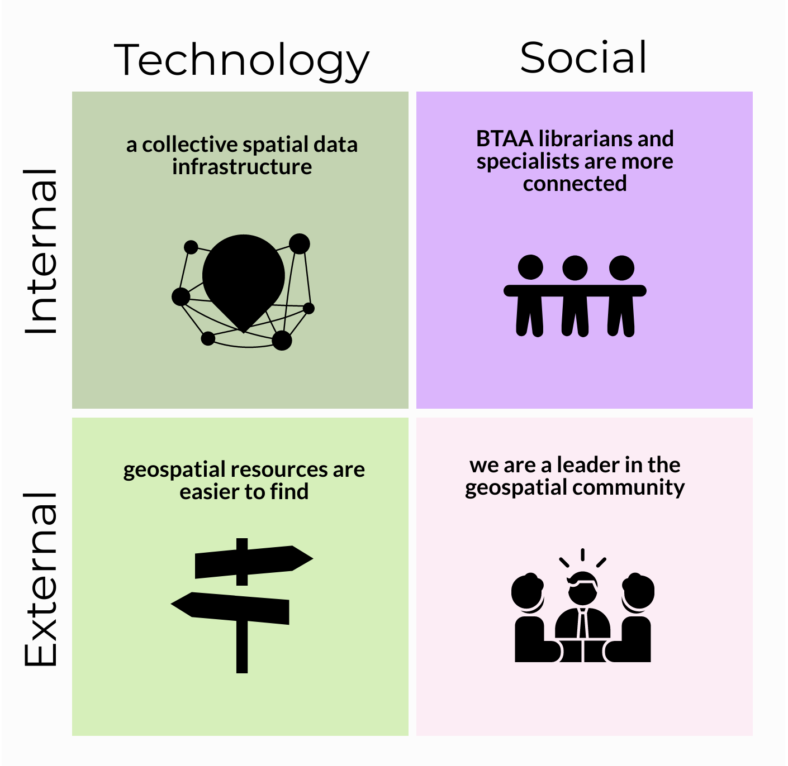

---
tags:
  - reports
  - '2020'
---

# IMPACT REPORT May 2020

!!! abstract "Project Impacts: Executive Summary"

	### Participating institutions are now part of a spatial data infrastructure
	
	* Involves 13 BTAA institutions
	* Estimated direct cost avoidance/savings of $29,000 per institution per year
	* Established governance for growth and sustainability
	* Identified strategic initiatives for future development
	
	
	### Geospatial resources are easier to find
	
	* Selected and implemented [GeoBlacklight](https://geoblacklight.org/) ‒ open source, spatial discovery interface
	* Aggregated, enhanced, and normalized metadata records for over 30,000 publicly available resources into a single search portal ‒ includes geospatial data, as well as scanned maps from library collections
	* Increased usage ‒ number of users was up by 25% over the past year
	
	
	### Big Ten Academic Alliance geospatial librarians and specialists are more connected
	
	* Established monthly meetings as a large group and in topical committees
	* Provided funding for members to present about the project at conferences
	* Collaborated to publish 5 academic articles, present 8 posters, and deliver at least 17 presentations
	* Improved workflows at local institutions
	
	
	### We are a leader in the geospatial community beyond the BTAA
	
	* Active leadership in the national GeoBlacklight community, including guiding development in open-source academic spatial data infrastructures
	* Contributed to the GeoBlacklight codebase
	* Published workflow documentation widely used by the geospatial community
	* Provided consultation to similar projects at other academic institutions

## Introduction

We have come a long way since the idea for a sustained collaboration across CIC map libraries germinated a decade ago among informal conversations between librarians and directors. This vision began to take shape in 2012 when three map librarians issued a white paper, _A Collaborative Vision for Spatial Scholarship across the CIC_ (1). This paper identified geospatial data as a long-term, interdisciplinary need that would necessitate increasingly complex infrastructures to manage. The authors concluded that these infrastructures would likely be prohibitively expensive for each CIC library to maintain individually, and they proposed collaborative solutions for the long-term management of geospatial resources. 
{ .annotate }

1.  Bidney, M., Mattke, R. & Weessies, K. (2012). A Collaborative Vision for Spatial Scholarship across the CIC, 2012, white paper. http://hdl.handle.net/11299/213250

This paper was a major impetus for the creation of the BTAA Geospatial Data Project, with its goal to provide discoverability, facilitate access, and connect scholars to geospatial data resources. The initial pilot project was to deliver a proof of concept with outcomes that included: a production-level online interface to geospatial data resources, a foundational geospatial metadata standard that would be interoperable and useful into the future, and a set of workflows for collaboratively creating metadata. 

The project has since accomplished several of the recommendations laid out in the original white paper, including creating a collective specialized tool for discovering geospatial resources, combining scanned map collections, and encouraging active communication across the BTAA geospatial community. Along the way, it has also become a leader in the larger geospatial community.

The reasons behind the success of the project and its impact are delivered in this report.

**Matrix of BTAA Geospatial Data Project Impacts**

## Impact #1: Participating institutions are now part of a spatial data infrastructure

### What was the need?

A spatial data infrastructure is  “a framework of technologies, policies, standards, and human resources necessary to acquire, process, store, distribute, and improve the use of geospatial data across multiple public and private organizations” (1). The benefits of a shared infrastructure include reduced costs through shared technology, consistency of data manipulation and output through agreed-upon standards, and improved data discovery and accessibility. 
{ .annotate }

1. Wade, T., & Sommer, S. (2006). A to Z GIS, An illustrated dictionary of geographic information systems. Esri Press.

Prior to this project, most BTAA libraries had not been able to provide a spatial data infrastructure to serve their users because they do not have the needed combination of funding, technology resources, and/or local expertise.

### What did we do?

We began our collaboration in 2015 with two strategies: basing operations at the University of Minnesota and collecting financial contributions from each participating institution. This allowed us to hire a full-time Metadata Coordinator, fund a Spatial Data Analyst and Curator part-time, and utilize in-kind labor and funds from the University of Minnesota Libraries to contract with an application developer. 

Once funding and staff were in place, we further built our collective spatial data infrastructure by: 

1. identifying important public geospatial resources
2. agreeing upon a metadata standard and developing a processing workflow
3. releasing a collective geoportal
4. publishing metadata records and keeping them updated
5. performing outreach to users on how to find and access resources in the site
6. documenting our research and guidelines
7. establishing governance for the growth and sustainability of the project

### What were the outcomes?

#### A public-facing search portal 

By collectively funding this project and centralizing its operation, each institution can reference a geoportal with local and regional resources for researchers, students, and faculty. This geoportal offers metadata, web services, direct downloads, and links to external sites for more information. Each institution has a major but equal, stake in the geoportal and can select local resources, such as their state’s geospatial data or their library-owned scanned maps, for inclusion into the geoportal. The geoportal is also open to the public, providing member institutions and contributing agencies the means to increase discoverability to collections for their wider communities.

#### Shared expertise

This project has also resulted in bringing together specialized expertise related to spatial data infrastructures, including geospatial metadata, application development, and data curation. Project staff members now have demonstrable expertise in the realms of metadata and application development that can be shared both within and beyond the project.

#### Auxiliary staff capacity

The number of staff dedicated to GIS or cartographic cataloging activities varies between institutions. At times, a participating library may have extended periods of position vacancies or funding decisions that result in a gap in these areas of knowledge. Being able to rely upon Task Force members at other institutions to share adoptable workflows and  metadata schemas has functioned as a kind of safety net that allows libraries to continue offering services even when staff capacity is limited.

####Substantial savings

Each library contributes $15,000 per year to participate in the project. This covered initial development costs and continues to cover ongoing maintenance. If each library established their own geoportal, it would cost approximately $60,000 to launch and $40,000 per year to maintain ‒ an average of $44,000 over five years. This results in an estimated direct cost avoidance/savings of $29,000 per institution per year. (See this sheet for a comparison of [cost estimates for building and maintaining Geodata@Wisconsin](https://docs.google.com/document/d/1fvkfobcVxjxCDcc0hWYx-nwyqWU7va3qLvvKRrZ-OUM/edit?usp=sharing))

By aggregating the costs of each geoportal together over five years, it would result in a total of $3,120,000 for 12 institutions. By contrast, the total five-year cost of the BTAA GDP Geoportal has been $1,926,300 — $825,000 in contributed funds and $1,101,300 in in-kind support ($318,800 for UMN management, technical infrastructure, and software development support and $782,500 for Task Force Member effort). The total UMN cost per year over five years is $78,760 ($15,000 direct; $63,760 in-kind). The total cost per year over five years for other institutions is $28,041 ($15,000 direct; $13,041 in-kind).

**Comparing Five Year Aggregated Costs: 12 Local Geoportals vs. one BTAA GDP Geoportal**

## Impact #2: Geospatial resources are easier to find

### What was the need?

Geospatial resources are difficult to find for several reasons. Public data is often poorly documented with minimal or inconsistent metadata. This is further compounded by the available distribution platforms, which may have limited search capabilities, forcing users to rely upon guessing at keywords to perform searches for desired resources.

Online sources for geospatial resources are also widely dispersed across the internet. Geospatial data rarely shows up in Google searches, so in order to find specific desired datasets, users need to know which agencies, administrative bodies, or educational units produce and distribute it.

Finally, many historical geospatial resources are in the form of paper maps, plat books, and atlases. If these are not digitized, users may not know about their existence or how to find them, especially if they are held by out-of-state libraries or similar institutions. 

### What did we do?

1. built a geoportal with GeoBlacklight, an application designed for geospatial data which features specialized search functions, including normalized facets and a spatial (map-based) search interface
2. aggregated resources into a single search point
3. enhanced and normalized metadata for all records
4. added both public geospatial data and scanned map images from libraries to the collection

### What were the outcomes?

#### A large collection of metadata records produced from many sources featuring a mix of geospatial resource types

With the geoportal, a user does not need to know who created the data in order to find it. Users can focus on searching by What, When, and Where. They do not have to worry about Who or Why. We have aggregated 211 collections of resources, which include:

    * 14,636 geospatial datasets and portals
    * 11,823 scanned maps and atlases
    * 1,608 aerial images and sets
    
#### Users can find public geospatial data records from nine different states, as well as cartographic resources from around the world

**Centerpoints of Geoportal Resources in the United States**

**Geoportal Resources Worldwide**

**Location of the Geoportal Users in the United States by Metropolitan Area (2017-2019)**

#### Usage is increasing

April 2019 to March 2020 ‒ Pageviews: 65,175; Sessions: 12,219; Unique users: 9,265. Compared to the same time period in 2018-2019, this represents an increase in pageviews by 7%, in sessions by 19%, and in number of users by 25%.

#### Users find geospatial resources in our site from external search engines

From the period of March 2017-March 2020, we had 20,555 users. Analytics indicate that 38.6% of these users found items in the geoportal by searching in Google.

#### We made several hidden collections accessible

Similar and complementary to the BTAA Cooperative Cataloging Project, the team is making unknown spatial data resources available for use by a range of patrons within and outside of our libraries. Ultimately, we are making collections of geospatial resources accessible to researchers of all types, whether they derive from our individual libraries’ collections or by our gathering open data from agencies outside of our libraries willing to share their datasets with others. Seamlessly bringing together disparate sources of geospatial data, whether in the form of datasets or georeferenced map images, makes possible novel ways researchers can tie geospatial information together with enlightening outcomes.

**Spatial searching with the BTAA Geoportal
**
The BTAA Geoportal utilizes bounding box geographic coordinates from the metadata record to populate a map interface. This allows users to search by location throughout large collections, such as the Sanborn Map Collections from Pennsylvania State University. Most of the participating institutions are not able to offer this feature through their own digital library applications.

_Comments from project members that highlight the impact of our shared infrastructure and the resulting improved resource discoverability_

!!! quote

	"From the UW's perspective -- it has provided a place where metadata that describes geospatial research data produced on our campus can be broadly discovered by academic (and non-academic) user communities. Participating Universities can store their campus research data in an institutional repository and index metadata within the BTAA Geoportal. The geoportal serves as a value-added layer to institutional repositories – where it becomes the trusted geographic search and discovery solution for spatially-enabled content. The combination of local data repositories and the BTAA Geoportal working together helps researchers facing federal data management and broad public/open access requirements." - Wisconsin

!!! quote

	"A grad student was looking for GIS data for Twin Cities parks -- we used the geoportal to search due to the map search option (combined with "parks" as a keyword). It turned out that St. Paul parks were part of a Ramsey County administrative boundaries data set, which would have been hard to locate with just text searching." - Minnesota

!!! quote

	"...the BTAA platform allows much broader exposure to valuable research data like the historic Wisconsin Land Economic Inventory (Bordner Survey) data (digitized vectors from the 1930s scanned maps)" - Wisconsin
	
!!! quote

	"It has definitely caused us to work more on getting our scanned maps up to the geoportal." - Michigan

!!! quote

	"Our Early Maps of the Americas Collection was previously only available internally, before being added into the geoportal" - Chicago

!!! quote

	"A graduate student in The Spatial History of Nineteenth-Century Cities: Tokyo, London, New York course was doing a deep dive into London maps. She was particularly interested in the tourist experience during the Victorian Era. I pulled the paper maps she requested, but then showed her the geoportal. She ended up including a number of maps from the portal into her project, which she wouldn't have had access to otherwise. She mentioned maps from Michigan specifically." - Chicago

## Impact #3: Big Ten Academic Alliance geospatial librarians and specialists are more connected

### What was the need?

A project of this type cannot be successful without individuals and their experiences, commitment, and effort being focused on a vision. A shared vision requires transitioning from individualized, site-based approaches to a team focused on long-term collaboration. To be successful, this approach requires a regular flow of information, ideas, and contributions across institutions. It also requires trust and a willingness to engage with new concepts beyond one’s specialization. The geoportal is a sustainable spatial data infrastructure only if we foster the connections among the people and institutions supporting it.

### What did we do?

1. recruited 1-3 Task Force members specializing in the areas of GIS, maps, metadata, and cataloging from each participating institution
2. hold monthly meetings for the full Task Force and topical committees
3. charge working groups as needed
4. periodically hold “sprints,” where Task Force members spend a day focusing on making improvements or additions to needed areas. Sprints have included blog posts, help pages, and metadata cleanup
5. provide funding for Task Force members to present about the project at conferences 
6. regularly share knowledge amongst ourselves, learning about things such as data standards, infrastructure, geospatial web services, and metadata schemas from each other

### What were the outcomes?

#### Regular and sustained communications between institutions

The collaboration started with three librarians and their libraries, grew into commitments from eight BTAA libraries in the form of monies and infrastructure, and later expanded to active representatives from twelve libraries. And these representatives have collaborated on multiple and diverse levels to produce an online open-access location where researchers can discover geospatial data and images for their needs on one end while we all contribute to data input from a diverse population of creators on the other. Project participants have benefitted in so many ways, strengthening communication and ties across the participating BTAA libraries.

#### Improved workflows at local libraries

Another positive benefit has been our ability, through working in an open-access environment, to share the necessary tools to build and operate a successful collaborative data-input workflow. Task Force members have been able to use what they learn and implement improvements in their own libraries. For example, librarians at Michigan State University used the workflow they developed for preparing records for the BTAA Geoportal and applied it to metadata practices for all of their scanned maps (2).
{ .annotate }

2. Kiser, T. & Smeltekop, N. (2018). A Method for Creating Scanned Map Metadata for Geoportals, Library Catalogs, and Digital Repositories: Reworking Existing MARC Records of Paper Maps to Create New Records for their Scanned Counterparts, Journal of Map & Geography Libraries, 14:2-3, 109-131, DOI: 10.1080/15420353.2019.1640166

#### Increased activity in research and publications

With more professional opportunities for team members such as service/leadership to committees, delivering presentations (especially valuable for tenure and/or promotion), and documenting our efforts, we collaborated to publish [5 academic articles](https://sites.google.com/umn.edu/btaa-gdp/about/activities/articles), present [8 posters](https://sites.google.com/umn.edu/btaa-gdp/about/activities/posters), and deliver at least [17 presentations](https://sites.google.com/umn.edu/btaa-gdp/about/activities/presentations).

**Examples of collaborative presentations by Task Force members**
{ width="300" }
{ width="300" }

## Impact #4: We are a leader in the geospatial community beyond the BTAA

### What was the need?

A large portion of the development of open-source technologies for spatial data infrastructures takes place at Ivy League research universities. These institutions have teams of developers creating solutions for their local needs. The rest of the academic geospatial community benefits from this work but has not always had opportunities for input on the development of technologies.

Another divide concerns that of geospatial librarians and specialists working in academia and those GIS professionals working in local government. Each sector contains its own expertise, but they are not typically in regular communication with one another. For example, libraries have knowledge about metadata and archiving, while GIS professionals may be more focused on technical processing and data delivery. 

### What did we do?

1. became active participants in the Geo4Lib and GeoBlacklight communities
2. host and moderate monthly meetings of the GeoBlacklight developers and users
3. facilitate bi-annual code sprints of GeoBlacklight
4. provide consultation to similar projects at other institutions
5. create documentation and deliver workshops on metadata standards and workflows
6. communicate with data providers about harvesting their collections

### What were the outcomes?

#### We help drive directions in open-source technology for academic spatial data infrastructure

We are now a strong enough collective voice that we can help drive directions in geospatial technology, such as GeoBlacklight. Examples of specific features for GeoBlacklight that we pushed for and/or developed include the integration of ArcGIS Rest services, a Wiki for the Metadata schema, rollover help text,  and a static image plugin. We are also currently developing a metadata editor for the application, which will be especially helpful for librarians and catalogers. [This report includes more details on our contributions to GeoBlacklight.](https://docs.google.com/document/d/1O0kAisrVAktYDEocp63wxwXmHICh3y4I09z_x8KQmjQ/edit?usp=sharing)

Normalizing the metadata schema and associated standard from the beginning has had a positive and ongoing effect on GeoBlacklight enhancements as well as its community, benefiting many other spatial data users outside of our project.

#### Data providers get more exposure to their collections

How do geospatial data providers benefit from having their information accessible through the geoportal? Perhaps most obviously, exposing their collections and content without barriers will make them known as trusted “go-to” information providers. More use of their data potentially means more opportunities for them to garner research dollars as well. 

Another benefit to data providers has been our ability to deliver metadata workshops to individuals within agencies and libraries. A benefit in return is higher-quality metadata that allows better access to resources residing in the BTAA Geoportal.

_Comments from project members that highlight the impact of our collaborations and leadership_

!!! quote

	"For me, it has provided a community of practice offering valuable insights, advice, and assistance in how we can all do our work better and more efficiently." - Wisconsin

!!! quote

	"Participating in the task force has been rewarding as it provides a network of geospatial librarians that regularly share what they are working on, which is a very different thing from annual/semi-annual conference attendance." - Chicago

!!! quote

	"Through my involvement, I have learned from other task force members how they are engaging with contacts in local/state agencies. Submitting public datasets for the geoportal (and presenting on it at a couple of regional/state GIS conferences) has connected me with and increased my (and OSU Libraries) visibility among local/state agency contacts in a way that would not have happened so naturally otherwise. This knowledge has helped me to connect students with those GIS professionals and draw on their expertise when needed." - Ohio State
