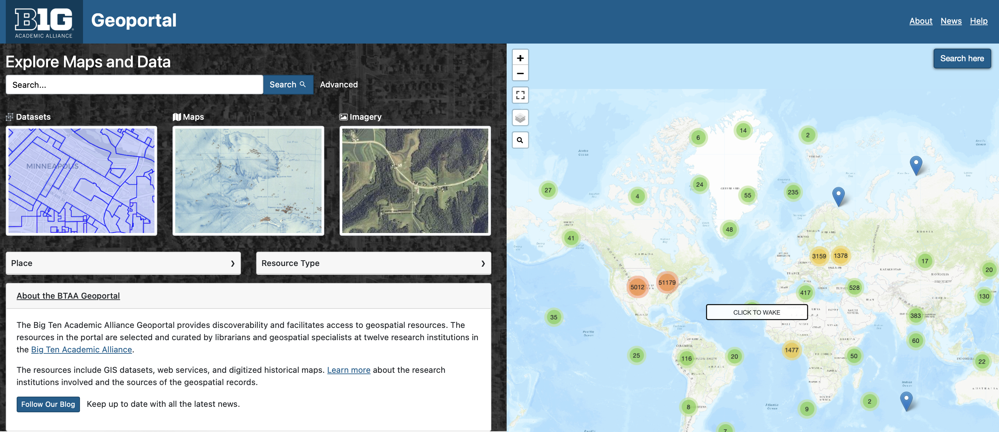
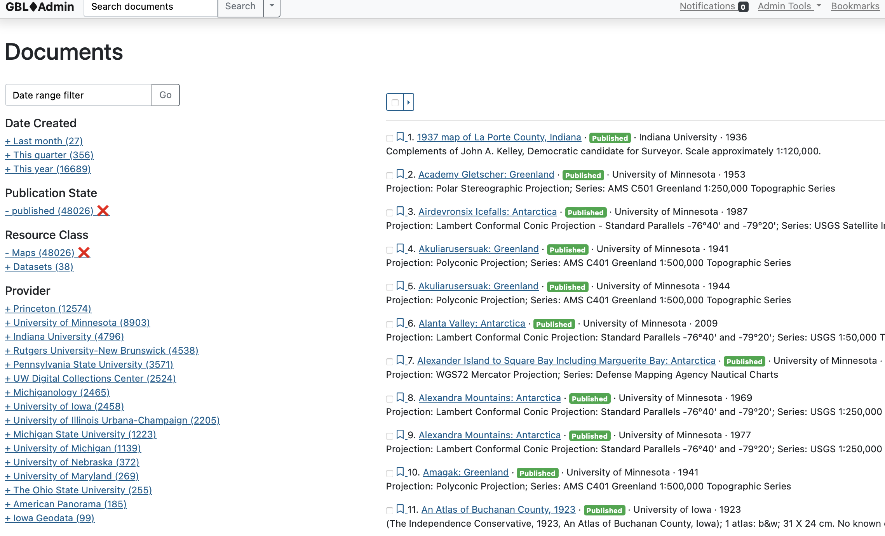
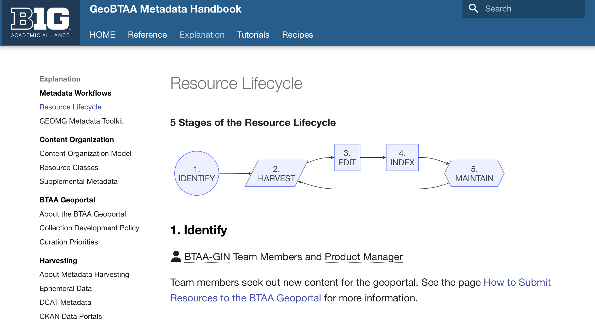
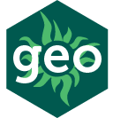

# Technology Projects

## BTAA-GIN Local Projects

-   ### BTAA Geoportal

    ---

    
	
    Our flagship project is a search portal that connects users to digital geospatial resources, including GIS datasets, web services, and digitized historical maps from multiple data clearinghouses and library catalogs. 

    [:octicons-arrow-right-24: Visit the Geoportal](https://geo.btaa.org)
    
	[:octicons-arrow-right-24: Read more about the Geoportal's key features and testimonials](geoportal.md).

-  ### GBL Admin

    ---
        
     
    
    A GeoBlacklight plugin that provides a complex web-form for editing documents and an CSV-based import/export workflow for OpenGeoMetadata's Aardvark schema.

    [:octicons-arrow-right-24: GitHub repo](https://github.com/geobtaa/geoblacklight_admin)
    
	[:octicons-arrow-right-24: Watch a demo video](https://www.youtube.com/watch?v=lWjcr-Ow228).

-  ### GeoBTAA Metadata Handbook

    ---
        
    
	
    Our handbook provides documentation, tutorials, and python recipes for BTAA Geoportal metadata. 

    [:octicons-arrow-right-24: Read the handbook](https://z.umn.edu/gbl-handbook)
    
	[:octicons-arrow-right-24: Clone the Harvesting Guide](https://github.com/geobtaa/harvesting-guide).
	
	
-  ### Geodata Collection

    ---
        
    
	
    This initiative involves expanding our technology stack for collection and storage of open geospatial data. 

    [:octicons-arrow-right-24: Read more about the initiative](geodata-collection.md)
    

## Geospatial Library Community Projects

-  ### GeoBlacklight

    ---
    
    { width=100 align=left }
	
    We contribute code and documentation to the open source geospatial application, GeoBlacklight

    [:octicons-arrow-right-24: Read about the GeoBlacklight community](https://geoblacklight.org)
    
	[:octicons-arrow-right-24: View the open-source code](https://github.com/geoblacklight/geoblacklight).
    
-  ### OpenGeoMetadata
    
    ---
    
    { width=100 align=left }
	
    We contribute metadata analysis, metadata files, and documentation to the OpenGeoMetadata project.

    [:octicons-arrow-right-24: Learn about the OGM Aardvark metadata schema](https://opengeometadata.org)
    
	[:octicons-arrow-right-24: Browse metadata files](https://github.com/opengeometadata).

