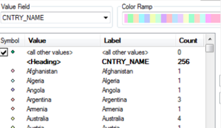

# Types of Geospatial Information

!!! Info

	:material-arrow-right-box: Purpose: To introduce the most common types of data in GIS.
	
	:timer: Estimated time to complete: 30-40 minutes

	:fontawesome-solid-user: Prepared by: Nicole Kong, Associate Professor, GIS Specialist, Purdue University (kongn@purdue.edu). 

	:material-creative-commons: License: Except where otherwise noted, content in this tutorial is licensed under a [Creative Commons Attribution 4.0 International license](https://creativecommons.org/licenses/by/4.0/).

## Introduction

Geographic Information Systems (GIS) can use several different types of data. The "type" introduced in this tutorial refers to the data models or formats that GIS professionals typically use to collect and share information. It does not refer to the information's topic, content, purpose, source, or other aspects.

## Geospatial Information Types

- Most GIS data, but not all, is stored in one of the following data models:
    - Vector
    - Raster
    - Tabular

* Geospatial information can also be extracted from scanned maps.

* GIS data can be hosted online using web services.

### Vector Data

* Vector data is comprised of vertices and lines (or arcs)
* It is represented explicitly in the form of XY coordinates.
* The 3 basic geometry types for vector data are:
	* **Points** - XY coordinates (examples: cities, schools, incident locations)
	* **Lines** - connecting the points in a set order (example: roads, streams)
	* **Polygons** - a set of points connected in a particular order and closed, the 1st and last point are the same (examples: a state, county, or census block)

* Most GIS applications do not allow mixed geometry type
In a single layer

<figure markdown>

<figcaption>Vector Data Types *Used by permission of Paul Bolstad, GIS Fundamentals</figcaption>

</figure>

* Each vector feature has attribute data that describe it.

<figure markdown>

<figcaption>Attribute Data</figcaption>

</figure>

* Vector data are usually saved as a shapefile or a feature class in a geodatabase. In Arc/Info (1980-1999), it was saved in a format called "coverage".

* Vector symbology:

<figure markdown>

<figcaption>Single Symbol</figcaption>

</figure>

<figure markdown>

<figcaption>Categorical Symbol</figcaption>

</figure>

<figure markdown>

<figcaption>Quantitative Symbol</figcaption>

</figure>

### Raster Data

* Raster data is made up of pixels. 
* Each pixel has its own value.
* Raster data is usually used to represent surfaces.
* Raster data models are commonly used for: 
	* digital elevation models (DEM)
	* aerial and satellite imagery 
	* land use / land cover maps

* Raster data resolution: cell dimension, or the size of pixels.
* Raster images can consume a large amount of storage space.

<figure markdown>

<figcaption>Raster Data Types *Used by permission of Paul Bolstad, GIS Fundamentals</figcaption>

</figure>

* Types of raster data:

  * **Discrete** rasters have distinct themes or categories. Each class can be discretely defined, usually ba integer values. Example, land cover/use map.

  * **Continuous** rasters are grid cells with gradual changing data such as elevation and temperature.

<figure markdown>

<figcaption>Continuous and Categorical Data *Used by permission of Paul Bolstad, GIS Fundamentals</figcaption>

</figure>

* Raster data are usually saved in the format of raster dataset, GeoTIFF, or many other formats.

### Vector vs. Raster

|   |**Vector**|**Raster**|
|---|---|---|
|**Positional Precision**|Can be precise|Defined by cell size|
|**Attribute Precision**|Poor for continuous data|Good for continuous data|
|**Output Quality**|Very good, map like|Fair to poor, depending on resolution|
|**Data Structure**|Often complex|Often quite simple|
|**Storage Requirement**|Relatively small|Often quite large|
|**Spatial Analysis**|Good topology relationship|Good for modeling|

### Tabular Data

Tables with geospatial information can be used for mapping purposes in GIS.

  * Tables with spatial information that can be joined with an existing map 

  * Tables with XY coordinate information

  * Tables with address information

  * Geocoded data

### Scanned Maps

A scanned map stored as an image file.

  * Georeferenced scanned map: has a linked file that stores spatial information so that it can be overlayed with other digital maps in GIS. Usually stored as GeoTIFF.

  * Un-georeferenced scanned map: The presence of coordinates in the record’s metadata does not make the map georeferenced. Can be saved as TIFF or JPG, etc.

<figure markdown>

<figcaption>A Scanned Map</figcaption>

</figure>

### Web Services - GIS

* A streaming GIS layer that can be viewed and queried in a browser or GIS application.

* Types of GIS web services - they are often provided using either Esri format or open standard defined by Open Geospatial Consortium (OGC)

<table>
  <tr>
    <th rowspan="4">Esri</th>
    <td>ArcGIS Dynamic Map Layer Service</td>
    <td>Vector data. Map image layers are dynamically rendered.</td>
  </tr>
  <tr>
    <td>ArcGIS Feature Layer Service</td>
    <td>Displays vector data as individual or collected features.</td>
  </tr>
  <tr>
    <td>ArcGIS Image Map Layer Service</td>
    <td>Displays raster data (a grid of cells used to store imagery).</td>
  </tr>
  <tr>
    <td>ArcGIS Tiled Map Layer Service</td>
    <td>Displays set of web-accessible tiles that reside on a server.</td>
  </tr>
  <tr>
    <th rowspan="2">OGC</th>
    <td>Web Mapping Service (WMS)</td>
    <td>Renders a geospatial dataset as map images.</td>
  </tr>
    <td>Web Feature Service (WFS)</td>
    <td>Serves queryable geographic features.</td>  
  <tr>
    <th>IIIF</th>
    <td>International Image Interoperability Framework (IIIF)</td>
    <td>Displays an image from a server. This image can be panned and zoomed.</td>
  </tr>
</table>

## How to Find Data in the BTAA Geoportal

The [BTAA Geoportal search results page](https://geo.btaa.org/?search_field=all_fields&q=) provides a facet for **Resource Class**. This allows a user to filter by the following categories:

* **Datasets:** vector or raster data
* **Maps:** scanned maps and photographs
* **Web Services:** any item with a web service, such as an ArcGIS REST service or an OGC web service
* **Imagery:** aerial photography and satellite imagery
* **Websites:** interactive web resource, such as a dashboard or online map
* **Collections:** a thematic or administrative group of records

## Exercise

Find an example for each of following type of data from [BTAA Geoportal](https://geo.btaa.org). Discuss the use cases of each data type, as well as pros/cons of the particular data type.

  * Vector data
  * Raster data
  * Scanned map
  * Web service

-------------
*Tutorial content edited by BTAA-GIN 2025*
