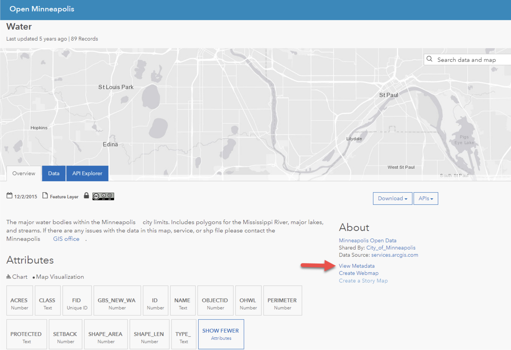
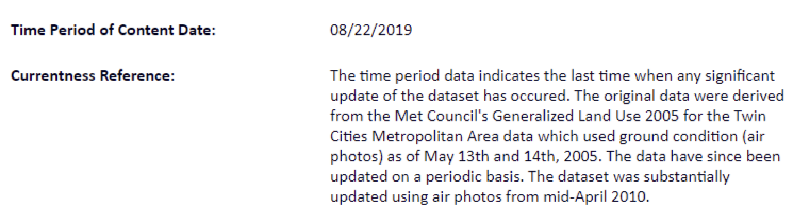
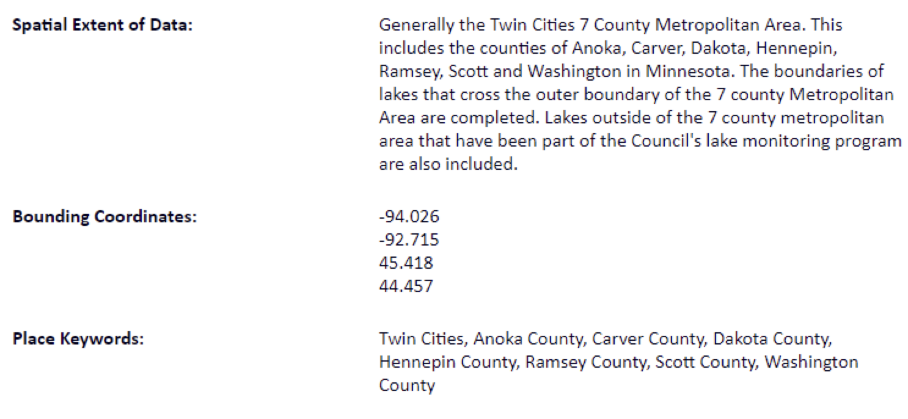
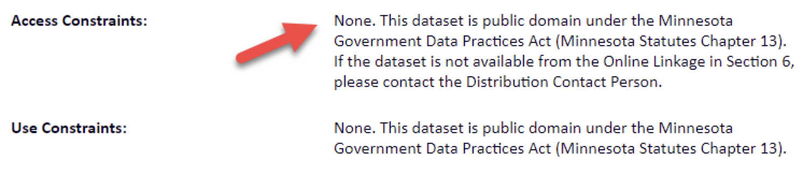
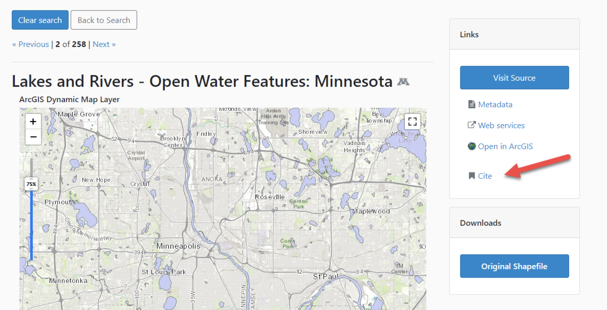

# Evaluate Geospatial Data

!!! Info

	:material-arrow-right-box: Purpose: To help students evaluate geospatial information.

	
	:timer: Estimated time to complete: 30-40 minutes

	:fontawesome-solid-user: Prepared by: Ryan Mattke, Map & Geospatial Information Librarian, University of Minnesota (matt0089@umn.edu). 

	:material-creative-commons: License: Except where otherwise noted, content in this tutorial is licensed under a [Creative Commons Attribution 4.0 International license](https://creativecommons.org/licenses/by/4.0/).
	
??? Note "Note for Instructors"

	This introductory tutorial can support class and research projects in any discipline where students are expected to use geospatial data but may be less familiar with how to locate and access potential sources of those data.

	The tutorial is divided into two activities that can be used separately or in conjunction with one another depending on course- or assignment-level learning objectives. These activities may be appropriate for students at both the undergraduate and graduate level.

	The tutorial was designed to allow for use in in-person, hybrid, and fully online instructional contexts, and instructors could assign the activities to be completed individually or in small groups depending on course structure and goals.
	
## Learning Objectives

Through completing this tutorial, students will:

1. Determine whether or not metadata exists for a given resource
1. Review available metadata to evaluate a geospatial dataset for authority, quality, and fitness for use
1. Understand where to find citation information

## Introduction

Geospatial data are any data referenced to locations on the earth. Geospatial data provide information about the locations and shapes of, and relationships between, geographic features. For more information on finding data, see [Finding Geospatial Data.
](03_find-geospatial-data.md)

Geospatial data can be found in various types and formats. For a brief overview, see this tutorial about [Types of Geospatial Information.](01_types-of-geospatial-information.md)

!!! tip

	Click on any of the images in this tutorial to zoom in.

## Locating the metadata

Locating metadata can be tricky, as it is usually *recommended* that data providers create some kind of metadata, but it is rarely *required*.

For the example below, I searched for “lakes rivers” and focused the map on the Minneapolis area. The first two results both appear to be possible options.

<figure markdown>
  { width="500" }
  <figcaption>Searching the BTAA Geoportal</figcaption>
</figure>

After clicking on one of the options, we can see the data extent (upper right), get basic information (green arrows), visit the data source (yellow arrow), or view the metadata directly (red arrow). There is also a citation option (purple arrow).

<figure markdown>
  { width="500" }
  <figcaption>The "Lakes and Rivers" item page</figcaption>
</figure>

Clicking the Visit Source button provides us with even more information, including the original metadata (which can also be accessed directly through the Geoportal).

<figure markdown>
  { width="500" }
  <figcaption>"Lakes and Rivers" on the source website</figcaption>
</figure>

Clicking on the other option, we can still get basic information (green arrow) and visit the data source (yellow arrow), but there is no direct metadata link. However, in this case, there is the option of web services (purple arrow).

<figure markdown>
  { width="500" }
  <figcaption>The "Water" item page</figcaption>
</figure>

Clicking the Visit Source button does provide us with more information, including a View Metadata link.

<figure markdown>
  { width="500" }
  <figcaption>"Water" on the source website</figcaption>
</figure>

...but sometimes that link does not provide us with much additional information. In this case, just a brief description.

<figure markdown>
  { width="500" }
  <figcaption>The metadata for "Water" on the source website</figcaption>
</figure>

## Activity 1

Use the worksheet provided to take some notes related to these questions to determine whether or not metadata exists for a given resource.

[Link to worksheet](https://docs.google.com/document/d/1xVvLaKe_yPx5AnXYOb9mRuWLqt3di-6Zp7DRJFAV9ik/edit?usp=sharing)

## Examining the Metadata

The [Federal Geographic Data Committee](https://www.fgdc.gov/metadata) has a good definition of metadata: 
> “Metadata is information about data. Similar to a library catalog record, metadata records document the who, what, when, where, how, and why of a data resource. Geospatial metadata describes maps, Geographic Information Systems (GIS) files, imagery, and other location-based data resources.”

### Metadata's Importance

Though it often involves extra steps beyond finding useful geospatial data, the evaluation of the data is equally important.

* Metadata is important, as it allows the user to critically evaluate and assess the credibility, authority, and accuracy of the data. Metadata provides necessary context.
* Metadata often contains information about how the data can be used.
* Metadata also enables proper attribution and citation.

### Metadata categories

Metadata records are often split into different categories of information.

<figure markdown>
  { width="500" }
  <figcaption>The metadata sections for "Lakes and Rivers"</figcaption>
</figure>

<figure markdown>
  { width="500" }
  <figcaption>Metadata categories</figcaption>
</figure>

#### Temporal Information

For example, the metadata might contain information about when the data was published or last edited, but also about when the data was originally created

<figure markdown>
  { width="500" }
  <figcaption>Temporal information</figcaption>
</figure>

#### Spatial Information

The metadata will usually have bounding coordinates, but might also have a textual description of the spatial extent.

<figure markdown>
  { width="500" }
  <figcaption>Spatial information</figcaption>
</figure>

#### Attribute Information

The metadata often contains information about what attribute information is included, which can be important in selecting the right data for your project, and can also help decode the attribute names.

<figure markdown>
  { width="500" }
  <figcaption>Attribute information</figcaption>
</figure>

#### Rights Information

Some data might be public domain.

<figure markdown>
  { width="500" }
  <figcaption>Constraints information</figcaption>
</figure>

While other data may be available, but have some restrictions on reuse

<figure markdown>
  { width="500" }
  <figcaption>License information</figcaption>
</figure>

#### Attribution and Citation

Data attribution and citation is also important, as it allows others to examine and/or replicate your work.  In the BTAA Geoportal, we provide a “Cite” link which will give you basic citation information about the data

<figure markdown>
  { width="500" }
  <figcaption>Cite widget in the BTAA Geoportal</figcaption>
</figure>

## Activity 2

Use the worksheet provided to review available metadata to evaluate a geospatial dataset for authority, quality, and fitness for use.

[Link to worksheet](https://docs.google.com/document/d/1nub46MEObsAa02vS1hZ3_i3HkQViuiCSfwC5UEwe--o/edit?usp=sharing)

## Resources

Additional resources for evaluating geospatial information:

Spatial Reference Information: [Introduction to Spatial References (Esri)
](https://developers.arcgis.com/documentation/core-concepts/spatial-references/)

[Federal Geospatial Data Committee](https://www.fgdc.gov/metadata)

* [What is Metadata?](https://www.fgdc.gov/metadata/documents/WhatIsMetaFiles/WhatIsMetadataPDF)
* [Metadata Fact Sheet](https://www.fgdc.gov/resources/factsheets/documents/GeospatialMetadata-July2011.pdf)
* [Value of Metadata](https://www.fgdc.gov/metadata/documents/ValueOfMetaFiles/ValueOfMetaPDF)