!!! Info

	:material-arrow-right-box: Purpose: To help students evaluate geospatial information.

	
	:timer: Estimated time to complete: 30-40 minutes

	:fontawesome-solid-user: Prepared by: Jay Bowen, GIS Specialist, University of Iowa (jay-bowen@uiowa.edu). 

	:material-creative-commons: License: Except where otherwise noted, content in this tutorial is licensed under a [Creative Commons Attribution 4.0 International license](https://creativecommons.org/licenses/by/4.0/).

??? Note "Note for Instructors"

	This tutorial is intended for GIS users with an established cursory understanding of how to use GIS software for visualizing spatial data and making maps, regardless of whether they are graduate, undergraduate, or faculty/staff users. These users may have encountered web services for GIS in formats like WMS, WMTS, or WFS, but are unsure of how to use them. This tutorial is meant to introduce users to these formats, demonstrate how to find them in the BTAA Geoportal, and show how to use them in QGIS, ArcGIS Desktop, ArcGIS Online, and ArcGIS Pro. For an extra challenge involving the use of ArcGIS Feature Services to create [a web map with Leaflet](https://jebowe3.github.io/using-web-services/Iowa-511/index.html), please follow the [link to my tutorial on GitHub](https://jebowe3.github.io/using-web-services/).

	These slides walk through the steps of loading an ArcGIS Feature Service in several of the most commonly used GIS platforms. Please use the links provided on the Loading Web Services: Menu page to jump to the appropriate slides for your preferred software.

	The tutorial was designed for in-person, hybrid, and online instructional contexts. The self-guided review activity can be assigned to be completed after class, or as a live activity where students can pose questions to the instructor and other students, in person or through a chat window, as they work through it.

------------------------------

## Learning Objectives

Through completing this tutorial, students will:

1. Learn the basics of GIS web services - What are they? What kind of data do they host? What are the benefits and drawbacks?
2. Locate and load an ArcGIS Feature Service with the BTAA Geoportal and their preferred GIS software.
3. Find and load their own web service through the BTAA Geoportal and consider the utility of their data to different kinds of users.

!!! tip

	Click on any of the images in this tutorial to zoom in.

## Intro to Web Services

Several types of web services available to GIS users that serve geospatial data in different formats from web servers. As documented in the tutorial, Types of Geospatial Information by Nicole Kong, geospatial data for web services fall into four categories: vector, raster, tabular, and scanned maps. For this exercise, we will focus on the categories below:

| Data Type   | What is it?                                                | Relevant Web Service          |
|-------------|------------------------------------------------------------|-------------------------------|
| Vector      | Discrete points, lines, or polygons                        | WFS/ArcGIS Feature Service    |
| Raster      | Continuous pixelated data with each pixel assigned a value | WMS/ArcGIS Map Service        |
| Scanned Map | A scanned sheet map in image format                        | WMTS/ArcGIS Tiled Map Service |

Effective use of all these services will likely save you a lot of time downloading, cleaning, processing, and managing your data.

### Web Feature Service (WFS)

:  Features: Direct access to vector data curated by the organization hosting the data. You will not need to join tabular data from one source to shapefiles from another source, and you will often have a direct connection to consistently updated data.

:  Drawbacks: Updates to the tables are dependent upon the host. What happens if the server goes down or the data cease to be updated? For regularly updated data, it can be difficult to determine all possible values for classification purposes, if only a portion are used frequently, and the metadata are not very detailed.

### Web Map Service (WMS)

:  Features: Renders geospatial data as map images. Similar benefits to WFS.

:  Drawbacks: Can be quite limiting if derived from data that were originally in vector format – loss of associated tabular data.

### Web Map Tile Service (WMTS)

:  Features:  Access to scanned maps that are already georeferenced. Saves a lot of time considering how painstakingly slow georeferencing can be! 

:  Drawbacks: The georeferencing is not always great. You may find yourself redoing it anyway.

!!! Question
    Can you think of any drawbacks or reasons why it might be preferable to download, process, and manage your own data?

## Locating Services

For the purposes of this exercise, let’s map leaking underground storage tanks in Iowa.

   1. Navigate to the [BTAA Geoportal](https://geo.btaa.org/). Search for “Iowa leaking tanks.”
   2. In the results, under “Limit your search,” scroll down to “Resource Class” and click “Web Services.” This will limit your results to web services (not needed here, but it will help if you have many search results).
   3. Click the result entitled “Leaking Underground Storage Tanks: Iowa,” hosted by the Iowa DNR.
   4. In the upper right corner, under “Links,” click “Web Services.” Now you have access to a web service URL!

!!! Tip
	For a more thorough exploration of using the BTAA Geoportal, please see the tutorial entitled Finding Geospatial Data by Joshua Sadvari. 

## Loading Web Services

There are slightly different steps for loading web services depending upon which GIS platform you are using. 

### QGIS
Now that you have access to a web service, you will want to know how to use it in your preferred GIS software. For this exercise, we will use QGIS.

  1. Open QGIS and go to the Layer drop down menu. Click Add Layer > Add ArcGIS FeatureServer Layer.

	<figure markdown>
	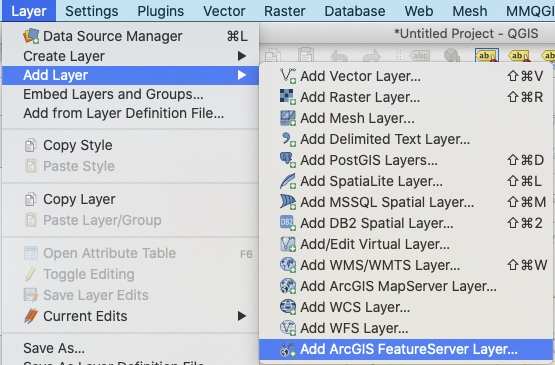{ width="500" }
	<figcaption>Add an ArcGIS FeatureServer Layer in QGIS</figcaption>
	</figure>

  2. In the window that opens, click “New” to establish a new connection between QGIS and the web service.

  	<figure markdown>
   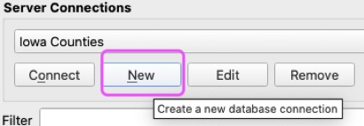{ width="500" }	<figcaption>New server connection in QGIS</figcaption>
	</figure>

  3. Give your connection a meaningful name, like “Iowa Environment Data”
  4. Paste the URL obtained from the geoportal into the empty box next to “URL” and click “OK.”

    <figure markdown>
   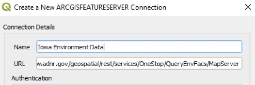{ width="500" }	<figcaption>Name and enter your service URL</figcaption>
	</figure>
	
	!!! Warning
   
    	Make sure that you cut off everything in the address after “MapServer,” ex: https://programs.iowadnr.gov/geospatial/rest/services/OneStop/QueryEnvFacs/MapServer
	
  5. The Server Connection window will appear. Highlight “Leaking Underground Storage Tanks” and click “Add” at the bottom of the window.

    <figure markdown>
   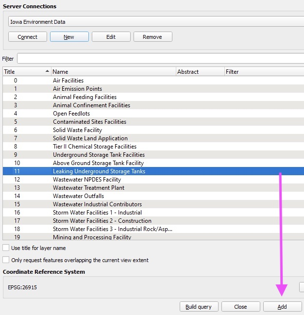{ width="500" }	<figcaption>QGIS Server Connection Window</figcaption>
	</figure>
	
  6. “Leaking Underground Storage Tanks” will appear in your Table of Contents. If you have not added a base map, do so now. As you can see, the map window is crowded with many symbols, but you now have data from a web service in your map window!
	
	<figure markdown>
   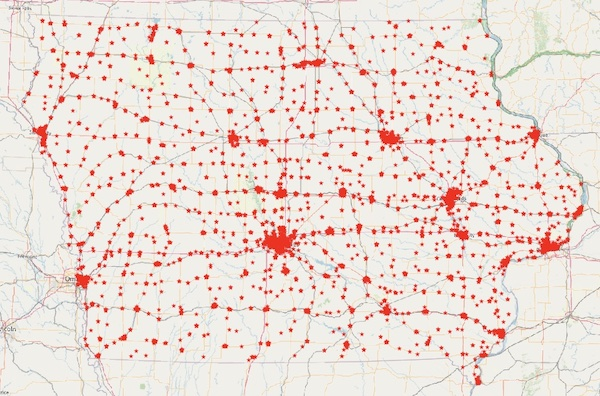{ width="500" }	<figcaption>Iowa Leaking Underground Storage Tanks web service</figcaption>
	</figure>
	
  7. Look at the attribute table and play around with editing the symbology based on one of the fields. There is a lot of interesting info!

  	<figure markdown>
   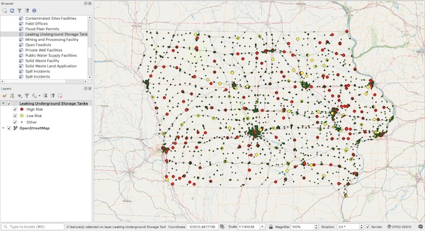{ width="500" }	<figcaption>Iowa Leaking Underground Storage Tanks web service with layer styling</figcaption>
	</figure>
	

### ArcGIS Pro
Now that you have access to a web service, you will want to know how to use it in your preferred GIS software. For this exercise, we will use ArcGIS Pro.

   1. Open ArcGIS Pro, go to the Insert tab, and click “Connections.”

    <figure markdown>
       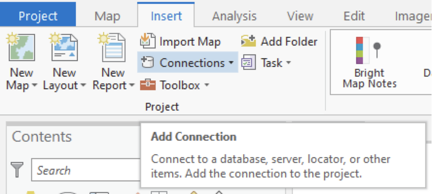{ width="500" }<figcaption>ArcGIS Pro Insert Tab</figcaption>
    </figure>
2. Click “New ArcGIS Server.”	
    <figure markdown>
	   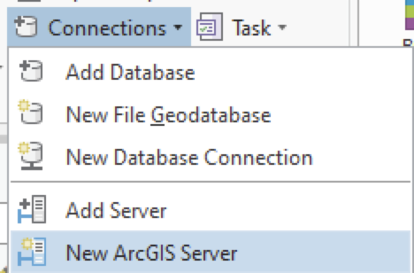{ width="500" }<figcaption>ArcGIS Pro Connections. In these options, you will also notice options for other types of web services. You can experiment with adding these later.</figcaption>
    </figure>
3. Paste the URL obtained from the geoportal into the empty box next to Server URL and click “OK.”
    <figure markdown>
	   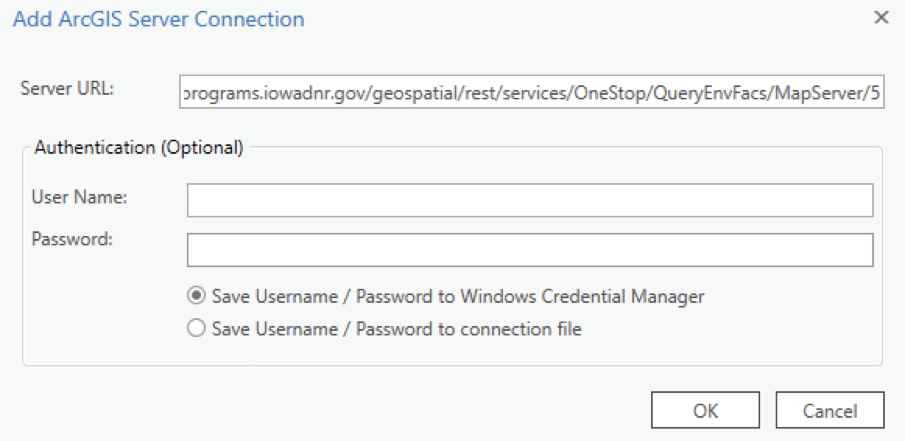{ width="500" }.   <figcaption>ArcGIS Pro Add Connection</figcaption>
    </figure>
4. In the Catalog window, open “Project,” expand “Servers,” and expand the service you just connected.
    <figure markdown>
   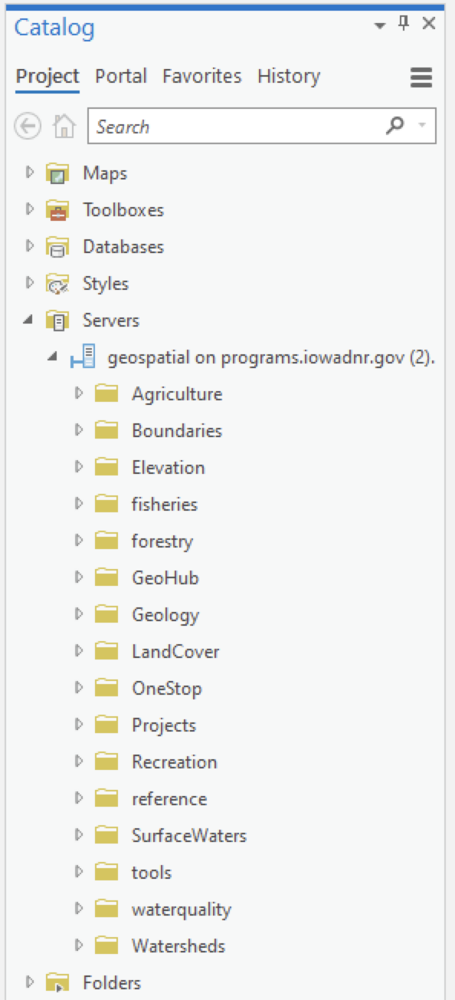{ width="500" }<figcaption>ArcGIS Pro Project Tab. Notice that you are connected to all the services the Iowa DNR offers.</figcaption>
    </figure>
5. Expand “OneStop” and “QueryEnvFacs.”
6. Use “Leaking Underground Storage Tanks” and select “Add To Current Map.”
    <figure markdown>
   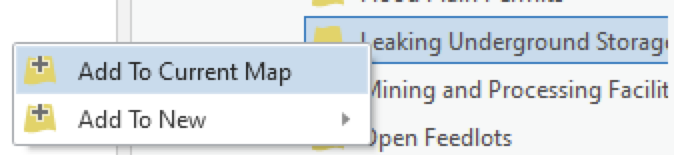{ width="500" }<figcaption>ArcGIS Pro add web service</figcaption>
	</figure>

    <figure markdown>
   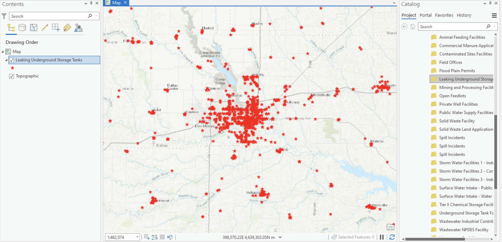{ width="500" }<figcaption>ArcGIS Pro map. You may need to zoom into your map in order to see the data, as it is scale-dependent upon loading in Pro. You will also notice that the map window is crowded with many symbols, but you now have data from a web service in your map window!</figcaption>
	</figure>
7. Look at the attribute table and play around with editing the symbology based on one of the fields. There is a lot of interesting info!
    <figure markdown>
   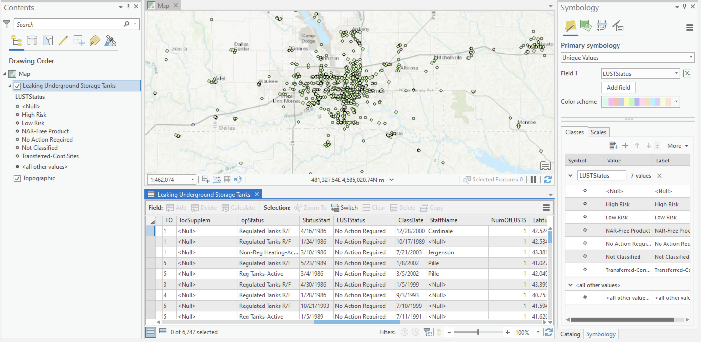{ width="500" }<figcaption>ArcGIS Pro attribute table</figcaption>
	</figure>

### ArcGIS Online
Now that you have access to a web service, you will want to know how to use it in your preferred GIS software. For this exercise, we will use ArcGIS Online.
Make sure to select “An ArcGIS Server Web Service” for this data. You will also notice options for other types of web services. You can experiment with adding these later.

1. Open ArcGIS Online, go to the Add tab, and click “Add Layer from Web.”
    <figure markdown>
   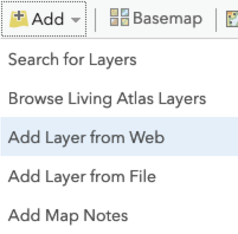{ width="500" }<figcaption>ArcGIS Online Add Layer</figcaption>
	</figure>
2. Copy and paste the web service URL in the empty box next to “URL” and click “Add Layer.”
    <figure markdown>
   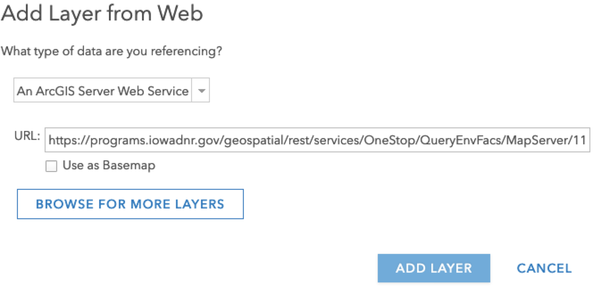{ width="500" }<figcaption>ArcGIS Online Add Layer</figcaption>
	</figure>
	
	<figure markdown>
   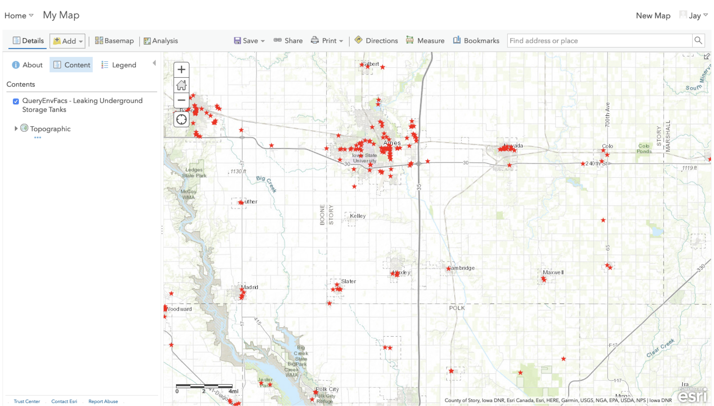{ width="500" }<figcaption>ArcGIS Online Add Layer. ArcGIS Online will automatically add the data to your map window. You will notice that there is a high density of similar symbols, but you now have data from a web service in your map window!</figcaption>
	</figure>
	
3. Look at the attribute table and play around with editing the symbology based on one of the fields. There is a lot of interesting info!

	<figure markdown>
   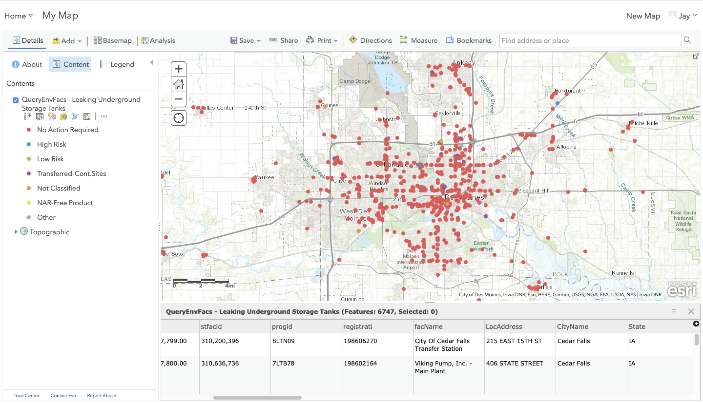{ width="500" }<figcaption>ArcGIS Online Attribute Table</figcaption>
	</figure>

### ArcGIS Desktop
Now that you have access to a web service, you will want to know how to use it in your preferred GIS software. For this exercise, we will use ArcGIS Desktop.

1. Open ArcGIS Pro, open the Catalog window
	<figure markdown>
   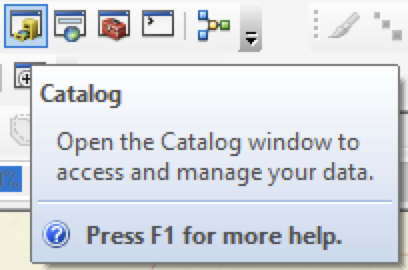{ width="500" }<figcaption>ArcGIS Desktop Catalog</figcaption>
	</figure>
2. Maximize “GIS Servers” and click “Add ArcGIS Server.”
	<figure markdown>
   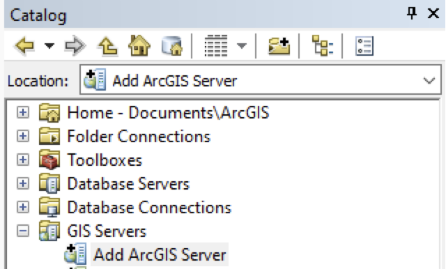{ width="500" }<figcaption>ArcGIS Desktop - add ArcGIS Server</figcaption>
	</figure>
3. Paste the web service URL into the box next to “Server URL” and click “Finish.”
	<figure markdown>
   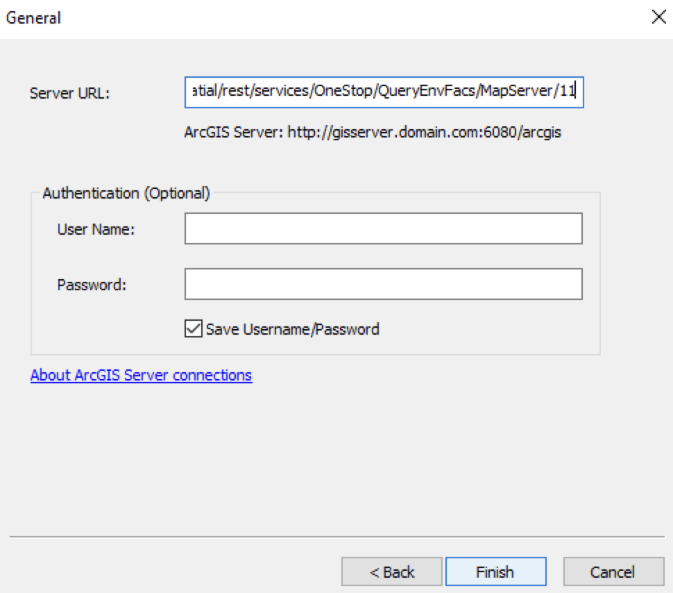{ width="500" }<figcaption>ArcGIS Desktop</figcaption>
	</figure>
4. Choose “Use GIS Services” and click “Next.”
	<figure markdown>
   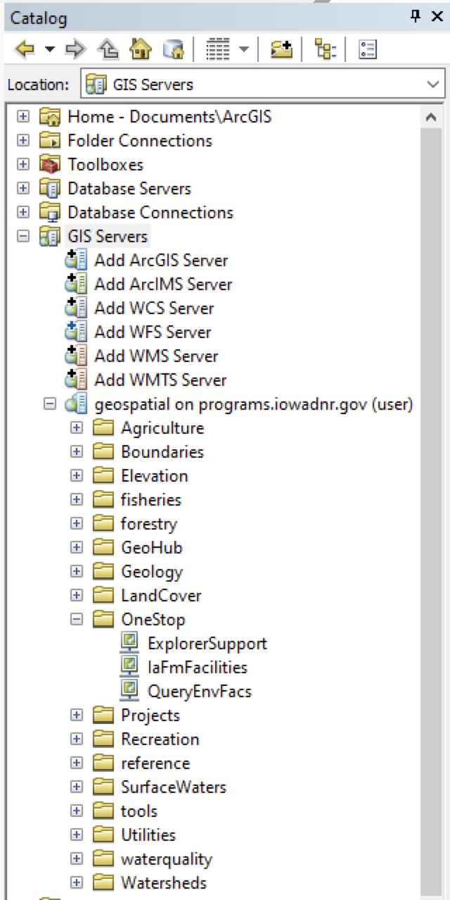{ width="500" }<figcaption>ArcGIS Desktop</figcaption>
	</figure>
5. In the Catalog window, expand the service you just connected. Expand “OneStop.”
6. Drag and drop “QueryEnvFacs” into your map window. Add a basemap if you have not done so.
7. In the Table of Contents, maximize “OneStop/QueryEnvFacs, find “Leaking Underground Storage Tanks” and tick the box next to it.
    <figure markdown>
   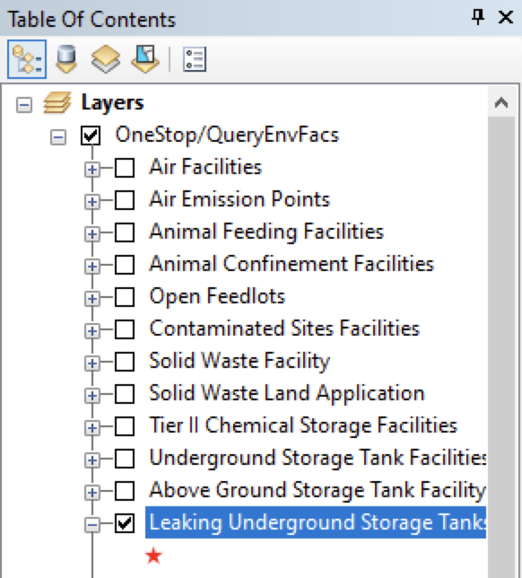{ width="500" }<figcaption>ArcGIS Desktop</figcaption>
	</figure>
8. It is likely that you will not be able to see the symbols on the map. Zoom into a city or region and they will appear. You will notice that there is a high density of similar symbols, but you now have data from a web service in your map window!
	<figure markdown>
   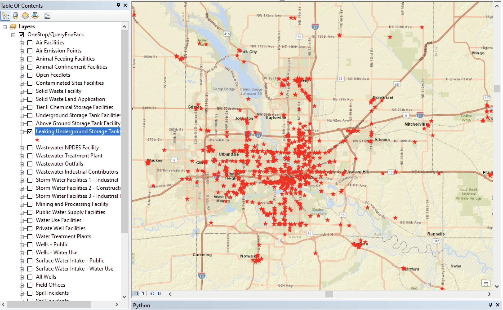{ width="500" }<figcaption>ArcGIS Desktop</figcaption>
	</figure>

## Exercise

Using the skills learned here, use the BTAA Geoportal to: 

1. Find a web service of your choice
1. Connect to it in QGIS or ArcGIS
1. Load the data in your map window
1. Take a screenshot of your data in the map window, add it to a Google doc, and write a paragraph explaining how this service might be useful to different kinds of users (general public, students, researchers, professionals, etc.).

