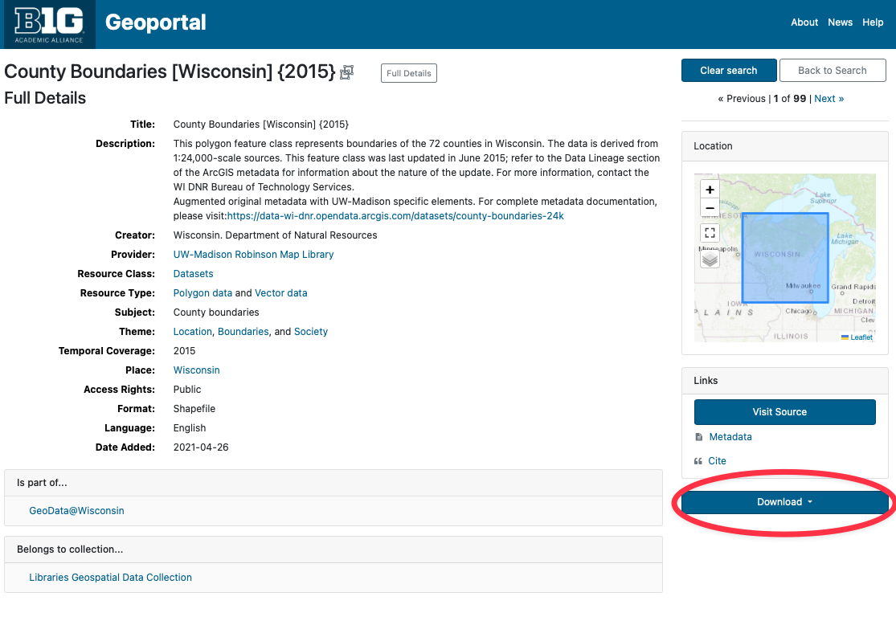
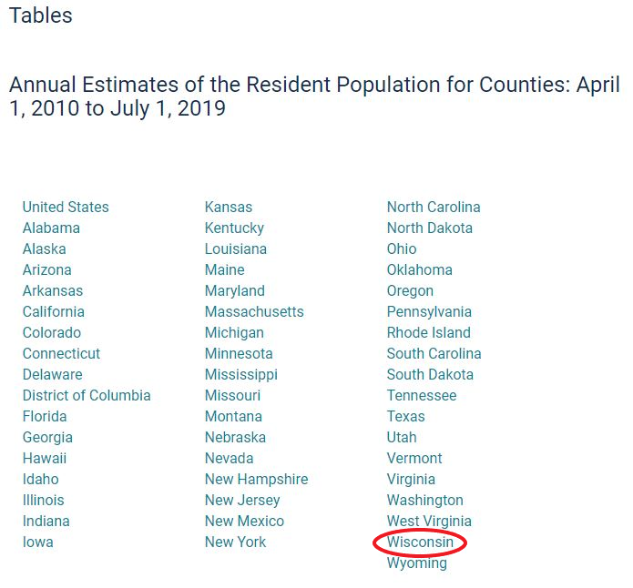
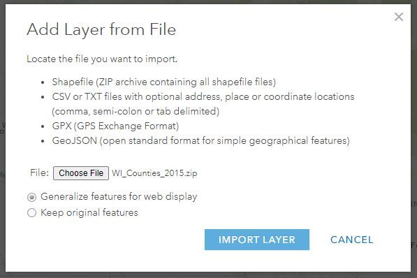
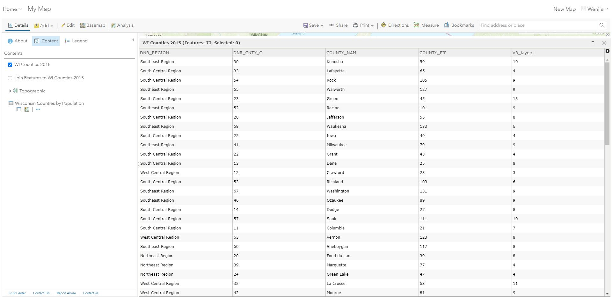
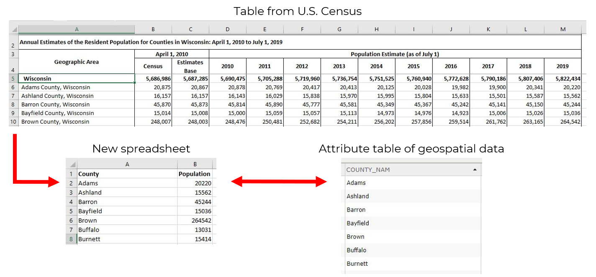
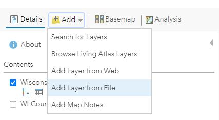
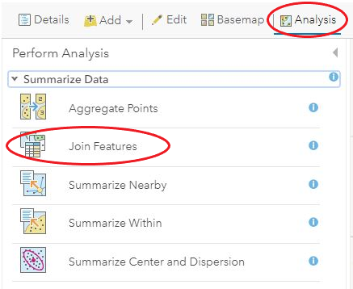
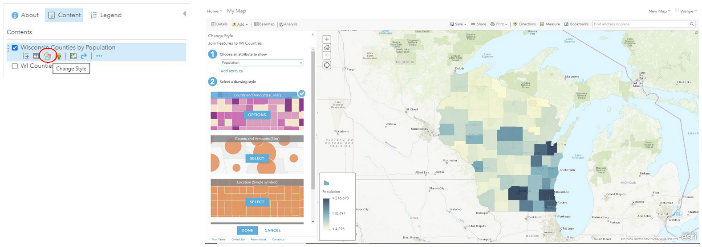
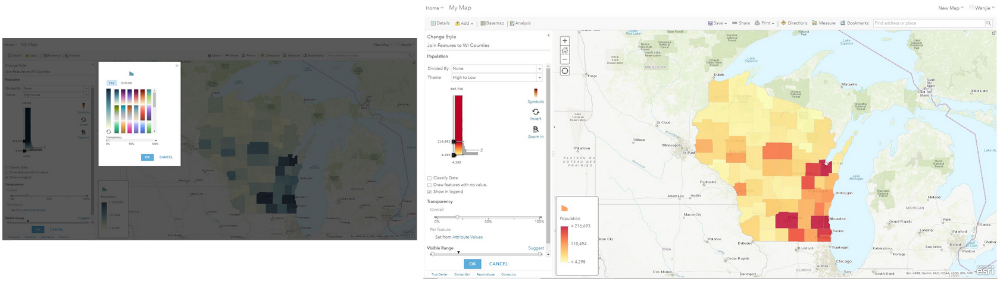
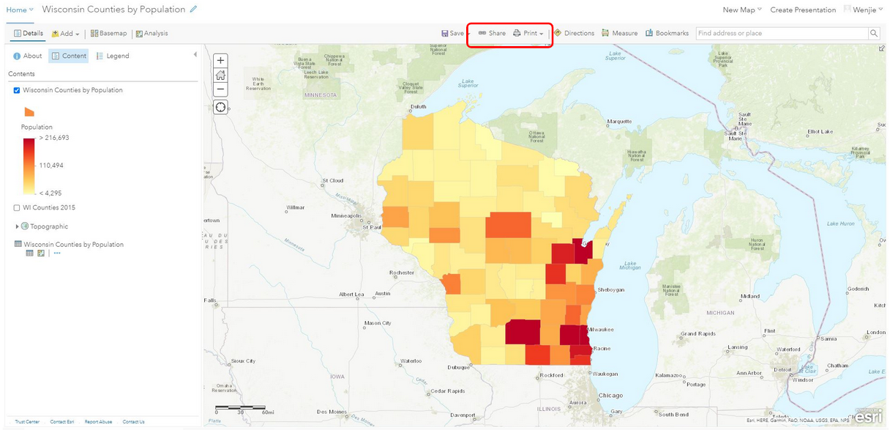

!!! Info

	:material-arrow-right-box: Purpose: To demonstrate how to use tabular data in GIS.
	
	:timer: Estimated time to complete: 40-50 minutes

	:fontawesome-solid-user: Prepared by: Wenjie Wang, GIS Specialist, University of Illinois at Urbana-Champaign (wenjiew@illinois.edu). 

	:material-creative-commons: License: Except where otherwise noted, content in this tutorial is licensed under a [Creative Commons Attribution 4.0 International license](https://creativecommons.org/licenses/by/4.0/).

------------------------------

??? Note "Note for Instructors"

	This tutorial gives an example to help students understand GIS technology allows people to connect data with geography. GIS can relate unrelated information by using location as the key index variable. Sometimes people don’t fully understand their data until they see how it relates to other things in a geographic context. And GIS can help people understand what belongs where.

	Through this tutorial, student can get familiar with how to link tabular data to geospatial data by using ArcGIS Online. Instructors can add more exercises based on students’ need.

## Download Data

The following steps show how to find geospatial data from BTAA geoportal and tabular data from U.S. Census.

!!! tip

	Click on any of the images in this tutorial to zoom in.

1. Visit the [BTAA Geoportal](https://geo.btaa.org) and search with the keywords `county boundary of Wisconsin`

2. Open the result "County Boundaries [Wisconsin] {2015}"

3. Click the Download button and select "Original Shapefile" to download the data. Save as "WI_Counties_2015.zip". This polygon feature class represents boundaries of the 72 counties in Wisconsin. The data is derived from 1:24,000-scale sources. This feature class was last updated in June 2015.
    <figure markdown>
     { width="500" }
     <figcaption>Polygon Feature Class for Wisconsin County Boundaries</figcaption>
    </figure>
4. Open U.S. Census website (<https://www.census.gov/en.html>) and search the keywords `wisconsin counties by population`
5. Open the first result "County Population Totals: 2010-2019" and click Wisconsin to download the table.

    <figure markdown>
{ width="500" }<figcaption>Annual Estimates of the Resident Population for Counties in Wisconsin: April 1, 2010 to July 1, 2019 (CO-EST2019-ANNRES-55), U.S. Census Bureau, Population Division, March 2020</figcaption>
    </figure>

## Prepare Data

1. Log into ArcGIS Online and create a Web Map
    <figure markdown>
    { width="500" }<figcaption>Adding a Layer in ArcGIS Online</  figcaption>
    </figure>
2. Add WI_Counties_2015.zip as a new layer from File
    <figure markdown>
    { width="500" }<figcaption>Choosing a File in ArcGIS Online</figcaption>
    </figure>
3. Choose an attribute to show. Here we use “show location only”
    <figure markdown>
    { width="500" }<figcaption>Choosing an Attribute to Show in ArcGIS Online</figcaption>
    </figure>
4. Click “show table” button to open attribute table and get to know what information was included in the geospatial dataset.
    <figure markdown>
    { width="500" }<figcaption>Show Table in ArcGIS Online</figcaption>
    </figure>
    <figure markdown>
    { width="500" }<figcaption>Attribute Table in ArcGIS Online</figcaption>
    </figure>
5. Create a new excel file and name it as "Wisconsin Counties by Population.csv". Copy and paste the county name column and population in 2019 column from U.S. Census spreadsheet into this new excel file. We need to use county name as the common field to link those two tables. Therefore, the name of counties in both table should be the same.

    !!! warning "Notice"
    		
    		Paste the values only and revise the name of counties by using the Replace tool.

    <figure markdown>
    { width="500" }<figcaption>Shared Attribute Between Two Tables</figcaption>
    </figure>
6. Add the “Wisconsin Counties by Population.csv” as a new layer and choose “None, add as table”
    <figure markdown>
    { width="500" }<figcaption>Add Layer from File</figcaption>
    </figure>
    <figure markdown>
    { width="500" }<figcaption>Add CSV</figcaption></figure>

## Data Process

The following steps show how to link tabular data to the geospatial data: 

1. Click Analysis and choose Join Features
    <figure markdown>
    { width="500" }<figcaption>Joining Features</figcaption>
    </figure>
2. Choose WI_Counties_2015 as the “Target Layer” and Wisconsin Counties by Population as the “Layer to Join to the Target Layer”.
3. Choose the “COUNTY_Nam” and “County” as the fields to match.
4. Choose a one-to-one join operation and name the result layer as Wisconsin Counties by Population.
    <figure markdown>
    { width="500" }{ width="500" }<figcaption>Join Features Input Form</figcaption>
    </figure>
5. Click the Run Analysis button, and a new layer based on population will be shown.
    <figure markdown>
    { width="500" }<figcaption>Join Output</figcaption>
    </figure>
6. Symbolize the Wisconsin Counties by Population layer by clicking “change style” button
    <figure markdown>
    { width="500" }<figcaption>Change Layer Style</figcaption>
    </figure>
7. Choose the appropriate style to clearly show the population
    <figure markdown>
    { width="500" }<figcaption>Reset Choropleth Symbology</figcaption>
    </figure>
8. Share or Print the Wisconsin Counties by Population map
9. For copyright information, refer to the copyright tutorial
    <figure markdown>
    { width="500" }<figcaption>Share or Print</figcaption>
    </figure>

## Exercise

!!! Questions

    1. What's the advantage of mapping tabular data?

    2. Choose different basemap and use different symbol to create different thematic map.

    3. Download a shapefile data related to students’ research field and link their tabular data to it.
