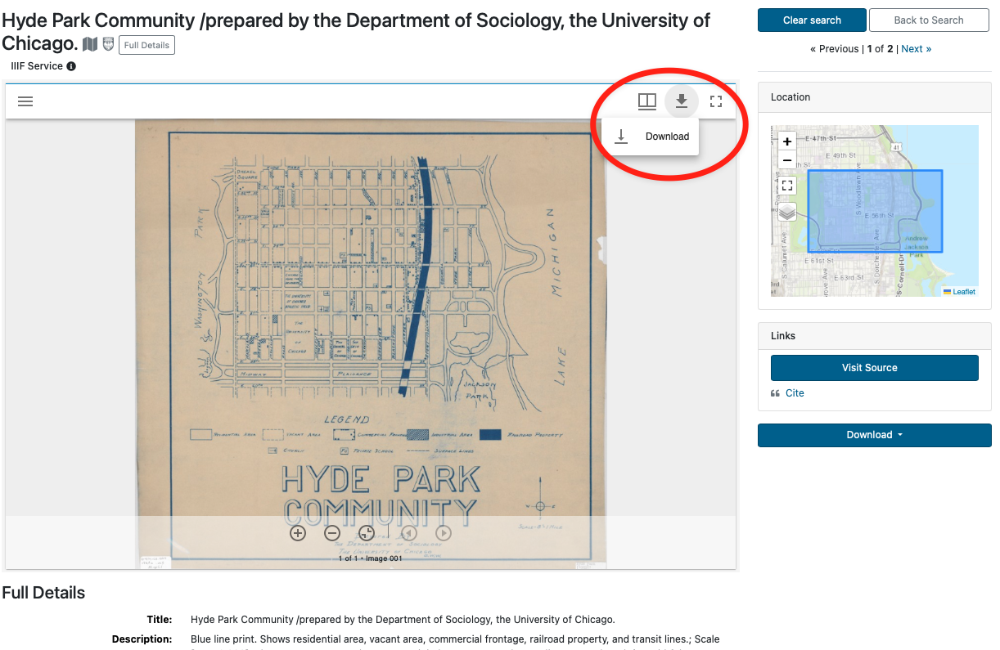
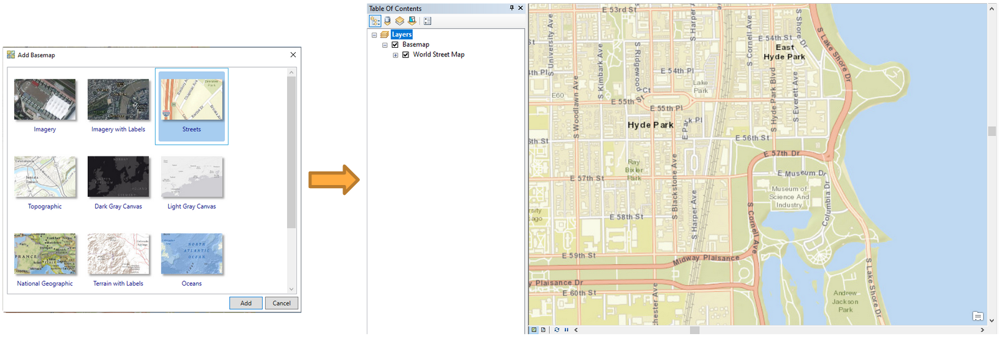
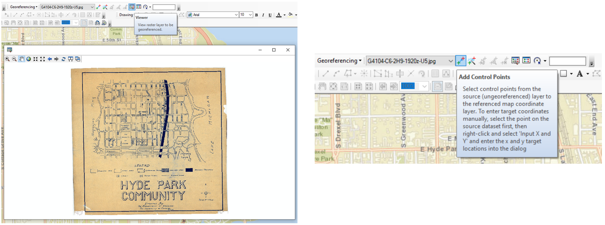
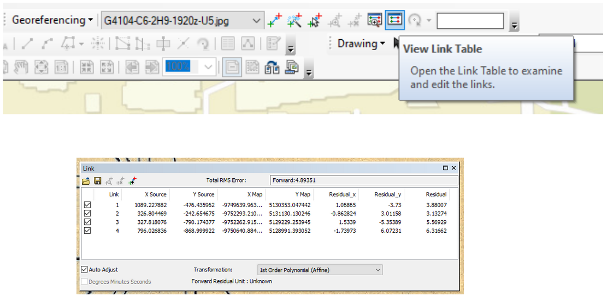
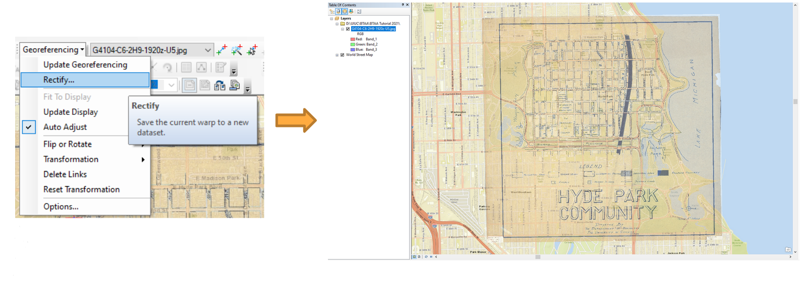
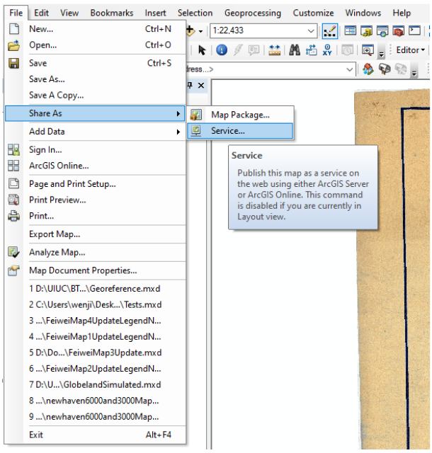
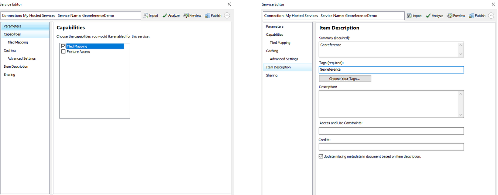
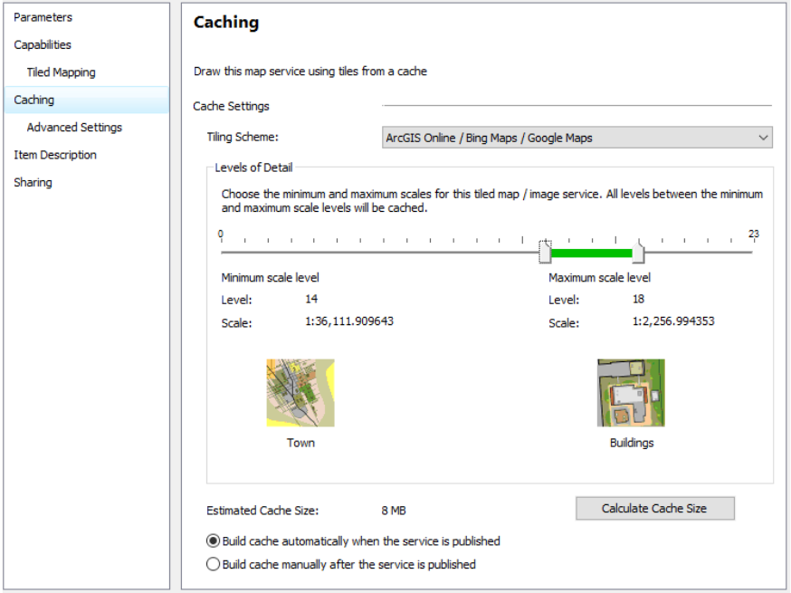

!!! Info

	:material-arrow-right-box: Purpose: How to georeference a map in ArcMap.
	
	:timer: Estimated time to complete: 40-50 minutes

	:fontawesome-solid-user: Prepared by: Wenjie Wang, GIS Specialist, University of Illinois at Urbana-Champaign (wenjiew@illinois.edu). 

	:material-creative-commons: License: Except where otherwise noted, content in this tutorial is licensed under a [Creative Commons Attribution 4.0 International license](https://creativecommons.org/licenses/by/4.0/).

------------------------------

## Introduction

Georeferencing is a commonly used tool to accurately digitize data on a paper map. It uses a series of control points in the digital image to associate this image with spatial locations. The digital image could be an aerial photograph, a scanned map, or a picture of a topographic map. The georeferenced map can be used for basic map analysis, such as calculating distances and areas. In this tutorial, you will learn how to georeference a historical map by using ArcMap. 

!!! tip

	Click on any of the images in this tutorial to zoom in.

## Download Data

1. Visit the [BTAA Geoportal](https://geo.btaa.org) and search with the keywords `Hyde Park Community`
2. Open the result titled "Hyde Park Community /prepared by the Department of Sociology, the University of Chicago."
3. Click the down arrow at the top right of the image preview box and select a resolution to download.
    <figure markdown>
     { width="500" }
     <figcaption>Download an image</figcaption>
    </figure>
4. Right click the map and save the image as “ark_61001_b2pn1qx6zj2q.jpg”

## Data Processing

1. Open ArcMap
2. Click **Add Basemap** and choose Streets map
3. Zoom in to the study area: Hyde Park, Chicago, Illinois
    <figure markdown>
    { width="500" }<figcaption>Add Basemap and Zoom to Hyde Park</figcaption>
    </figure>
4. Click **Add Data** and choose the image “ark_61001_b2pn1qx6zj2q.jpg”
5. Click **Customize** -> **Toolbar** -> **Georeferencing** to add georeferenced tool
6. Click **Fit To Display** to show the image in the study area.
    <figure markdown>
    { width="500" }<figcaption>Fit Scanned Map to Display</figcaption>
    </figure>
7. Right click Layers -> Properties and select **WGS_1984_Web_Mercator_Auxiliary_Sphere** as the coordinate system. 
    <figure markdown>
    { width="500" }<figcaption>Set Coordinate System</figcaption>
    </figure>
8. Click **Viewer** to show the image in a new window.
9. Click **Add Control Points** to select control points. Select control points from the viewer window, and then choose the corresponding location in the street map.
    <figure markdown>
    { width="500" }<figcaption>Add Control Points</figcaption>
    </figure>
10. Select control points in the area close to the four corners of the map.
11. Select additional control points. The more points you assign the more accurate your georeferenced map will be.
    <figure markdown>
    { width="500" }<figcaption>More Control Points</figcaption>
    </figure>

    !!! Tips
    	Here are some tips for choosing control points:

    	- The number of control points needed depends on the image being used. Normally, at least four control points are required for georeferencing.

    	- Choose road crossings or sidewalk intersections, because the edges of roads may change over time.

    	- The control points should be spread across the unreferenced image.

12. Click **View Link Table**. It is up to you to determine the acceptable residual values. If a link has a residual value much larger than others, the link should be deleted. 
    <figure markdown>
    { width="500" }<figcaption>Residual Values</figcaption>
    </figure>
13. After georeferencing, click **Rectify** to save the result.
14. In the layer property, change transparency to 50%. It is an easy to compare the georeferenced map locations with the real world locations.
    <figure markdown>
    { width="500" }<figcaption>Make Map Overlay Semi-Transparent</figcaption>
    </figure>

## Publish Map on ArcGIS Online

This topic is optional. To publish a hosted layer, you will need publishing privileges in your ArcGIS organizational account.

!!! Warning
	
	Publishing a tiled service to ArcGIS Online will consume credits, which are the currency used across ArcGIS. To estimate how many credits you will need to perform specific transactions or store data, you can refer to this website: https://doc.arcgis.com/en/arcgis-online/administer/credits.htm

1. Sign in with your university account.
2. Remove Basemap
3. Click **File** -> **Share as** -> **Service**
4. Choose Publish a service
5. Choose a connection and enter service name
    <figure markdown>
    { width="500" }<figcaption>Share as a Service</figcaption>
    </figure>
6. Select **Tiled Mapping**
7. Enter information in Item Description
8. In the Sharing tab, you can choose to share your service with yourself (private), your organization, or everyone (public) 
    <figure markdown>
    { width="500" }<figcaption>Enter Service Information</figcaption>
    </figure>
9. Select appropriate levels of detail. Do not choose extreme large cashe size, which may consume all your credits. 
10. Click the **Publish** button to publish this service.
11. Tile Packages can be used to save credits. You will not be charged for generating tiles. You will only be charged for tile storage. For more information, please refer to:  https://www.esri.com/about/newsroom/arcuser/use-tile-packages-to-save-credits/
    <figure markdown>
    { width="500" }<figcaption>Define Scale Range for Tiles</figcaption>
    </figure>
12. Log in to ArcGIS Online and open the published map in your Content. The map can be digitized for further usage. For more information, please refer to the Digitizing tutorial.
    <figure markdown>
    { width="500" }<figcaption>Open in ArcGIS Online</figcaption>
    </figure>