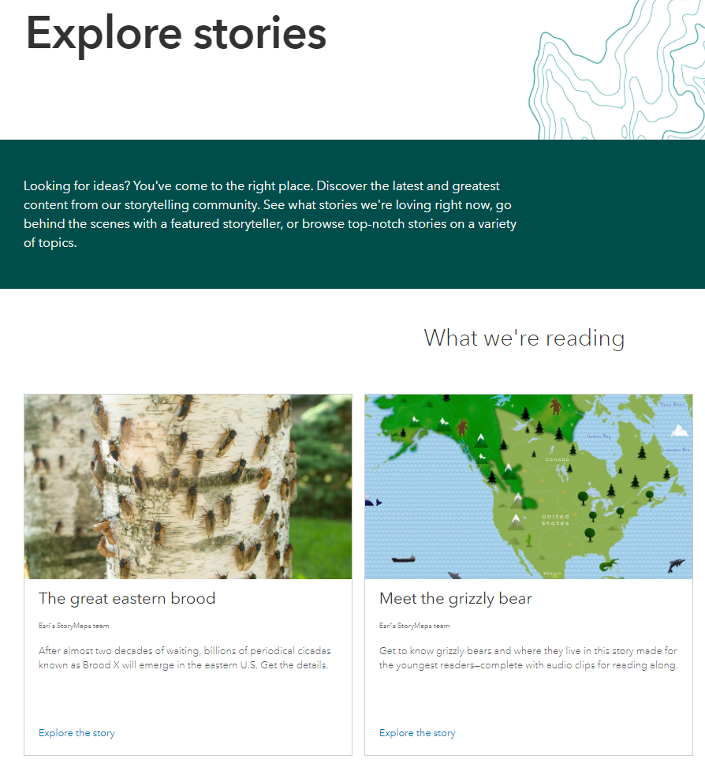
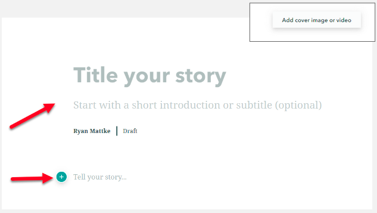
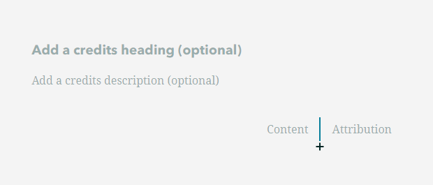
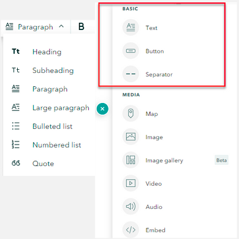
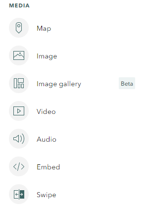
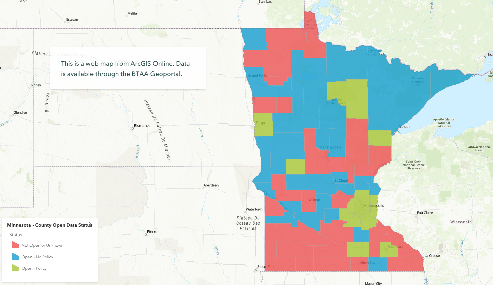

!!! info

	:material-arrow-right-box: Purpose: To provide a brief introduction to the capabilities of ArcGIS Story Maps.
	
	:timer: Estimated time to complete: variable

	:fontawesome-solid-user: Prepared by: Ryan Mattke, Map and Geospatial Information Librarian, University of Minnesota (matt0089@umn.edu). 

	:material-creative-commons: These slides and the accompanying activities are licensed under a [Creative Commons Attribution 4.0 International](https://creativecommons.org/licenses/by/4.0/) license.

------------------------------

## Introduction

Story Maps are an application within ArcGIS Online which allows you to integrate web maps with text, images, and other multimedia content.

Story Maps allow you to:

-   Put your web maps in context

-   Compare web maps and data sets

-   Experiment!

!!! tip

	Click on any of the images in this tutorial to zoom in.

<figure markdown>

{ width="500" }<figcaption>[Explore Stories](https://www.esri.com/en-us/arcgis/products/arcgis-storymaps/stories)</figcaption>

</figure>

## Basics

The first step is to log on to ArcGIS Online, go to your Content section, and click Create then Story Maps.

<figure markdown>

{ width="500" }<figcaption>Create Story Map</figcaption>

</figure>

Give your story a title and a subtitle and/or an introduction.

Add cover image or video (upper right).

Click the “+” symbol to add content to the story map.

<figure markdown>

{ width="500" }<figcaption>Adding Title and Content</figcaption>

</figure>

Be sure to take advantage of the options (at the bottom/end of the story map) to add credits and content attribution.

<figure markdown>

{ width="500" }<figcaption>Adding Credits</figcaption>

</figure>

Basic options for content:

-   Text ‒ Options include heading, subheading, paragraph, , large paragraph, bulleted list, numbered list, and quote

-   Button ‒ To highlight a link with text

-   Separator ‒ Insert a horizontal line

<figure markdown>

{ width="500" }<figcaption>Content Options</figcaption>

</figure>

Media options for content:

-   Map ‒ Insert a web map or web app from ArcGIS Online

-   Image ‒ Upload or link to a jpg, png, gif, or svg file

-   Image Gallery ‒ Insert a gallery of up to 12 images

-   Video ‒ Upload or link to video content

-   Audio ‒ Upload or link to audio content

-   Embed ‒ Embed using iframe code or a web url; this could be a website, or even another story map

-   Swipe ‒ Compare two web maps or images

<figure markdown>

{ width="500" }<figcaption>Media Options</figcaption>

</figure>

Immersive options for content:

-   Slideshow ‒ Full screen, media-focused layout

-   Sidecar ‒ Stationary text/media panel with a scrolling narrative panel that can include web maps

-   Map tour ‒ Showcase a set of locations

## Intermediate

Once you have the basics down, try something a little more fancy... 

Immersive options for content:

-   Slideshow ‒ Full screen, media-focused layout

-   Sidecar ‒ Stationary text/media panel with a scrolling narrative panel that can include web maps

-   Map tour ‒ Showcase a set of locations

<figure markdown>

{ width="500" }<figcaption>Immersive Options</figcaption>

</figure>

## Explore

[Example Story Map from the Big Ten Academic Alliance Geospatial Data Project](https://storymaps.arcgis.com/stories/4c3e1c4e72764a43914862193574c028)

<figure markdown>

{ width="500" }<figcaption>Compare Maps</figcaption>

</figure>

<figure markdown>

{ width="500" }<figcaption>Open Data Status</figcaption>

</figure>

<figure markdown>

{ width="500" }<figcaption>Compare Images</figcaption>

</figure>

## Resources

-   [Instruction for Creating Dynamic Digital Narratives](https://storymaps.arcgis.com/stories/d15f1045ffcb4fdea7672d1cafafdc12)

-   [Nine steps to great storytelling](https://storymaps.arcgis.com/stories/429bc4eed5f145109e603c9711a33407)

-   [Five Principles of Effective Storytelling](https://storymaps-classic.arcgis.com/en/five-principles/)

-   [Esri Resources Page](https://www.esri.com/en-us/arcgis/products/arcgis-storymaps/resources)

-   [Visual storytelling: Bring your narrative to life with an effective mix of photos](https://www.esri.com/arcgis-blog/products/story-maps/constituent-engagement/visual-storytelling-bring-your-narrative-to-life-with-an-effective-mix-of-photos/)

-   [How to make an awful story map](https://storymaps.arcgis.com/stories/585db547dd7f4403bb30a3eb13fd55ad)
