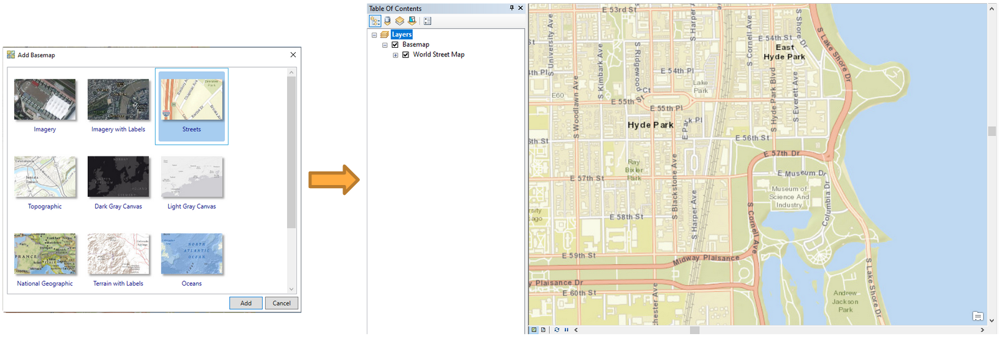
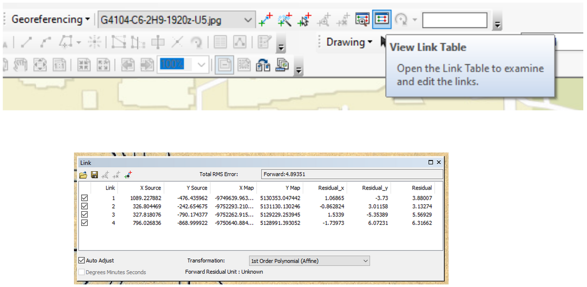
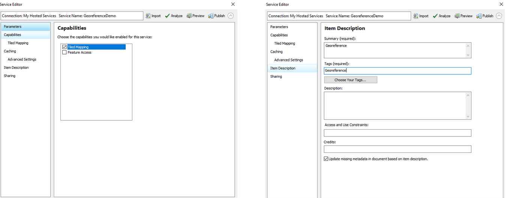
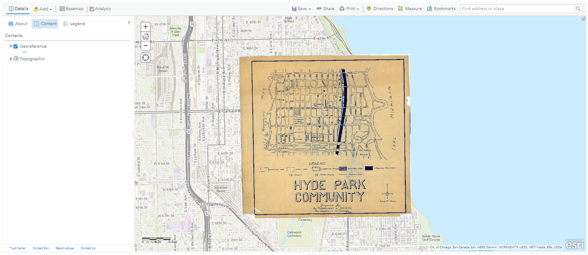

# Georeference

*This tutorial is part of an educational series produced by members of the [Big Ten Academic Alliance Geospatial Information Network](https://geo.btaa.org).*

:fontawesome-solid-user: Prepared by: Wenjie Wang, GIS Specialist, University of Illinois at Urbana-Champaign (wenjiew@illinois.edu). 

:material-creative-commons: These slides and the accompanying activities are licensed under a [Creative Commons Attribution 4.0 International](https://creativecommons.org/licenses/by/4.0/) license.

------------------------------

## Overview of Georeferencing

Georeferencing is a commonly used tool to accurately digitize data on a paper map. It uses a series of control points in the digital image to associate this image with spatial locations. The digital image could be an aerial photography, a scanned map, or a picture of a topographic map. The georeferenced map can be used for basic map analysis, such as calculating distances and areas. In this tutorial, you will learn how to georeference a historical map by using ArcMap. 

## Download Data

1. Open BTAA geoportal: https://geo.btaa.org/

2. Search term “Hyde Park Community”

3. Click Original Jpeg button to open the map

4. Right click the map and save image as “G4104-C6-2H9-1920z-U5.jpg”

## Data Processing

1. Open ArcMap

2. Click Add Basemap and choose Streets map

3. Zoom in to the study area: Hyde Park, Chicago, Illinois

<figure markdown>

<figcaption>Add Basemap and Zoom to Hyde Park</figcaption>

</figure>

4. Click Add data and choose the image “G4104-C6-2H9-1920z-U5.jpg”

5. Click Customize -> Toolbar -> Georeferencing to add georeferenced tool

6. Click Fit To Display to show the image in the study area.

<figure markdown>

<figcaption>Fit Scanned Map to Display</figcaption>

</figure>

7. Right click Layers -> Properties and select WGS_1984_Web_Mercator_Auxiliary_Sphere as the coordinate system. 

<figure markdown>

<figcaption>Set Coordinate System</figcaption>

</figure>

8. Click Viewer to show the image in a new window.

9. Click Add control Points to select control points. Select control points from the viewer window, and then choose the corresponding location in the street map.

<figure markdown>

<figcaption>Add Control Points</figcaption>

</figure>

10. Select control points in the area close to the four corners of the map.

11. Select additional control points. The more points you assign the more accurate your georeferenced map will be.

<figure markdown>

<figcaption>More Control Points</figcaption>

</figure>

!!! Tips
    Here are some tips for choosing control points:

    - The number of control points needed depends on the image being used. Normally, at least four control points are required for georeferencing.

    - Choose road crossings or sidewalk intersections, because the edges of roads may change over time.

    - The control points should be spread across the unreferenced image.

12. Click View Link Table. It is up to you to determine the acceptable residual values. If a link has a residual value much larger than others, the link should be deleted. 

<figure markdown>

<figcaption>Residual Values</figcaption>

</figure>

13. After georeferencing, click Rectify to save the result.

14. In the layer property, change transparency to 50%. It is an easy to compare the georeferenced map locations with the real world locations.

<figure markdown>

<figcaption>Make Map Overlay Semi-Transparent</figcaption>

</figure>

## Publish Map on ArcGIS Online

- This topic is optional. to publish a hosted layer, you will need publishing privileges in your ArcGIS organizational account.

- Publishing a tiled service to ArcGIS Online will consume credits, which are the currency used   across ArcGIS. To estimate how many credits you will need to perform specific transactions or store data, you can refer to this website: https://doc.arcgis.com/en/arcgis-online/administer/credits.htm

1. Sign in with your university account.

2. Remove Basemap

3. Click File -> Share as -> Service

4. Choose Public a service

5. Choose a connection and enter service name

<figure markdown>

<figcaption>Share as a Service</figcaption>

</figure>

6. Select Tiled Mapping

7. Enter information in Item Description

8. In the Sharing tab, you can choose to share your service with yourself (private), your organization, or everyone (public) 

<figure markdown>

<figcaption>Enter Service Information</figcaption>

</figure>

9. Select appropriate levels of detail. Do not choose extreme large cashe size, which may consume all your credits. 

10. Click Publish button to publish this service.

11. Tile Packages can be used to save credits. You will not be charged for generating tiles. You will only be charged for tile storage. For more information, please refer to:  https://www.esri.com/about/newsroom/arcuser/use-tile-packages-to-save-credits/

<figure markdown>

<figcaption>Define Scale Range for Tiles</figcaption>

</figure>

12. Log in to ArcGIS Online and open the published map in your Content. The map can be digitized for further usage. For more information, please refer to the Digitizing tutorial, which was prepared by Nicole Kong.

<figure markdown>

<figcaption>Open in ArcGIS Online</figcaption>

</figure>