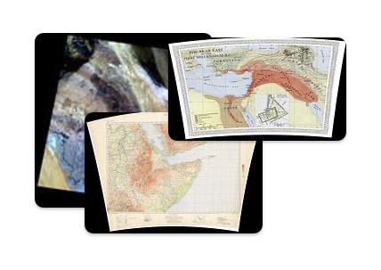
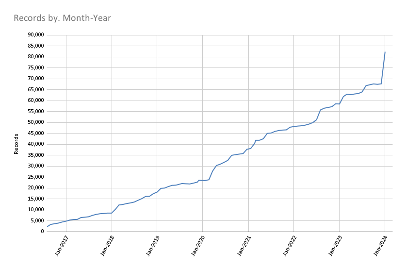

# January 2024 Program Status Update

## Monthly Highlight: New records from University of Chicago institute

<figure markdown="span">
  
  <figcaption>Thumbnails of a few georeferenced items from the CAMEL collection.</figcaption>
</figure>

We added one of our largest set of records this month: [8,605 records from the Center for Ancient Middle Eastern Landscapes, Institute for the Study of Ancient Cultures, University of Chicago](https://geo.btaa.org/catalog/12d-04) ("CAMEL").  This unique collection contains a mix of gereferenced maps and satellite imagery of the evolving Middle Eastern landscape.

<!-- more -->

This milestone represents several months of work. University of Chicago staff began meeting with the BTAA-GIN Product Manager in the summer of 2023 to prepare their metadata and workflows.  After several rounds of iterative testing, we were able to ingest the CAMEL records in January 2024. The U. Chicago staff did a great job of programmatically producing metadata in the [GeoBTAA Aardvark metadata profile,](https://gin.btaa.org/metadata/geobtaa-metadata-application-profile/) and we are able to load their records without needing to perform any augmentation or edits.  :100:

## Program Activities

### Committees

=== "TECHnology"

    * Completed mission statement and charter
    * Reviewed status of international Humanitarian Data Exchange portal
    * Worked on harmful language statement and identified the need to update our policies for accessibility, privacy, and usage.

=== "Community Engagement"

    * Discussing how to identify and share key documents in Google Drive, such as communication templates and reuseable graphics. Planning to set up a sprint to select these documents.
    

=== "Knowledge"

    * Distributed a member survey to identify research priorities as BTAA institutions
    * Reviewed the Journal of Geography and Map Libraries call for proposals related to geoportals and archiving

=== "Coordination"

	Held kickoff meeting and discussed how to structure the monthly Team Meetings.

### Workgroups

The [Geodata Pilot Collection Workgroup](https://docs.google.com/document/d/1yVwFRsQSxGC1zbrOSFMIAU872AuBGgpowt9fGwxcnJc/edit?usp=sharing) held a kickoff meeting, where they discussed the concept of foundational layers and identified guidelines for selecting sample datasets.

### Program Management

* The new Northwestern University Team Member attended a program orientation and began attending Team Meetings. 
* Our graduate student Research Assistant and Product Manager attended a Research Spike with librarians from three University of California schools. They researched [OpenIndexMaps](https://openindexmaps.org) and identified areas where GeoBlacklight needs to be updated for OpenIndexMaps. We created a new [GitHub Project Board](https://github.com/orgs/geobtaa/projects/19) to track our related plans for the BTAA-GIN.
* The BTAA-GIN Executive Committee reviewed our Geodata Collection Strategic Plan, and approved our plans for next steps.

----

## BTAA Geoportal 

### Analytics Statistics

!!! example  inline end "January 2024 by the numbers"

    * Visitors:	4,819
    * Visits:	5,389
    * Downloads:	371
    * Visits with download:	6.88%
    * Outlinks:	869
    * Visits with outlink:	16.13%
    * Num. searches:	1,103
    * Search keywords:	414
    * Pageviews:	14,104

**Unique visitors by month
**

!!! tip "More stats"

	See full statistics on our [Analytics Dashboard](https://tableau.umn.edu/t/UL/views/BTAAGeoportalusageMatomo/Monthlycharts?%3Aembed=y&%3AisGuestRedirectFromVizportal=y)

---

### Collections

==**:material-folder-multiple: Total records as of February 1, 2024: 82,383**==

### January Harvesting Activities

{{ read_csv('tables/harvests_2024-01.csv') }}

### Development

Development primarily focused on deferred maintenance and technology stack upgrade goals that improved performance and better prepares the Geoportal for future Blacklight and GeoBlacklight releases.

* Improved site performance by compressing CSS and JS assets
* upgraded Ruby to v3.3.0
* upgraded Ruby on Rails from v6.1 to v7.0
* upgraded the Mirador IIIF viewer

We also participated in the GeoBlacklight Community Sprint, which began at the end of January. Our goals are to modernize the applications JavaScript libraries, and overhaul the documentation site.

!!! tip "More development details"

	Read the full January [Development Tasks](https://docs.google.com/document/d/1bUyozcaEkA6OQEc9EE5PSiiHnpxw07EVpbUh1T-EHXs/edit?usp=sharing) report for more details.

---

## Next Steps

The next steps on our [Program Roadmap 2023-2024](https://github.com/orgs/geobtaa/projects/10) include the following tasks:

1. **Governance**:  Develop a ==priority projects matrix==
2. **Public documentation**: Teach the Team Members ==how to write in Markdown== and contribute to our new website.
3. **Asset management**: Create a ==Technology Roadmap== that includes Geoportal maintenance as well as the new features required by our Geodata Collection Strategic Plan.

