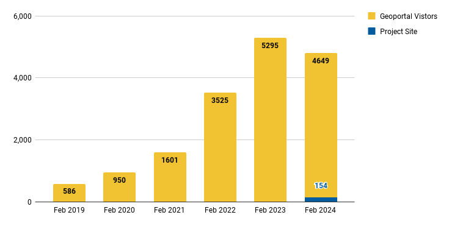
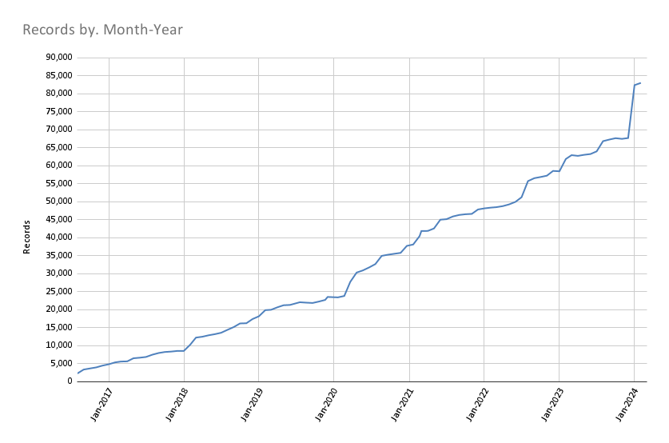
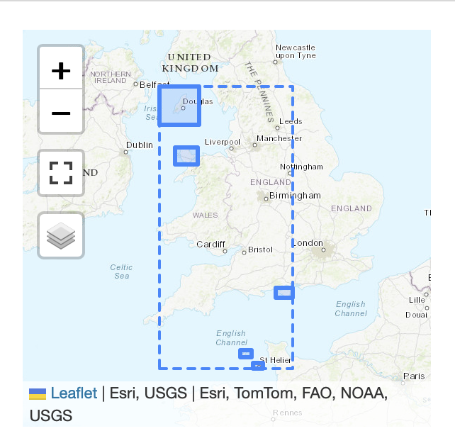

# February 2024 Program Status Update

<!-- more -->

## Monthly Highlight: Northwestern University Joins the BTAA-GIN

{ align=left width=25%}

We are pleased to announce that Northwestern University has become a member of the Big Ten Academic Alliance Geospatial Information Network (BTAA-GIN). This addition to our network signifies a notable development in our efforts to enhance the collective resources and expertise available to our members.

 

*   **New Team Members from Northwestern University:** We welcome Méch Frazier, GIS Specialist, and Kelsey James Rydland, Head of Digital Scholarship & Research Data Management, from Northwestern University. 
*   **Network Expansion:** With the addition of Northwestern University, the BTAA-GIN now comprises 15 participating institutions. This expansion underscores the network's commitment to supporting geospatial research and education across the entire BTAA.
*   **Updated Participant Map:** Our [participant map](../../../about/participants) has been updated by team member Jay Bowen to include Northwestern University.
*   **Contribution of Scanned Maps:** Northwestern University has contributed 250 scanned maps from their Digital Collections to the BTAA Geoportal. These contributions are from their "16th-Early 20th Century Maps of Africa" and "Maps and Atlases" collections. These maps are now accessible through the BTAA-GIN portal [here](https://geo.btaa.org/?f%5Bdct_isPartOf_sm%5D%5B%5D=15d-01).

## Program Activities

### Committees

=== "TECHnology"

    * Worked on harmful language statement and identified the need to update our policies for accessibility, privacy, and usage.
    * Reviewed work from sunsetted Interface Committee.
    * Decided to close ongoing anonymous geoportal survey, as sufficient feedback has been gathered.
    * Scheduled a metadata Cleanup Sprint for March 22, 2024.

=== "Community Engagement"

    * Collected a list of helpful BTAA-GIN templates and documents
    * Planning a sprint to clean up Google Drive
    

=== "Knowledge"

    * Completed a member survey to identify research priorities as BTAA institutions
    * Began analyzing survey results

=== "Coordination"

	* Devised new structure for Team Meetings to emphasize knowledge sharing and discussions.
	* Issued a call for Priority Projects from each committee.
	

-	### Workgroups

	The [Geodata Pilot Collection Workgroup](https://docs.google.com/document/d/1yVwFRsQSxGC1zbrOSFMIAU872AuBGgpowt9fGwxcnJc/edit?usp=sharing) began researching potential pilot datasets from BTAA member states.

- 	### Program Management

	* We held the first iteration of our revamped monthly [Team Meetings](https://z.umn.edu/b1g-team) that included a lightning presentation, round robin sharing, and discussions.
* We consulted with University of Minnesota library leadership about creating a new position that would be responsible for program & outreach coordination.

----

## BTAA Geoportal 

### Analytics Statistics

!!! example  inline end "February 2024 by the numbers"

    * Visitors:	4,649
    * Visits: 5,258
    * Downloads:	 361
    * Visits with download:	 6.3%
    * Outlinks: 1,190	
    * Visits with outlink: 22.63%
    * Num. searches: 2,415
    * Search keywords: 691
    * Pageviews: 14,115

**Unique visitors by month
**

!!! tip "More stats"

	See full statistics on our [Analytics Dashboard](https://tableau.umn.edu/t/UL/views/BTAAGeoportalusageMatomo/Monthlycharts?%3Aembed=y&%3AisGuestRedirectFromVizportal=y)

---

### Collections

**:material-folder-multiple: Total records as of March 1, 2024: ==83,002==**

<figure markdown="span">
  { width="800" }
  <figcaption>BTAA Geoportal Records from 2016 to March 1, 2024</figcaption>
</figure>

### February Harvesting Activities

{{ read_csv('tables/harvests_2024-02.csv') }}

### Development

* We started a [Technology Roadmap](https://github.com/orgs/geobtaa/projects/17) for the calendar year 2024 to prioritize our needs for a geodata collection pilot.
* We added a facet to filter maps that have been georeferenced.
* We updated the display of complex geometries in the location inset. Now, the rectangular bounding box appears as a dotted line, with the item exent as a solid polygon.

<figure markdown="span">
  { width="300" }
  <figcaption>Example of multipolygon display in Location inset</figcaption>
</figure>

!!! tip "More development details"

	Read the full February [Development Tasks](https://docs.google.com/document/d/1jJouG9WfDrCxxiPXkwknH-zKVGlq5rQv5l7pJMFrCaY/edit) report for more details.

---

## Next Steps

The next steps on our [Program Roadmap 2023-2024](https://github.com/orgs/geobtaa/projects/10) include the following tasks:

1. **Governance**:  Develop a ==priority projects matrix==
2. **Public documentation**: Teach the Team Members ==how to write in Markdown== and contribute to our new website.

