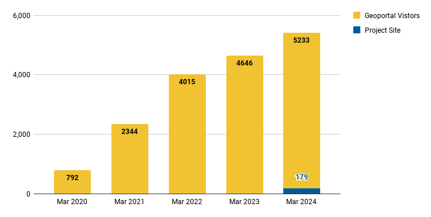
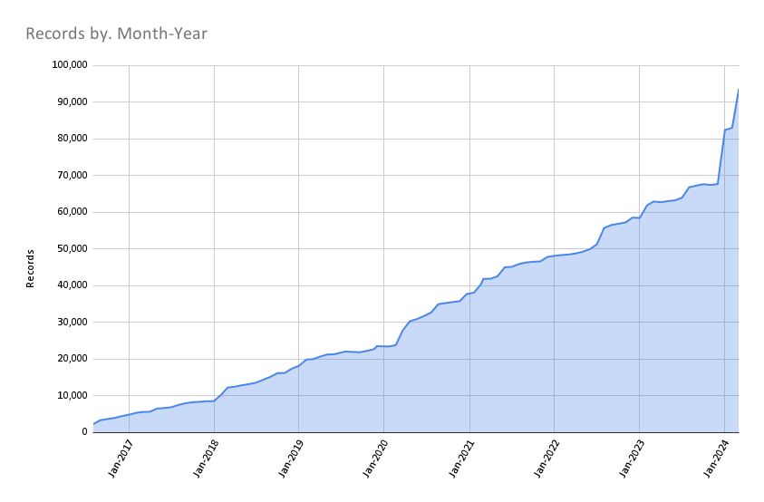

# March 2024 Program Status Update

## Monthly Highlight

We had the honor of being invited by Yale University Libraries to present our expertise in GeoBlacklight, OpenGeoMetadata, and the BTAA Geoportal to their Associate University Librarians. Our overview included development requirements, metadata strategies, collaboration successes, and our recommended priorities. 

Our slides are below:

<iframe src="https://docs.google.com/presentation/d/e/2PACX-1vScmqNGFhuUOYrGMGJv0sx76Fv9i50qppQ8a1mWXBmD8MXhTbQr6hL_Re8aG6gTjbf89LJECZrgBO2G/embed?start=false&loop=false&delayms=3000" frameborder="0" width="600" height="366" allowfullscreen="true" mozallowfullscreen="true" webkitallowfullscreen="true"></iframe>

<!-- more -->

Feedback afterwards indicated that we positively influenced Yale's decision to recommit to their geoportal development with an elevated focus on geospatial metadata. 

## Program Activities

### Committees

=== "TECHnology"

    * Determined six priority projects.
    * Held a metadata Cleanup Sprint for March 22, 2024.

=== "Community Engagement"

    * Scheduled an April sprint to clean up Google Drive
    * Update blog post schedule
    * Discussing how to coordinate Program Team lightning talks
    

=== "Knowledge"

    * Analyzed survey results of Team Member research priorities
    * Drafted charters for two subgroups: Scalable Approaches and Service Models to coordinate the top research priorities

=== "Coordination"

	* Revised instructions for Priority Projects submissions to include all Team Members instead of just committee co-chairs.
	* Made a schedule for upcoming discussion topics, including roadmaps and instituional priorities.
	

-	### Workgroups

	The [Geodata Pilot Collection Workgroup](https://docs.google.com/document/d/1yVwFRsQSxGC1zbrOSFMIAU872AuBGgpowt9fGwxcnJc/edit?usp=sharing) continued researching potential pilot datasets from BTAA member states.

- 	### Program Management

	* Issued a call for priority projects from all Team Members
	* Continued including lightning talks during Team Meetings. Ryan presented on his participation in the National Geospatial Advisory Council.

----

## BTAA Geoportal 

### Analytics Statistics

!!! example inline end "March 2024 by the numbers"

    * Visitors:	5,233
    * Visits: 5,906
    * Downloads:	 191
    * Visits with download:	 3.23%
    * Outlinks: 1,181	
    * Visits with outlink: 20.00%
    * Num. searches: 1,425
    * Search keywords: 536
    * Pageviews: 14,729

**Unique visitors by month
**

### Top 20 Internal Searches

{{ read_csv('tables/searches_2024-03.csv') }}

!!! tip "More stats"

	See full statistics on our [Analytics Dashboard](https://tableau.umn.edu/t/UL/views/BTAAGeoportalusageMatomo/Monthlycharts?%3Aembed=y&%3AisGuestRedirectFromVizportal=y)

---

### Collections

**:material-folder-multiple: Total records as of April 1, 2024: ==93,648==**

<figure markdown="span">
  { width="800" }
  <figcaption>BTAA Geoportal Records from 2016 to April 1, 2024</figcaption>
</figure>

### March Harvesting Activities

{{ read_csv('tables/harvests_2024-03.csv') }}

### Development

We did not pursue application development during March 2024.

---

## Next Steps

The next steps on our [Program Roadmap 2023-2024](https://github.com/orgs/geobtaa/projects/10) include the following tasks:

1. **Governance**:  Develop a ==priority projects matrix==
2. **Public documentation**: Teach the Team Members ==how to write in Markdown== and contribute to our new website.

!!! tip ""

**Upcoming highlight**: In April, our graduate student research assistant will be delivering a public presentation about OpenIndexMaps featuring historical maps in the BTAA Geoportal.

