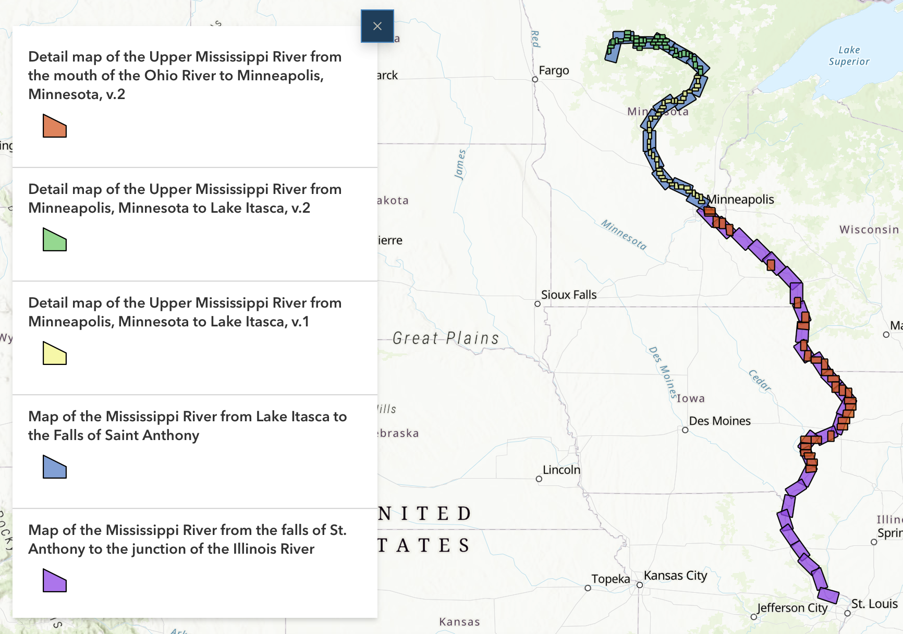
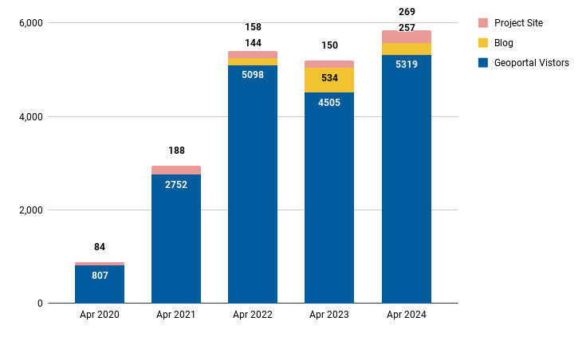
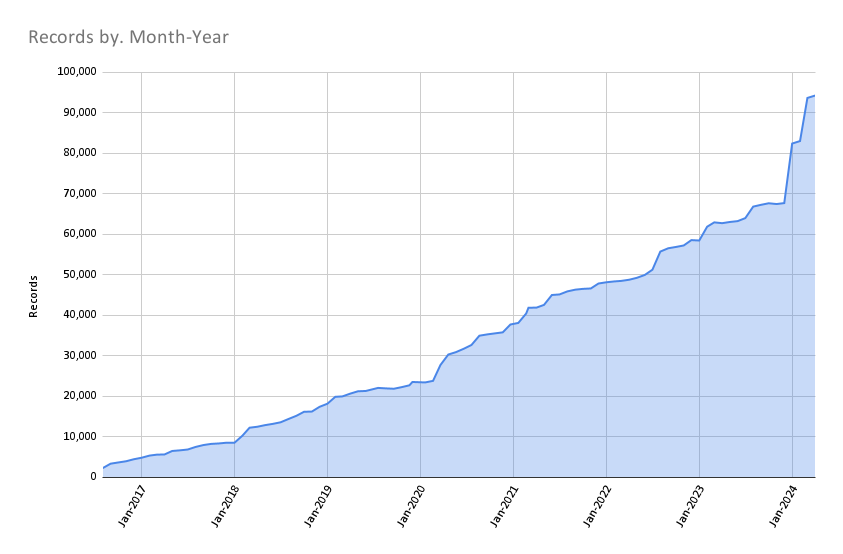

# April 2024 Program Status Update

<!-- more -->

## Monthly Highlight: New OpenIndexMaps for historical Mississippi River atlases

We recently added five OpenIndexMaps for [19th century atlases of the Mississippi River](https://geo.btaa.org/?f%5Bdct_creator_sm%5D%5B%5D=Owen+Connolly&f%5Bgbl_resourceType_sm%5D%5B%5D=OpenIndexMaps). Now, researchers can use an index map within the Geoportal to find and select atlas pages based upon location.

These OpenIndexMaps were created by our 2023-24 graduate research assistant, Owen Connolly. Owen delivered a presentation in April about this work to the Program Team, describing the creation process and demonstrating how the OpenIndexMap GeoJSON format can be ingested into ArcGIS StoryMaps to create interactive narratives. 

<figure markdown="span">
  { width="600" }
  <figcaption><a href="https://storymaps.arcgis.com/stories/c5888d46f39848aa9bd6479afcc6314a">ArcGIS StoryMap displaying all five OpenIndexMaps.</a></figcaption>
</figure>

!!! info

	Owen is the [7th graduate research assistant](../../../about/participants/#graduate-research-assistant-alumni) our program has supported. Several of these students have extended their position to fulfill requirements for the University of Minnesota's Master of GIS (MGIS) degree program, including internships, research credits, and delivering public presentations. 

## Program Activities

### Program Management

* Collected priority projects from all Team Members
* Continued including lightning talks during Team Meetings. Jay Bowen presented on creating vector tiles for [Open Source Interactive Web Maps with Large Datasets](https://docs.google.com/presentation/d/1zdEspVtbFwZKxIjwpiisJONqI5uBjg2f/edit?usp=drive_link&ouid=110955760814577692512&rtpof=true&sd=true).
* Drafted the The [BTAA-GIN Geodata Collection Implementation Plan](https://docs.google.com/document/d/1k3LgZZemeEjVrNNGn8XEXYw4kKJCtM2P0yQjkMkZOBY/edit?usp=sharing) (2024-2026), which extends the [Strategic Plan](../../../library/geodata-collection-strategic-plan) with more details.

### Committees and Workgroups

=== "TECHnology"

    * Reviewed and submitted six priority projects
    * Reviewed results of metadata sprint

=== "Community Engagement"

    * Held an April sprint to clean up Google Drive
    * Reviewed blog post submissions
    

=== "Knowledge"

    * Shared charters for two subgroups: Scalable Approaches and Service Models to coordinate the top research priorities

=== "Coordination"

	* Reviewed institutional goals
	* Updated lightning talk schedule

=== " Geodata Pilot Workgroup"

	* identifying datasets
	* determining the metadata requirements
	* The next steps are to establish AWS S3 storage buckets and upload a few test files.
	

----

## BTAA Geoportal 

### Analytics Statistics

!!! example inline end "April 2024 by the numbers"

    * Visitors:	5,318
    * Visits: 5,950
    * Downloads:	 477
    * Visits with download:	 8.02%
    * Outlinks: 966
    * Visits with outlink: 17.69%
    * Num. searches: 1,168
    * Search keywords: 446
    * Pageviews: 13,950

**Unique visitors by month
**

!!! tip inline end "More stats"

    See full statistics on our [Analytics Dashboard](https://tableau.umn.edu/t/UL/views/BTAAGeoportalusageMatomo/Monthlycharts?%3Aembed=y&%3AisGuestRedirectFromVizportal=y)

### Top 10 Internal Searches

1. sanborn
1. health
1. Montana
1. saginaw
1. buildings
1. eastern asia
1. North Dakota
1. cook county minnesota
1. Riyadh
1. saginaw, michigan

---

### Collections

**:material-folder-multiple: Total records as of May 1, 2024: ==94,242==**

<figure markdown="span">
  { width="800" }
  <figcaption>BTAA Geoportal Records from 2016 to May 1, 2024</figcaption>
</figure>

### April Harvesting Activities

{{ read_csv('tables/harvests_2024-04.csv') }}

### Development

* Upgraded the Geoportal to GeoBlacklight version 4.4, which introduces support for COGs and PM Tiles
* Adjusted item page viewer height and scrollover function
* Added the AllMaps plug, which allows users to georeference and view previously georeferences IIIF maps.
* Began work to integrate S3 storage buckets into the GBL Admin Toolkit

!!! tip "More development details"

	Read the most recent [Development Tasks](https://docs.google.com/document/d/15gPoT5nM92xswyfhogArVBrqBISSZQdgc3QaZy77vvw/edit) report for more details.

---

## Next Steps

We are nearing completion of our next steps on our [Revamping the BTAA GIN: a Program Roadmap (2023-2024)](https://github.com/orgs/geobtaa/projects/10), which includes the following milestones:

1. **Governance**:  Develop a ==priority projects matrix== (in progress)
2. **Public documentation**: Teach the Team Members ==how to write in Markdown== and contribute to our new website. (planned for May)

