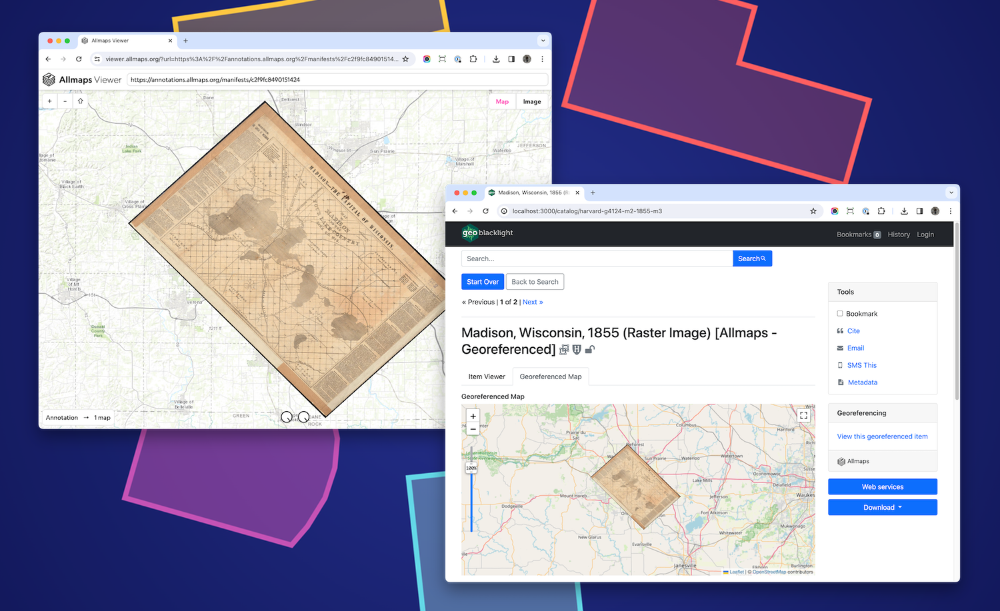
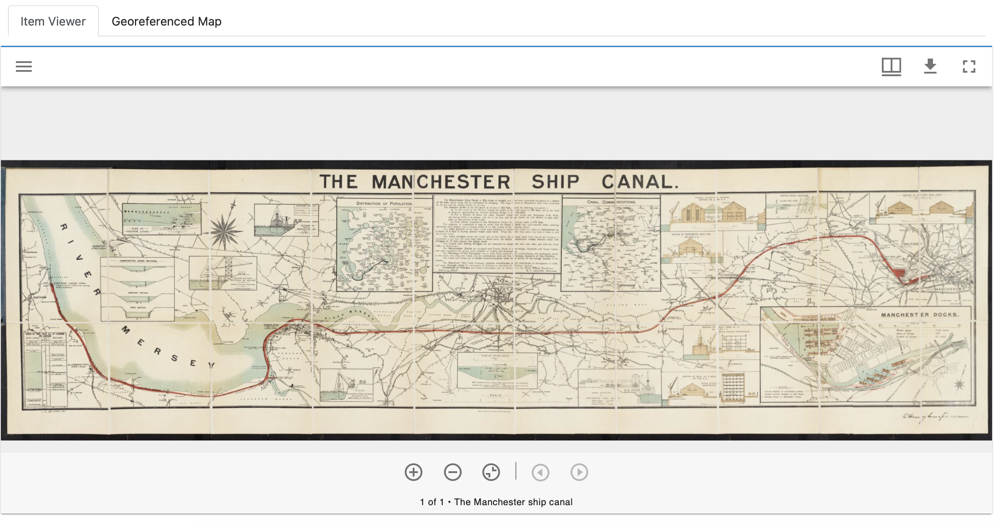
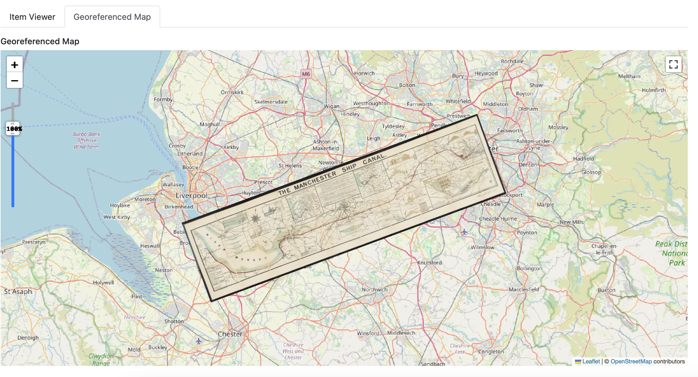
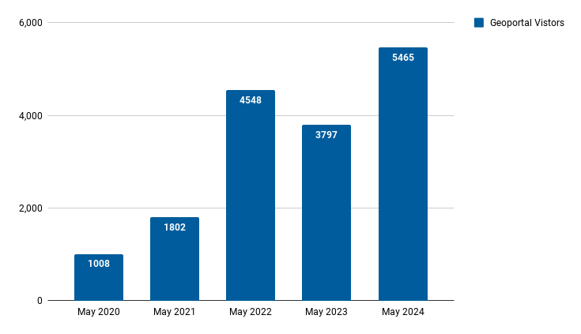
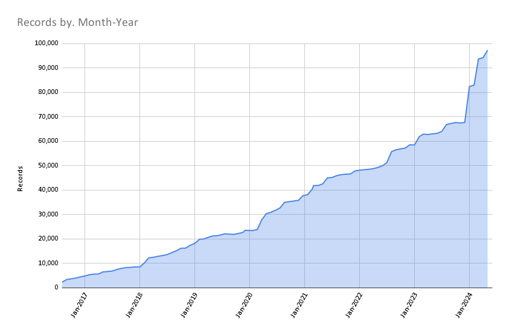

# May 2024 Program Status Update

<!-- more -->

## Monthly Highlight: Allmaps Georeferencing Plugin

  { width=300; align=left}

The BTAA Geoportal now features a plugin that integrates the Allmaps georeferencing platform for scanned maps hosted via IIIF. For maps that have already been georeferenced, users will find a second tab on the item page that displays the map over a basemap. For maps not yet georeferenced, users can use a widget in the sidebar to open the map in the Allmaps interface.

 

Users can find these items with a new facet, which will filter all of the maps hosted via IIIF with a count of how many have been georeferenced. In addition to enhancing user experience, this new feature can facilitate georeferencing sprints.

<figure markdown="span">
  { width="600" }
  <figcaption>Tab 1: Map in IIIF item viewer</figcaption>
</figure>

<figure markdown="span">
  { width="600" }
  <figcaption>Tab 2: Georeferenced map</figcaption>
</figure>

## Program Activities

### Program Management

* Team members voted on priority projects for the coming year.
* Continued including lightning talks during Team Meetings. Karen Majewicz [presented on using Markdown for documentation, reports, and our program website](https://gin.btaa.org/markdown-workshop/intro#/).
* Completed job description for new Program and Outreach Coordinator position.

### Committees and Workgroups

=== "TECHnology"

    * Updated the OCLC record for the BTAA Geoportal
    * Added the Harmful Language statement to the Geoportal footer
    * Reviewed the AllMaps plugin interface implications and ideas for hosting georeferencing sprints

=== "Community Engagement"

    * Collecting lightning talk ideas
    * Collecting BTAA LibGuides related to geospatial
    * Reviewed blog post submissions
    

=== "Knowledge"

    * Shared charters for two subgroups: Scalable Approaches and Service Models to coordinate the top research priorities

=== "Coordination"

	* Analyzed priority projects using a matrix combining Team Member votes, difficulty, time commitment, presence of owners/volunteers, and DEIA.

=== " Geodata Pilot Workgroup"

	* testing simple datasets in Amazon S3 buckets
	* testing reports from Python and QGIS to produce readme files and attribute table lists for shapefiles
	

----

## BTAA Geoportal 

### Analytics Statistics

!!! example inline end "May 2024 by the numbers"

    * Visitors:	5,465
    * Visits: 6,202
    * Downloads:	 572
    * Visits with download:	 9.22%
    * Outlinks: 1,228
    * Visits with outlink: 19.80%
    * Num. searches: 2,457
    * Search keywords: 446
    * Pageviews: 14,967

**Unique visitors by month
**

!!! tip inline end "More stats"

    See full statistics on our [Analytics Dashboard](https://tableau.umn.edu/t/UL/views/BTAAGeoportalusageMatomo/Monthlycharts?%3Aembed=y&%3AisGuestRedirectFromVizportal=y)

### Top 10 Internal Searches

1. flood
1. sanborn
1. wildfire
1. fish
1. salmon
1. geology
1. fire
1. hawaii
1. trout
1. Maryland DNR
1. plants

---

### Collections

**:material-folder-multiple: Total records as of June 1, 2024: ==97,280==**

<figure markdown="span">
  { width="800" }
  <figcaption>BTAA Geoportal Records from 2016 to June 1, 2024</figcaption>
</figure>

### May Harvesting Activities

{{ read_csv('tables/harvests_2024-05.csv') }}

### Development

* Added a new "Georeferenced via Allmaps Plugin" facet
* Continuing work on managing file assets and thumbnail derivatives in GBL Admin

!!! tip "More development details"

	Read the most recent [Development Tasks](https://docs.google.com/document/d/17nl_krFL21j5TkpQU6G81ovzJk96LM8JfkbpGe_po_4/edit?usp=sharing) report for more details.

---

## Next Steps

- We are nearing completion of our next steps on our [Revamping the BTAA GIN: a Program Roadmap (2023-2024)](https://github.com/orgs/geobtaa/projects/10). Our final task is to fill in the priority projects matrix for the coming year.

- Advertise the the new Program and Outreach position.

