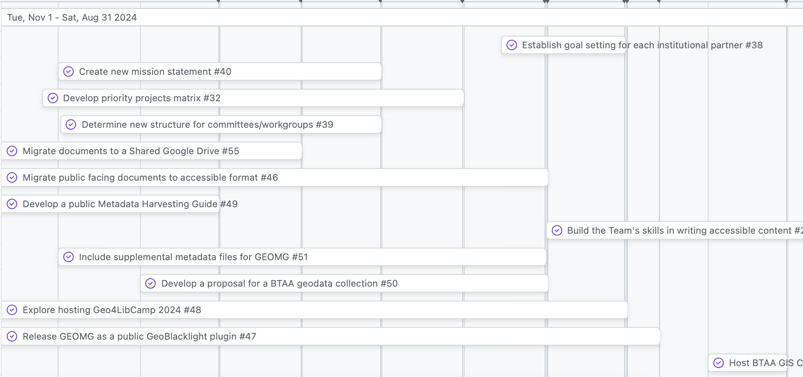
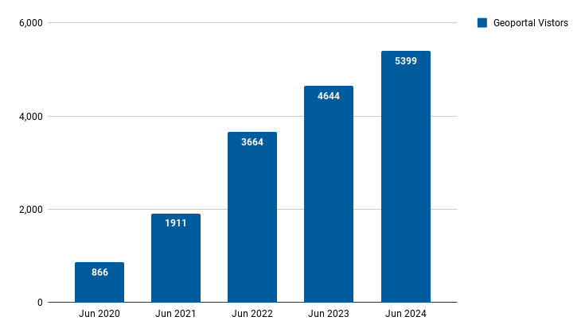
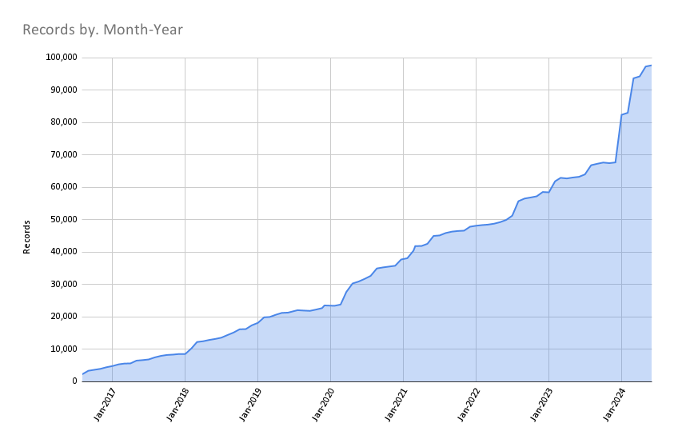

# June 2024 Program Status Update

## Monthly Highlight: Governance Roadmap Completed

{ width=300; align=left}

**This month, we completed our 2023-24 program roadmap, ["Revamping the BTAA GIN"](https://github.com/orgs/geobtaa/projects/10/views/6).**

 

The purpose of this roadmap was to guide our transition from a “Project” to an ongoing “Program,” with an increased focus on the social infrastructure of our organization. We made strides in four key areas: Governance, Content Management, Asset Management, and Community Support.

<!-- more -->

**1. Governance Refresh**: We updated our governance framework to reflect our shift to an ongoing program. This involved restructuring our committees and workgroups, developing a priority projects matrix, creating a new mission statement, and establishing goal-setting practices for each institutional partner. 

**2. Content Management**: We worked to improve the accessibility, discoverability, and persistence of our public content and documentation. We migrated our website to an open source platform, developed a public Metadata Harvesting Guide, and transferred our working documents to a shared Google Drive. 

**3. Asset Management**: We began work to expand our asset management capabilities beyond discovery metadata records for the BTAA Geoportal. We issued a strategic plan for a BTAA geodata collection and enhanced our metadata management toolkit to support file ingest and storage.

**4. Community Support**: We increased our support for the geospatial community by hosting the BTAA GIS Conference in 2023 and Geo4LibCamp in 2024, and by releasing our metadata management toolkit as a public GeoBlacklight plugin. 

## Program Activities

### Program Management

* Posted and advertised the job announcement for new Program and Outreach Coordinator position.
* Updated position description for graduate student research assistant to start in Fall 2024.
* Created a [Priority Projects dashboard](https://github.com/orgs/geobtaa/projects/22) for the 2024-25 program year.

### Committees and Workgroups

=== "TECHnology"

    * Charged a new workgroup to determine using FAST for Subject Terms
    * Discussed the Harmful Language statement and other policies for the Geoportal footer

=== "Community Engagement"

    * Did not meet
    * published June blog post
    

=== "Knowledge"

    * Invited staff from Scholar's Portal to present at upcoming Team Meeting
    * Preparing to kickoff new workgroups (Scalable Approaches and Service Models)

=== "Coordination"

	* Ranked priority projects, assigned owners, and copied them to a new [GitHub board](https://github.com/orgs/geobtaa/projects/22) for tracking progress
	* Reviewed DEIA goals

=== " Geodata Pilot Workgroup"

	* established GitHub repository with sample datasets
	* began discussing minimum metadata requirements
	

----

## BTAA Geoportal 

### Analytics Statistics

!!! example inline end "June 2024 by the numbers"

    * Visitors:	5,399
    * Visits: 6,016
    * Downloads:	 281
    * Visits with download:	 4.67%
    * Outlinks: 1,135
    * Visits with outlink: 18.87%
    * Num. searches: 812
    * Search keywords: 363
    * Pageviews: 13,427

**Unique visitors by month
**{ width="600" }

!!! tip inline end "More stats"

    See full statistics on our [Analytics Dashboard](https://tableau.umn.edu/t/UL/views/BTAAGeoportalusageMatomo/Monthlycharts?%3Aembed=y&%3AisGuestRedirectFromVizportal=y)

### Top 10 Internal Searches

1. Land use
1. Sanborn
1. Montgomery sanborn
1. Utah
1. Lithuania
1. Wisconsin Adams county
1. Milwaukee
1. Massachusetts sanborn maps
1. India roads
1. fema

 

---

### Collections

**:material-folder-multiple: Total records as of July 1, 2024: ==97,662==**

<figure markdown="span">
  { width="800" }
  <figcaption>BTAA Geoportal Records from 2016 to July 1, 2024</figcaption>
</figure>

### June Harvesting Activities

{{ read_csv('tables/harvests_2024-06.csv') }}

### Development

**Geoportal Interface Enhancements:**

* Improved user interface by folding long text values.
* Fixed a bug with the map’s “Click to wake” feature.

**GBL Admin Improvements:**

* Added tabs for JSON previews and previous versions in the item edit pages.
* Connected GBL Admin to the Amazon S3 storage bucket for asset management, including uploads of zip files and supplemental metadata.
* Implemented a batch process for harvesting thumbnails from remote sources into S3.
* Introduced a lower priority tier for background processing jobs to maintain application performance.

**Collaboration with Web Development:**

* Configured S3 buckets to allow ingests from GBL Admin.

!!! tip "More development details"

	Read the most recent development reports for more details: [Part 1](https://docs.google.com/document/d/1KGBmGkJMyTvCLUwqVaAQJPq_hRICRbuFzhbGpGdlzck) and [Part 2](https://docs.google.com/document/d/1Sly8jUcZJInqTLw6WrN1JRkWEOKawQK2nb14N6Gp8uw)

---

## Next Steps

For the 2024-2025 year, our new [Priority Projects board](https://github.com/orgs/geobtaa/projects/22/views/5) will function as our program guide.  Projects with higher priorities will be tackled first, with lower priorities later in the year. Projects that are currently in progress or up next include:

* Compile a list of planned lightning talks for Program Team meetings
* Create or update policies and disclaimers for the Geoportal
* Continue the Geodata Pilot
* Kickoff three new workgroups: implementing FAST subjects;  Scalable Approaches; Service Models

