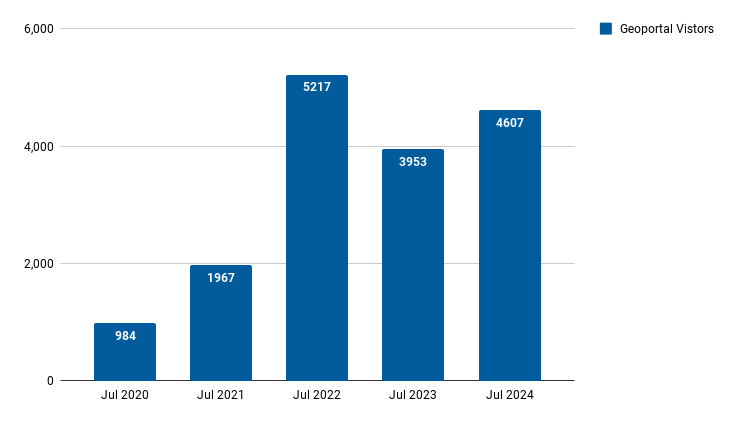
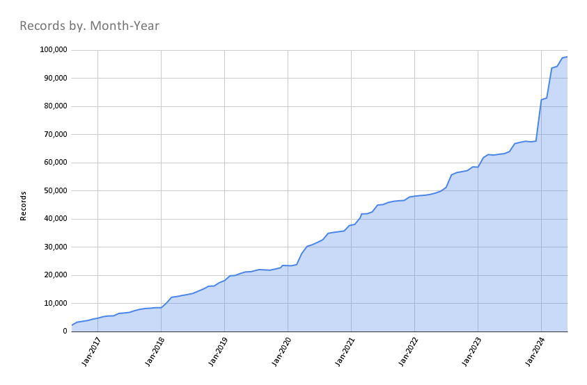

# July 2024 Program Status Update

## Monthly Highlight: New published article about the BTAA-GIN

  { width=300; align=left}
 

The *Journal of Map & Geography Libraries* published an article about the BTAA-GIN, "[Sustaining a Spatial Collaboration: Leveraging Social Infrastructure to Support Technological Advancement in Geospatial Data Discovery](https://doi.org/10.1080/15420353.2024.2388576)." This article, authored by four Team Members, describes the BTAA-GIN, reviews our history to date, and lays out our future plans.  

 

<!-- more -->

Full citation: Tickner, A., McElfresh, L. K., Mattke, R., & Majewicz, K. (2024). Sustaining a Spatial Collaboration: Leveraging Social Infrastructure to Support Technological Advancement in Geospatial Data Discovery. Journal of Map & Geography Libraries, 1–14. https://doi.org/10.1080/15420353.2024.2388576

## Program Activities

### Program Management

* Monitoring the [Priority Projects dashboard](https://github.com/orgs/geobtaa/projects/22) for the 2024-25 program year.
* Conducting interviews for new Program and Outreach Coordinator position.
* Announced opening for graduate student research assistant to start in Fall 2024.

### Committees and Workgroups

*Note: Most groups did not meet in July due to a planned summer hiatus. Notes below reflect ongoing efforts.*

=== "TECHnology"

    * Charged a new workgroup to determine using FAST for Subject Terms - kickoff in August
    * Working on Priority Project to Add policies and disclaimers to Geoportal

=== "Community Engagement"

    * Plan to coordinate with Knowledge committee to visit their monthly meeting to discuss these ideas further
    

=== "Knowledge"

    * Preparing to kickoff new workgroups (Scalable Approaches and Service Models)

=== "Coordination"

	* Reviewing priority projects, assigned owners, and copied them to a new [GitHub board](https://github.com/orgs/geobtaa/projects/22) for tracking progress

=== " Geodata Pilot Workgroup"

	* Reviewing GBL Admin upload workflow
	* Reviewing "staging area" options
	

----

## BTAA Geoportal 

### Analytics Statistics

!!! example inline end "July 2024 by the numbers"

    * Visitors:	4,607
    * Visits: 5,163
    * Downloads:	 222
    * Visits with download:	 4.3%
    * Outlinks: 928
    * Visits with outlink: 17.97%
    * Num. searches: 706
    * Search keywords: 303
    * Pageviews: 12,221

**Unique visitors by month
**{ width="600" }

!!! tip inline end "More stats"

    See full statistics on our [Analytics Dashboard](https://tableau.umn.edu/t/UL/views/BTAAGeoportalusageMatomo/Monthlycharts?%3Aembed=y&%3AisGuestRedirectFromVizportal=y)

### Top 10 Internal Searches

1. Sanborn
1. zoning
1. contour
1. election
1. summit county gis data
1. lake superior
1. landuse
1. housing elections
1. tiledmaplayer
1. vote

 

---

### Collections

**:material-folder-multiple: Total records as of August 1, 2024: ==98,013==**

<figure markdown="span">
  { width="800" }
  <figcaption>BTAA Geoportal Records from 2016 to July 1, 2024</figcaption>
</figure>

### July Harvesting Activities

{{ read_csv('tables/harvests_2024-07.csv') }}

### Development

**Geoportal Interface Enhancements:**

* Released update that incorporates thumbnails stored in Amazon S3. We anticipate a performance boost as a result.

**GBL Admin Improvements:**

* Enhanced the file ingest interface in GBL Admin interface, including multiple downloads and the ability to specify link type.
* Now storing thumbnails in S3 for production.

!!! tip "More development details"

	[Read the most recent development reports for more details](https://docs.google.com/document/d/1HAbVzGrTAWrWrtUz2t04aLuOh3E2moLOoE0jprNX4iE/edit)

---

## Next Steps

For the 2024-2025 year, our new [Priority Projects board](https://github.com/orgs/geobtaa/projects/22/views/5) will function as our program guide.  Projects with higher priorities will be tackled first, with lower priorities later in the year. Projects that are currently in progress or up next include:

* Compile a list of planned lightning talks for Program Team meetings
* Create or update policies and disclaimers for the Geoportal
* Continue the Geodata Pilot
* Kickoff three new workgroups: implementing FAST subjects;  Scalable Approaches; Service Models

