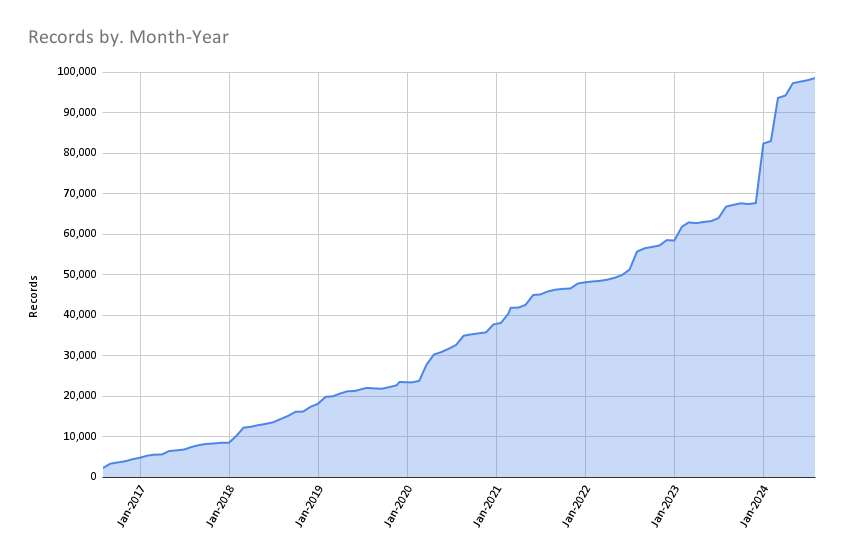

# September 2024 Program Status Update

## Monthly Highlight: 

 

<!-- more -->

## Program Activities

### Program Management

* We welcomed a new Program Team Member from Purdue, Dr. Innocensia Owuor, GIS Specialist and Clinical Assistant Professor.
* The September Program Team meeting featured a presentation from East View Geospatial about their Global Census Archive.
* We completed interviews for the new Program and Outreach Coordinator position.

### Committees and Workgroups

=== "TECHnology"

    * Working on website policies and updating the Geoportal footer links
    * Created a local gazeteer for counties, states, and nations

=== "Community Engagement"

    * Updated blog with new posts
    * Planning to update the Geoportal help pages next 

=== "Knowledge"

    * Did not meet in September

=== "Coordination"

	* Compiling plans for a Map Librarian summit
	* Planned Program Team meeting topics

=== "Geodata Pilot Workgroup"

	* Determining what components to add to a Download Package (dataset, metadata, readme, thumbnails, etc.)
	* Added a field for Provenance Statement and Reference System

=== "FAST for Subject Terms Workgroup"

	* Analyzing the map records for current adherence to a thesaurus.
	* Reviewing Keywords field with the aim to organize the values into controlled Subjects

=== "Service Model Collaboration Workgroup"

	* Held kickoff meeting in September
	* Determining objectives	
	
	

----

## BTAA Geoportal 

### Analytics Statistics

!!! example inline end "September 2024 by the numbers"

    * Visitors:	
    * Visits: 
    * Downloads:	 
    * Visits with download:	
    * Outlinks: 
    * Visits with outlink: 
    * Num. searches: 
    * Search keywords: 
    * Pageviews: 

**Unique visitors by month
<!--**{ width="600" }
-->

!!! tip inline end "More stats"

    See full statistics on our [Analytics Dashboard](https://tableau.umn.edu/t/UL/views/BTAAGeoportalusageMatomo/Monthlycharts?%3Aembed=y&%3AisGuestRedirectFromVizportal=y)

### Top 10 Internal Searches

TBD

 

---

### Collections

**:material-folder-multiple: Total records as of September 1, 2024: ==98,897==**

<figure markdown="span">
  { width="800" }
  <figcaption>BTAA Geoportal Records from 2016 to 
October 1, 2024</figcaption>
</figure>

### August Harvesting Activities

{{ read_csv('tables/harvests_2024-09.csv') }}

### Development

* Improved test coverage for GeoBlacklight Admin, identiying redundant or erroneous code
* Updated header and footer in development site for the TECH Committee to review
* Cleaned up the font decoration to be clearer while retaining accessibility

!!! tip "More development details"

	[Read the most recent development reports for more details](https://docs.google.com/document/d/1wnDkQLP2IcLxei_OG-sRcDLdLtZvFW9hd4wmuL1n6fA)

 
---

## Next Steps

Projects that are currently in progress or up next include:

* Review and publish policies and disclaimers for the Geoportal
* Continue the Geodata Pilot
* Continue to normalize records to FAST for Subjects and Place Names
* Kickoff the Scalable Approaches workgroup

Refer to our [Priority Projects board](https://github.com/orgs/geobtaa/projects/22/views/5) for more details.

