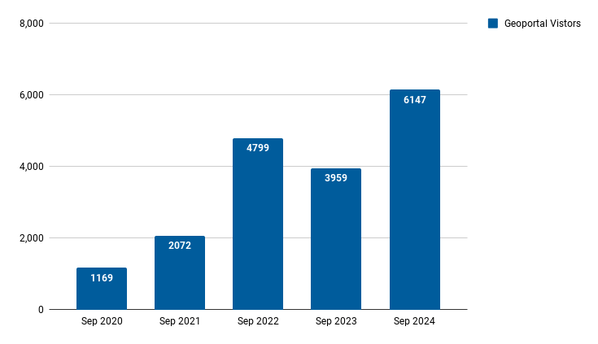

# September 2024 Program Status Update

## Monthly Highlight: Newly published article about ephemeral data

{ width="400"; align=right }

A new article titled "[Ephemeral Geodata: An Impending Digital Dark Age](https://doi.org/10.1080/15420353.2024.2398542)," co-authored by four BTAA-GIN Team Members, was recently published in the *Journal of Map & Geography Libraries*. The authors explore a long-standing challenge for our program, framing the lack of public geodata archives as a "looming digital dark age." This analysis is based on our experiences managing the BTAA Geoportal and [GeoData@Wisconsin](https://geodata.wisc.edu), as well as our roles as map librarians. This article not only highlights a widespread issue but also provides a compelling rationale for our new initiative, the BTAA-GIN Geodata Collection, which aims to address gaps in the availability and accessibility of geospatial resources.<!-- more -->

 

*Figure caption: Filling the growing gap by collecting annual snapshots. This stepped temporal bar chart shows geospatial resources with the subject “Roads” for BTAA library-held maps, datasets available in data clearinghouses across the BTAA states, and the University of Wisconsin-Madison's Robinson Map Library collections as of April 2023. (Illustration from the cited article.)*

!!! info "Citation"

	Majewicz, K., Martindale, J., Kernik, M., & Mattke, R. (2024). Ephemeral Geodata: An Impending Digital Dark Age. Journal of Map & Geography Libraries, 1–26. https://doi.org/10.1080/15420353.2024.2398542. 
	
	An open access version can be found at https://hdl.handle.net/11299/265741.

## Program Activities

### Program Management

* We welcomed a new Program Team Member from Purdue University, **Dr. Innocensia Owuor, GIS Specialist and Clinical Assistant Professor**.
* The September Program Team meeting featured a presentation from East View Geospatial about their Global Census Archive.
* We completed interviews for the new Program and Outreach Coordinator position.

### Committees

=== "TECHnology"

    * Working on website policies and updating the Geoportal footer links
    * Created a local gazeteer for counties, states, and nations

=== "Community Engagement"

    * Updated blog with new posts
    * Planning to update the Geoportal help pages next 

=== "Knowledge"

    * Did not meet in September

=== "Coordination"

	* Compiling plans for a Map Librarian summit
	* Planned Program Team meeting topics

### Workgroups

=== "Geodata Pilot Workgroup"

	* Determining what components to add to a Download Package (dataset, metadata, readme, thumbnails, etc.)
	* Added a field for Provenance Statement and Reference System

=== "FAST for Subject Terms Workgroup"

	* Analyzing the map records for current adherence to a thesaurus.
	* Reviewing Keywords field with the aim to organize the values into controlled Subjects

=== "Service Model Collaboration Workgroup"

	* Held kickoff meeting in September
	* Determining objectives	
	
	

----

## BTAA Geoportal 

### Analytics Statistics

!!! example inline end "September 2024 by the numbers"

    * Visitors:	6,147
    * Visits: 6,698
    * Downloads: 243	 
    * Visits with download: 3.36%	
    * Outlinks: 1,229
    * Visits with outlink: 18.35%
    * Num. searches: 1,962
    * Search keywords: 617
    * Pageviews: 17,206

**Unique visitors by month
**{ width="600" }

!!! tip inline end "More stats"

    See full statistics on our [Analytics Dashboard](https://tableau.umn.edu/t/UL/views/BTAAGeoportalusageMatomo/Monthlycharts?%3Aembed=y&%3AisGuestRedirectFromVizportal=y)

### Top Internal Searches

1. salmon
2. wildfire
3. reef
4. climate population
5. cougar
6. sanborn
7. geology
8. PLSS
9. elevation
10. Pennsylvania
11. hurricane
12. Mountain 

 

---

### Collections

**:material-folder-multiple: Total records as of October 1, 2024: ==98,897==**

<figure markdown="span">
  { width="800" }
  <figcaption>BTAA Geoportal Records from 2016 to 
October 1, 2024</figcaption>
</figure>

### August Harvesting Activities

{{ read_csv('tables/harvests_2024-09.csv') }}

### Development

* Improved test coverage for GeoBlacklight Admin, identiying redundant or erroneous code
* Updated header and footer in development site for the TECH Committee to review
* Cleaned up the font decoration to be clearer while retaining accessibility

!!! tip "More development details"

	[Read the most recent development reports for more details](https://docs.google.com/document/d/1wnDkQLP2IcLxei_OG-sRcDLdLtZvFW9hd4wmuL1n6fA)

 
---

## Next Steps

Projects and tasks that are up next include:

* Review and publish policies and disclaimers for the Geoportal
* Kickoff the Scalable Approaches workgroup

Refer to our [Priority Projects board](https://github.com/orgs/geobtaa/projects/22/views/5) for more details.

