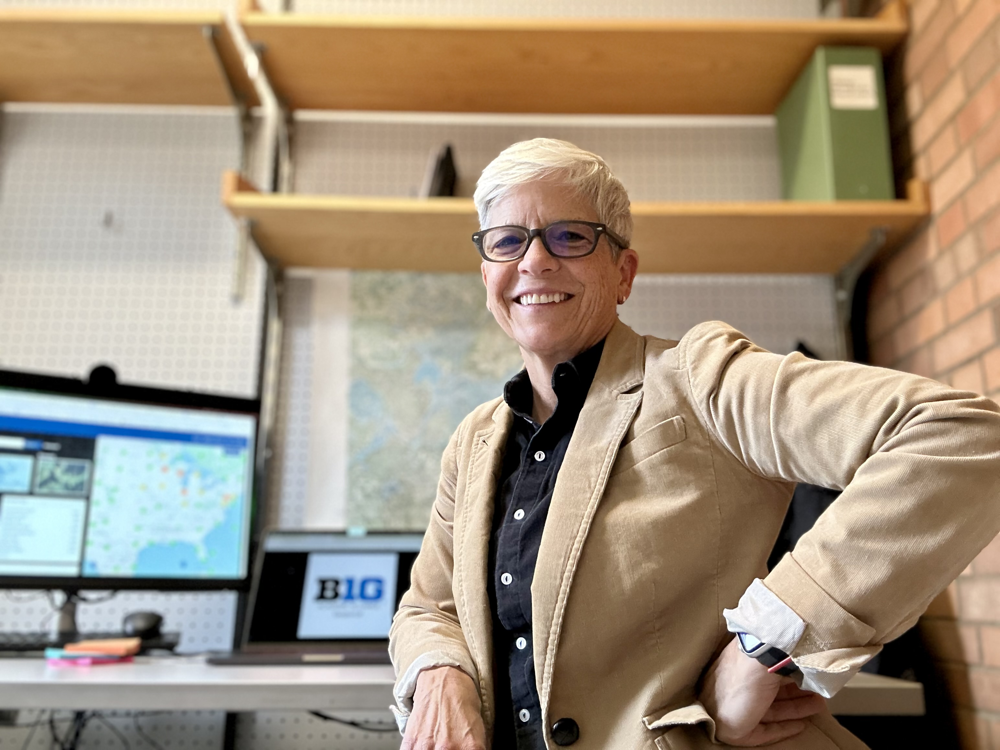
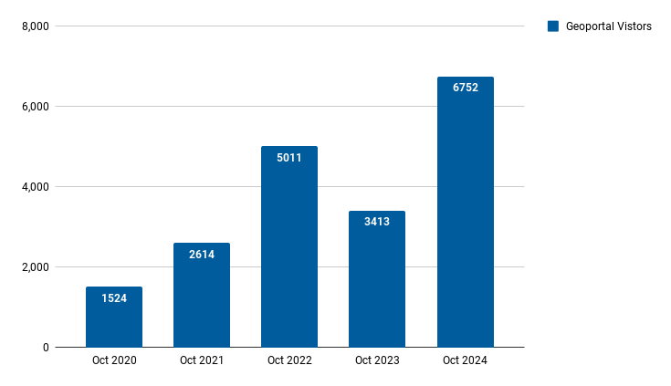
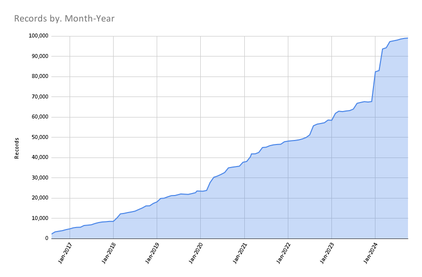

# October 2024 Program Status Update

## Monthly Highlight: Welcome to our new Associate Director

{ width="400"; align=right }

We are happy to announce that Colleen Wilson has joined the Big Ten Academic Alliance's Geospatial Information Network as our new Associate Director of Program Management and Outreach Coordination. In this newly created role, Colleen will play a vital part in stakeholder engagement and work to strengthen connections within our diverse geospatial data community. Her leadership will be instrumental in driving outreach initiatives, coordinating program goals, and managing team activities.

<!-- more -->

Colleen brings over 20 years of experience in program coordination and digital strategy from her previous roles at KQED PBS/NPR in San Francisco and Twin Cities Public Television. She is passionate about leveraging innovative digital platforms to enhance impact and foster collaboration.

Having lived in seven Big Ten states, Colleen is now based in Minnesota, where she is excited to be part of the Big Ten community.

Please join us in welcoming Colleen to the team! We look forward to her contributions and to seeing how she helps us connect and grow.

 

*Figure caption: Photograph of Colleen Wilson*

## Program Activities

### Committees

=== "TECHnology"

    * Received positive feedback on the new footer and updated links to the privacy policy, terms of service, and disclaimer.
    * Discussed new ideas for continuing the committee's impact on its first anniversary.

=== "Community Engagement"

    * Confirmed speakers for next semester's Lightning Talks, including a January panel on ArcGIS.
    * Discussed updating the Geoportal intro materials and proposed tutorials for resource visibility; assigned leads for updates.

=== "Knowledge"

    * Agreed to combine Nov and Dec committee meetings into single one in December.
    * Engaged in a series of discussions exploring different service models asking: 
		* What kinds of services do we want to offer?
		* What resources do we have (i.e., infrastructure and services) 
		* How do we provide the services (i.e., comparing models)?
		* Who is the audience for GIS/data services from the libraries vs. from other campus units? 
		* How do users see library services, and how do those expectations line up with reality?

=== "Coordination"

	* New Program & Outreach hire will attend committee meetings and interview GIN members to offer assistance and publish member highlights for the site.
	* Discussed the potential long-term plan to serve as a repository for research data, specifically optimized for geospatial data.
	* Proposed timeline:
		* 2025: Seed repository with public data and test the inclusion of research data upon request.
		* 2026: Officially begin adding research data to the repository.

### Workgroups

=== "Geodata Pilot Workgroup"

	* Reviewed technical metadata fields, including coordinate systems, area calculations, and spatial resolution
	* Agreed to sunset within next few months

=== "FAST for Subject Terms Workgroup"

	* Analyzing the map records for current adherence to a thesaurus.
	* Reviewing Keywords field with the aim to organize the values into controlled Subjects
	* Working on a MARC to OGM Aardvark crosswalk

=== "Service Model Collaboration Workgroup"

	* did not meet in October	
	
	

## BTAA Geoportal 

### Analytics Statistics

!!! example inline end "September 2024 by the numbers"

    * Visitors:	6,752
    * Visits: 7,375
    * Downloads: 241	 
    * Visits with download: 3.27%	
    * Outlinks: 1,405
    * Visits with outlink: 19.05%
    * Num. searches: 1,069
    * Search keywords: 384
    * Pageviews: 17,313

**Unique visitors by month**

{ width="600" }

!!! tip inline end "More stats"

    See full statistics on our [Analytics Dashboard](https://tableau.umn.edu/t/UL/views/BTAAGeoportalusageMatomo/Monthlycharts?%3Aembed=y&%3AisGuestRedirectFromVizportal=y)

**What Users are Looking for**

-   Top Google searches leading to the Geoportal

		1. ohio school district map
		2. south bend city limits
		3. maryland parcel map
		4. maryland gis property search
		5. madison wi zoning map
		6. fire insurance map california
		7. 1937 aerial photographs wisconsin
		8. sanborn maps
		9. property lines map
		10. nj wetlands map

-   Top internal keyword searches

		1. salmon
		2. St. Louis
		3. Kenya
		4. Sàdah
		5. Lake Superior
		6. Geology
		7. china
		8. agriculture
		9. Ukraine
		10. Ireland
		11. New York City
		12. London 

 

---

### Collections

**:material-folder-multiple: Total records as of November 1, 2024: ==99,022==**

<figure markdown="span">
  { width="800" }
  <figcaption>BTAA Geoportal Records from 2016 to 
October 1, 2024</figcaption>
</figure>

### October Harvesting Activities

{{ read_csv('tables/harvests_2024-10.csv') }}

### Development

* New Footer: We added a new footer to the application with links to important policy pages like our Harmful Language Statement. The new footer also highlights “Collection Stories” written by our GIN committee members.
* Worked to iteratively block AI web scrapers from overwhelming the servers and freezing the site.
* Enhancing GeoBlacklight Admin to handle resource access (external links and internal assets) with its own dedicated database table and interface view.

!!! tip "More development details"

	[Read the most recent development report for more details](https://docs.google.com/document/d/1A-XHbnvE49mr4QBYWBbx2PiCgYuM7kRdKjP7GEPMcZA/edit?usp=sharing)

---

## Priority Projects

Tasks that are up next include:

* Closeout the "Add Policies and Disclaimers" project
* Make plans to sunset the Geodata Pilot Workgroup
* Develop workgroup for next stage of Geodata Collection Roadmap
* Begin planning for the BTAA GIS Conference

Refer to our [Priority Projects board](https://github.com/orgs/geobtaa/projects/22/views/5) for more details.

