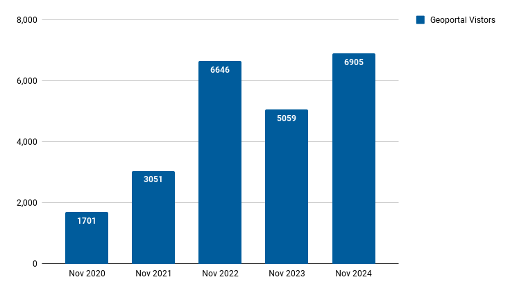
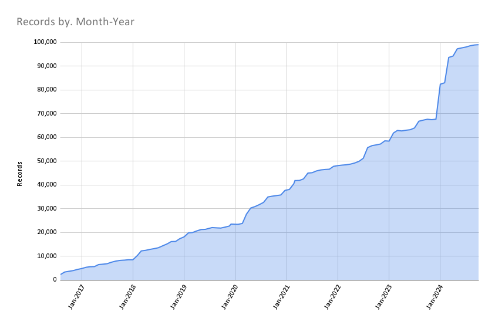

# November 2024 Program Status Update

## Celebrating 100,000 Datasets and Counting

{ width="300"; align=right }

The BTAA-GIN Geoportal has reached an impressive milestone: over 100,000 geospatial resources, with a large percentage of this growth happening in the past year alone!

 Whether you're researching urban planning, environmental change, or historical maps, the Geoportal connects you to data from state and local governments, universities, and beyond. With one powerful interface, you can uncover a vast range of datasets to power your research.
 
 <!-- more -->

[**Explore the possibilities—search the Geoportal today! :material-tab-search:**](https://geo.btaa.org)

 

## Program Activities

### Committees

=== "TECHnology"

	* Completed the priority project on adding policies and disclaimers to the Geoportal.  
	* Began reconfiguring meetings to focus on thematic topics, incorporating short member presentations and interactive activities such as the recent session on evaluating landing pages.

=== "Community Engagement"

	* Held a separate work session to create a series of short video walkthroughs introducing the Geoportal to new users.  
	* Suggested including the INTERFACE Activities Tracker as a resource in these videos.  
	* New Program & Outreach hire, Colleen Wilson, shared what she's been working on and outlined upcoming plans.

=== "Knowledge"

	* The GIS Service Model group held a second meeting and is considering conducting a survey to assess the current state of GIS services.

=== "Coordination"

	* Oregon has committed to joining us at the start of the new year. An onboarding plan along with a new handbook for new members is in development.   
	* New Program & Outreach hire, Colleen Wilson, was introduced along with her plan to meet with each institution in the next two months to learn how best to leverage and support this collaboration.

### Workgroups

=== "Geodata Pilot Workgroup"

	* Reviewing new metadata fields and input guidelines  
	* Recommending formats for data dictionaries  
	* Began a draft of a final report

=== "FAST for Subject Terms Workgroup"

	* Continuing to analyze Subject field for maps  
	* Determining cleanup activities and future workflows for new items

=== "Service Model Collaboration Workgroup"

	* Developed a tiered GIS service model based on a 2020 survey of BTAA-GIN members  
	* Planning to create a new survey to explore tiered service models and compensation practices among BTAA-GIN members and beyond, focusing on service definitions, tier structures, and staffing.
	
	

## BTAA Geoportal 

### Analytics Statistics

!!! example inline end "November 2024 by the numbers"

	* Visitors: 6,905  
	* Visits: 7,582  
	* Downloads: 318  
	* Visits with download: 4.19%  
	* Outlinks: 1,468  
	* Visits with outlink: 19.36%  
	* Num. searches: 2,549  
	* Search keywords: 795  
	* Pageviews: 16,593

**Unique visitors by month**

{ width="600" }

!!! tip inline end "More stats"

    See full statistics on our [Analytics Dashboard](https://tableau.umn.edu/t/UL/views/BTAAGeoportalusageMatomo/Monthlycharts?%3Aembed=y&%3AisGuestRedirectFromVizportal=y)

**What Users are Looking for**

-   Top Google searches leading to the Geoportal

	1. btaa geoportal	  
	2. ohio school district map  
	3. south bend city limits  
	4. aerial photographs wisconsin  
	5. outagamie county gis  
	6. milwaukee voting wards  
	7. evansville city limits  
	8. school district map ohio  
	9. sanborn maps michigan  
	10. wetlands map nj

-   Top internal keyword searches

	1. wildfire  
	2. ann arbor  
	3. forest  
	4. salmon  
	5. deer  
	6. food  
	7. fish  
	8. fire  
	9. yemen  
	10. sanborn

 

---

### Collections

**:material-folder-multiple: Total records as of December 1, 2024: ==103,310==**

<figure markdown="span">
  { width="800" }
  <figcaption>BTAA Geoportal Records from 2016 to 
December 1, 2024</figcaption>
</figure>

### November Harvesting Activities

{{ read_csv('tables/harvests_2024-11.csv') }}

### Development

* Refactored GBL Admin to separate primary metadata fields from access links.   
* Exploring adding gazetteer information to the application

!!! tip "More development details"

	[Read the most recent development report for more details](https://docs.google.com/document/d/1D\_aZIyZJQNB8DubuYCPUPf-AR2M57sKrxG6c2CTRJxs/edit?tab=t.0)

---

## Priority Projects Update

* Closed [Adding Policies and Disclaimers](https://github.com/geobtaa/.github/issues/70)  
* Began creating [Walkthroughs of the Geoportal](https://github.com/geobtaa/.github/issues/72)  

Refer to our [Priority Projects board](https://github.com/orgs/geobtaa/projects/22/views/5) for more details.

