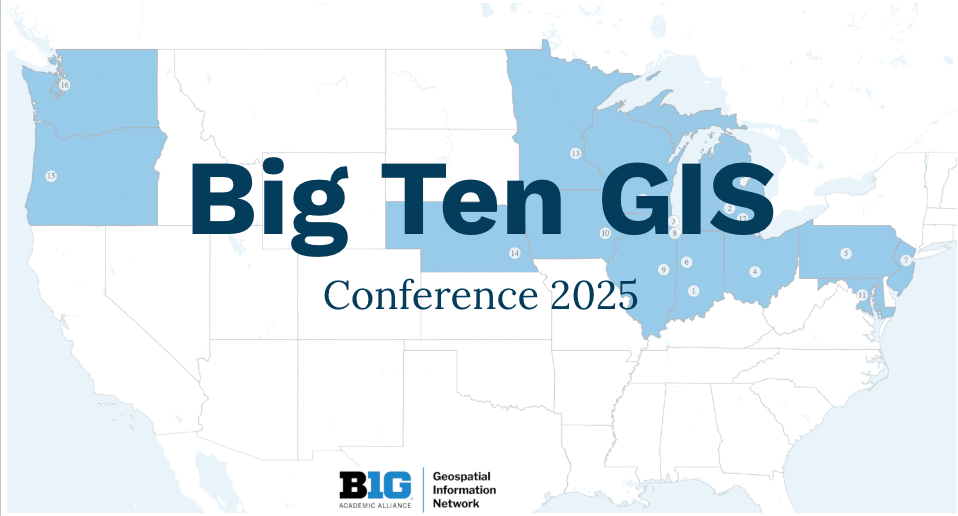
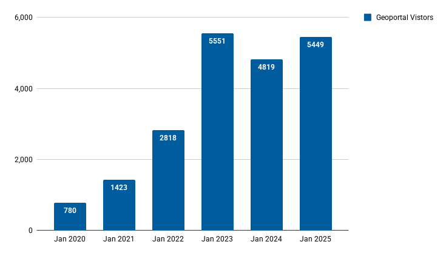
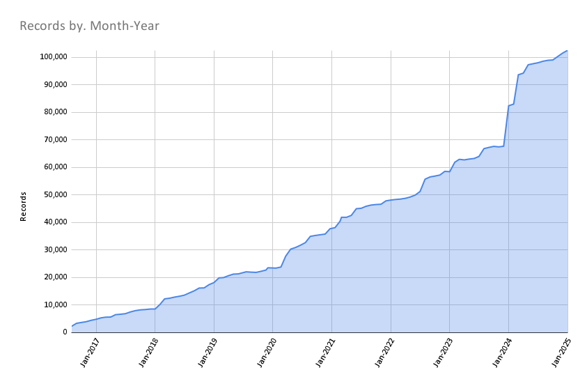

# January 2025 Program Status Update

## Big Ten GIS Conference 2025!

📍SAVE THE DATE: The virtual Big Ten GIS Conference takes place **April 11, 2025**

{ width="300"; align=right }

We are excited to announce the [Big Ten GIS Conference](../../../conference/2025), a free virtual conference happening on **April 11, 2025**! This annual event brings together researchers, educators, students, and GIS professionals to present their work, exchange ideas, and explore the latest advancements in geospatial research and tools.

:material-bullhorn-variant-outline: **Call for Proposals is Open!**  
Are you working on an exciting geospatial project? Have insights to share about GIS applications, research, or tools? We invite **presentations, lightning talks, and map gallery submissions** from **any discipline** using geospatial information. You do not need to be affiliated with a Big Ten university to present—submissions from all institutions and industries are welcome!

 <!-- more -->

💡 **Topics may include (but are not limited to):**

* Agriculture & natural resources
* Artificial Intelligence (AI) and Machine Learning
* Geography, urban planning & infrastructure
* GIS education & methods
* Health sciences, humanities & social sciences
* IDEA and social/environmental justice
* UAVs & GIS in academia
* Applied GIS in campus infrastructure & municipal projects

📝 **Submission Deadlines & Links**

-    #### 🔹 Submit a Presentation or Lightning Talk

    → [Submission Form](https://forms.gle/EiW21r1HN6SsR2399)
    
    ⏳ Deadline: March 5, 2025, at 5 PM CST
    
-    #### 🔹 Submit to the Map Gallery

    → [Submission form](https://forms.gle/v6QHb8qiTdbLCVvi7) (requires a Google account)
    
    → [Guidelines](https://gin.btaa.org/conference/map-gallery)
    
    ⏳ Deadline: March 24, 2025, at 5 PM CST

✋ **Who Should Attend?**

This conference is open to anyone interested in geospatial research—students, educators, researchers, and professionals from all institutions and industries. Whether you're presenting a project, showcasing research, or simply eager to learn, the Big Ten GIS Conference is a place to share and engage. While the event highlights work from Big Ten universities, we welcome all attendees and presenters, regardless of affiliation.
 
📢 Accessibility Note: Closed captions will be provided throughout the event.

**Registration Opens Soon!**

We can’t wait to welcome you to the Big Ten GIS Conference—start preparing your proposals and stay tuned for updates!
 

## Program Activities

### Committees

=== "TECHnology"

	* The Technology Committee id not meet in January (holiday)

=== "Community Engagement"

	* **Editorial Calendar:** The blog post calendar is on track, with reminders set through June 2025\. Plans are underway to include introductory posts from west coast schools by summer.  
	* **Geoportal Walkthrough Videos:** Work continues on video walkthroughs to introduce the GIN, its mission, and the Geoportal. A sprint for scripting and narration is scheduled for late Feb.

=== "Knowledge"

	* **Geospatial Data Citation Guide:** The committee is drafting a charter for a new working group to develop a guide for citing geospatial data, which will be promoted across BTAA institutions. This effort aligns with ongoing discussions about citation best practices and, if ready, will be promoted at the BTAA GIS Conference in April.  
	* **Service Models Collaboration & Geo4LibCamp:** The committee is exploring ways to contribute to Geo4LibCamp (May 2025\) by sharing service models and gathering insights from attendees to inform a set of recommendations.

=== "Coordination"

	* The Coordination Committee did not meet in January.

### Workgroups

=== "Geodata Pilot Workgroup"

	* Issued a final report for initial approval by the Coordination Committee.

=== "FAST for Subject Terms Workgroup"

	* Completed a final draft of a MARC to OGM Aarvark crosswalk  
	* Remediated scanned map metadata with FAST subject headings, a new field for scale/resolution, and a new dedicated field for admin tags distinct from the Keywords field.

=== "Service Model Collaboration Workgroup"

	* Drafted a member survey to explore tiered service models and compensation practices among BTAA-GIN members and beyond. The plan is to share a revised draft with the larger program team in March.
	
	

## BTAA Geoportal 

### Analytics Statistics

!!! example inline end "January 2025 by the numbers"

	* Visitors: 5,449  
	* Visits: 5,996  
	* Downloads: 196  
	* Visits with download: 3.27%  
	* Outlinks: 1,269  
	* Visits with outlink: 21.16%  
	* Num. searches: 982  
	* Search keywords: 389  
	* Pageviews: 13,190

**Unique visitors by month**

{ width="600" }

!!! tip inline end "More stats"

    See full statistics on our [Analytics Dashboard](https://tableau.umn.edu/t/UL/views/BTAAGeoportalusageMatomo/Monthlycharts?%3Aembed=y&%3AisGuestRedirectFromVizportal=y)

**What Users are Looking for**

-   Top Google searches leading to the Geoportal

	1. ohio school district map  
	2. south bend city limits  
	3. fire insurance map california  
	4. fire insurance map  
	5. evansville city limits  
	6. california fire insurance map  
	7. nj wetlands map  
	8. btaa geoportal  
	9. school district map ohio  
	10. 1937 aerial photographs wisconsin

-   Top internal keyword searches

	1. Egypt  
	2. Sanborn  
	3. Planimetric  
	4. Georgia  
	5. GEOCODER USA  
	6. ACS 5-year Estimates  
	7. Impervious  
	8. New albany, indiana  
	9. CORONA  
	10. Iowa county wisconsin

 

---

### Collections

**:material-folder-multiple: Total records as of January 31, 2025: ==102,537==**

<figure markdown="span">
  { width="800" }
  <figcaption>BTAA Geoportal Records from 2016 to 
February 1, 2025</figcaption>
</figure>

### January Harvesting Activities

| Source & GitHub link | Records added | Records retired | Geoportal Link |
| :---- | ----- | ----- | :---- |
| [Additional 2024 records from Geodata@Wisc](https://github.com/geobtaa/metadata/issues/765) | 224 | 0 | [https://geo.btaa.org/?f%5Bb1g\_geom\_import\_id\_ssi%5D%5B%5D=273\&publication\_state=%2A\&sort=date\_created\_dtsi+desc](https://geo.btaa.org/?f%5Bb1g_geom_import_id_ssi%5D%5B%5D=273&publication_state=%2A&sort=date_created_dtsi+desc) |
| [Indiana Historic Maps](https://github.com/geobtaa/metadata/issues/769) | 607 | 0 | [https://geo.btaa.org/?f%5Bb1g\_geom\_import\_id\_ssi%5D%5B%5D=287\&publication\_state=published](https://geo.btaa.org/?f%5Bb1g_geom_import_id_ssi%5D%5B%5D=287&publication_state=published) |
| [Minnesota Streetcar Museum \- Minnesota Digital Library](https://github.com/geobtaa/metadata/issues/772) | 18 | 0 | [https://geo.btaa.org/?f%5Bschema\_provider\_s%5D%5B%5D=Minnesota+Digital+Library%2C+Minnesota+Streetcar+Museum](https://geo.btaa.org/?f%5Bschema_provider_s%5D%5B%5D=Minnesota+Digital+Library%2C+Minnesota+Streetcar+Museum) |
| [St. Cloud State University \- Minnesota Digital Library](https://github.com/geobtaa/metadata/issues/773) | 22 | 0 | [https://geo.btaa.org/?f%5Bschema\_provider\_s%5D%5B%5D=Minnesota+Digital+Library%2C+St.+Cloud+State+University](https://geo.btaa.org/?f%5Bschema_provider_s%5D%5B%5D=Minnesota+Digital+Library%2C+St.+Cloud+State+University) |
| [Alfred C. Kinsey Gall Wasp Research Maps](https://github.com/geobtaa/metadata/issues/777) | 20 | 0 | [https://geo.btaa.org/?f%5Bdct\_isPartOf\_sm%5D%5B%5D=01d-06](https://geo.btaa.org/?f%5Bdct_isPartOf_sm%5D%5B%5D=01d-06) |

Note: ArcGIS Hub harvesting activities were paused in January due to updates in our GBL Admin tool and our metadata processing workflow.  

We also performed extensive cleanup on several collections:  

* Updated links; added thumbnails for all [Michigan General Land Office Plats](https://geo.btaa.org/?f%5Bdct_isPartOf_sm%5D%5B%5D=06a-03)  
* Updated links; added IIIF views and thumbnails for all [Indiana Digital Collections](https://geo.btaa.org/?f%5Bgbl_resourceClass_sm%5D%5B%5D=Maps&f%5Bschema_provider_s%5D%5B%5D=Indiana+University)  
* Ingested metadata improvements for all scanned maps, including a new field for scale and FAST compliant subjects (as directed by the FAST for Subject Terms Workgroup)

### Web Development

**GeoBlacklight Admin Enhancements**  

* Launched the Data Dictionaries feature   
* Streamlined distribution imports with a background queue
   
**Dev Geoportal UX Redesign**  

* Improved item view pages with breadcrumb navigation, buttonless sidebar, always-visible citations/downloads, and a new “More Like This” feature.  
* Created a guide documenting logos, colors, typography, and web components to ensure design consistency.  
* UI/UX improvements will continue in February, with further refinements to navigation, metadata display, and code snippets.  

!!! tip "More development details"

	[Read the most recent development report for more details](https://docs.google.com/document/d/1XD02izbjEBX8q75600FB1cutN1dO3pOaUCGrHdfGrAk/edit?usp=sharing)

---

## Next Steps

- Continue planning Big Ten GIS Conference.  
- Charge the Geodata Collection Foundation Working Group.  
- Provide a Technology overview training for new Team Members.

