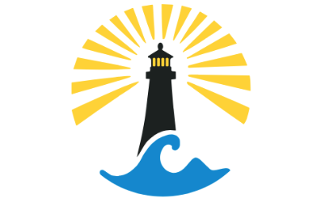
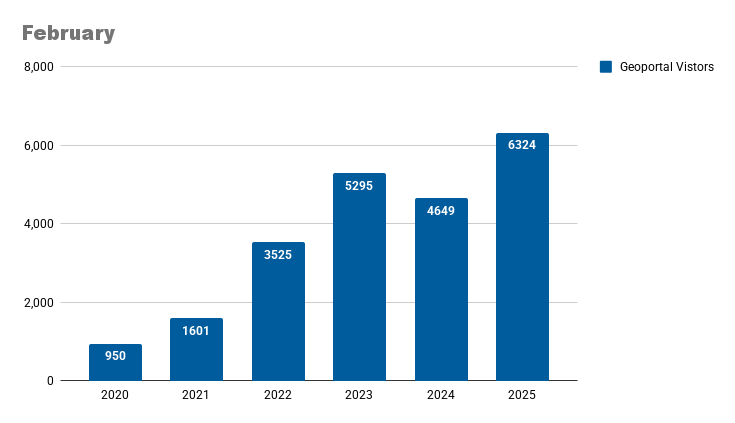
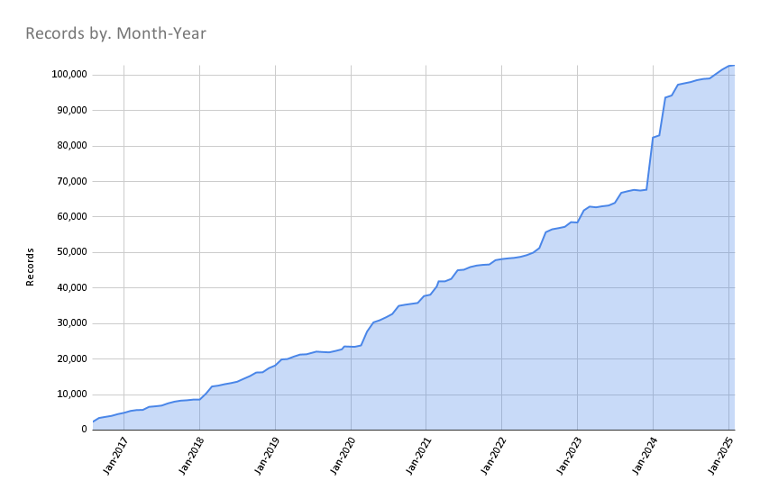

# February 2025 Program Status Update

## Building a Sustainable Geodata Repository: BTAA-GIN Pilot Phase Complete

{ width="300"; align=right }

The BTAA-GIN Geodata Pilot Workgroup has successfully completed its current phase, establishing the technical and metadata infrastructure for a scalable geospatial repository. Over the past year (Q1 2024–Q1 2025), the workgroup focused on building a framework for data curation, refining metadata standards, and improving workflow automation.

 <!-- more -->

📌 [**Read the full report here**](https://gin.btaa.org/library/geodata-collection-goundwork-report/)

### Key Accomplishments

* curated a pilot collection of 35 datasets on our development site to test our processes for gathering, describing, and sharing geospatial information
* added new metadata fields and entry guidelines to provide technical and administrative documentation for datasets
* created new methods for programmatically generating metadata and derivative files from collected datasets
* introduced new ways for users to evaluate datasets with visual previews and data dictionaries

### Next Step

The next phase, **Foundation (2025–26),** will feature our activites to:

* partner with data providers to develop a process for exchanging resources
* continue to enhance the BTAA Geoportal and backend management tools
* curate real-world data submissions to build our first official collections
* release a formal plan that documents our goals, workflows, and guidelines

## Program Activities

### Committees

=== "TECHnology"

	* Reviewed new item page design.  
	* Previewed the draft Strategic Technology Plan 2025-2026.  
	* Reviewed candidates for potential data preservation/rescue and discussed the benefits of establishing a workgroup to update the collection development policy.

=== "Community Engagement"

	* Shared a list of potential candidates for the geospatial data archiving pilot and government data rescue with the Tech Committee.  
	* Completed two sprints to storyboard videos introducing GIN and providing Geoportal walkthroughs.

=== "Knowledge"

	* Proposed discussing and brainstorming at-risk state datasets for the geospatial data archiving pilot at the next Program Team meeting as well as initiating a workgroup to align this with our mission and workflows.  
	* Still seeking members for the [Geospatial Data Citation group](https://docs.google.com/document/d/1JaHoM19eeUxMFeayJzVU6XP4PD9EX3Dob7Gfxwiekuo/edit?tab=t.0#heading=h.q847yh9hguay).  
	* Transactions in GIS CFP on spatial data sharing presents a potential publication opportunity tied to data citation, platform promotion, and data privacy, with a discussion planned for the 3/13 Program Team meeting.

=== "Coordination"

	* Reviewed drafts of two new documents  
	     * Strategic Technology Plan 2025-2026  
	     * Geodata Collection Groundwork Phase Report  
	* Onboarding of new members is ongoing. USC will participate in our monthly meetings until a final membership decision is made in July 2025.  
	* Our annual conference has a new name: Big Ten GIS Conference 2025. Promotion for the Call for Proposals & Maps begins this month.

### Workgroups

=== "Geodata Pilot Workgroup"

	Workgroup has been sunset and the [final report](https://gin.btaa.org/library/geodata-collection-goundwork-report/) has been published.

=== "FAST for Subject Terms Workgroup"

	* Published revised metadata for maps; still need to add new metadata fields to Geoportal item page.  
	* May sunset the workgroup after next TECH Committee meeting.

=== "Service Model Collaboration Workgroup"

	* Draft survey in progress. Expected to circulate in the next month.
	
	

## BTAA Geoportal 

### Analytics Statistics

!!! example inline end "January 2025 by the numbers"

	* Visitors: 6,324  
	* Visits: 7,174   
	* Downloads: 523  
	* Visits with download: 7.29% 
	* Outlinks: 2,484  
	* Visits with outlink: 34.63%  
	* Num. searches: 2,977  
	* Search keywords: 854  
	* Pageviews: 18,579

**Unique visitors by month**

{ width="600" }

!!! tip inline end "More stats"

    See full statistics on our [Analytics Dashboard](https://tableau.umn.edu/t/UL/views/BTAAGeoportalusageMatomo/Monthlycharts?%3Aembed=y&%3AisGuestRedirectFromVizportal=y)

**What Users are Looking for**

-   Top Google searches leading to the Geoportal
	
	1. btaa geoportal  
	2. ohio school district map  
	3. south bend city limits  
	4. franklin county school district map  
	5. nj wetlands map  
	6. 1937 aerial photographs wisconsin  
	7. st. louis county gis mn  
	8. maryland mile marker map  
	9. how many states were there in 1800  
	10. evansville city limits

-   Top internal keyword searches

	1. Redlining  
	2. Bear  
	3. Uses  
	4. Hennepin county  
	5. Sanborn  
	6. Detroit  
	7. Oregon forest  
	8. Contaminated water  
	9. Erosion  
	10. wildlife

 

---

### Collections

**:material-folder-multiple: Total records as of March 1, 2025:** ==102,823== 

<figure markdown="span">
  { width="800" }
  <figcaption>BTAA Geoportal Records from 2016 to 
March 1, 2025</figcaption>
</figure>

### January Harvesting Activities

| Task | Records added | Records retired |
| :---- | ----- | ----- |
| [Reharvest Minnesota Geospatial Commons February 2025](https://github.com/geobtaa/metadata/issues/789) | 2 | 2 |
| [Minnesota Geospatial Commons January 2025](https://github.com/geobtaa/metadata/issues/720) | 0 | 1 |
| [New Minnesota Digital Library: UMN Duluth](https://github.com/geobtaa/metadata/issues/792) | 41 | 0 |
| [New Minnesota Digital Library: Stillwater](https://github.com/geobtaa/metadata/issues/791) | 22 | 0 |
| [Washington State Open Data website record](https://github.com/geobtaa/metadata/issues/803) | 1 | 0 |
| [Oregon GeoHub website record](https://github.com/geobtaa/metadata/issues/804) | 1 | 0 |
| [Harvest Oregon GeoHub](https://github.com/geobtaa/metadata/issues/806) | 178 | 0 |
| [2025-01-21 Scan ArcGIS Hubs](https://github.com/geobtaa/metadata/issues/766) | 295 | 199 |
| [2025-02-04 Scan ArcGIS Hubs](https://github.com/geobtaa/metadata/issues/785) | 134 | 319 |
| [2025-02-11 Scan ArcGIS Hubs](https://github.com/geobtaa/metadata/issues/793) | 162 | 336 |
| [2025-02-18 Scan ArcGIS Hubs](https://github.com/geobtaa/metadata/issues/801) | 206 | 327 |
|  |  |  |
| [2025-02-25 Scan ArcGIS Hubs](https://github.com/geobtaa/metadata/issues/811) | 219 | 403 |
| [Reharvest Wisconsin OpenGeometadata 2025-02](https://github.com/geobtaa/metadata/issues/788) | 30 | 0 |

### Web Development

**New Features or Enhancements**

* Geoportal Updates: Launched a new item view page redesign, added a Big Ten GIS Conference banner, updated Allmaps facets and sidebar tools, and upgraded to Rails 7.2.  
* Rails 7.2 Upgrade: Provides about 1.5 years before Blacklight v7 and GeoBlacklight v4 reach the end of Rails' security support window.  
* Conferences & Collaboration: Wrapped up the month at Stanford’s David Rumsey Map Center with discussions on IIIF, IIIF+Maps, and Allmaps, and gave a FastAPI+React demo to GeoBlacklight developers.

!!! tip "More development details"

	[Read the most recent development report for more details](https://docs.google.com/document/d/19sSRPXlRzI-dF-fMAbF44S1NBFgVYX23F-gS6-Ikuqc/edit?usp=sharing)

---

## Priority Projects Update

* Completed [Geodata Collection Pilot](https://github.com/geobtaa/.github/issues/71)   
* [Refer to our Priority Projects board for more details](https://github.com/orgs/geobtaa/projects/22/views/6).

