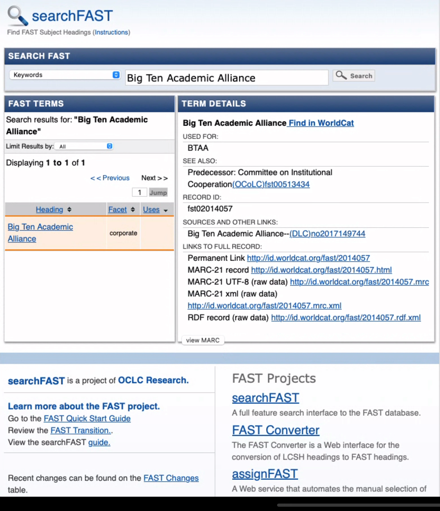
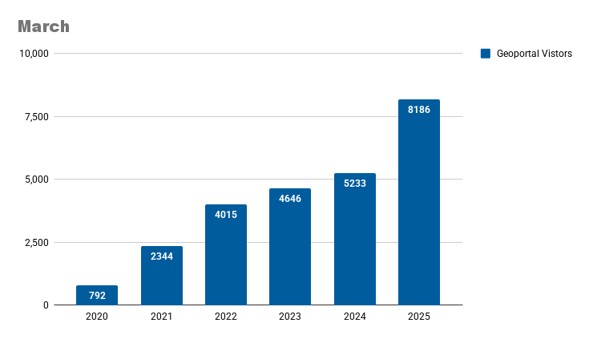
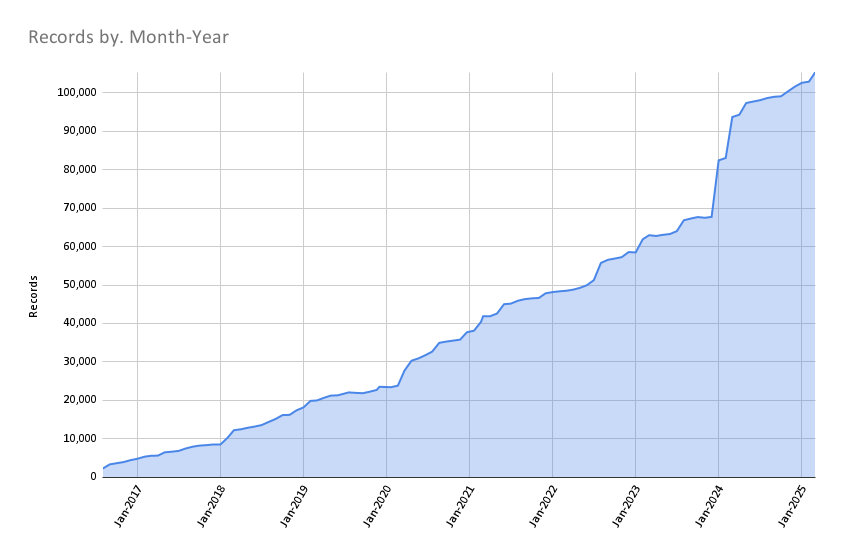

# March 2025 Program Status Update

## Monthly Highlight: BTAA-GIN FAST Subject Terms Workgroup Update

{ width="300"; align=right }

The BTAA-GIN FAST for Subject Terms Workgroup explored using FAST (Faceted Application of Subject Terminology) to improve search and discovery in the BTAA Geoportal. FAST, adapted from Library of Congress Subject Headings (LCSH), offers a more streamlined and accessible way to tag metadata.
 <!-- more -->
The group developed guidance for applying FAST terms across records in the Geoportal, both retrospectively and going forward. This work aims to make geographic data more discoverable and useful for researchers across member institutions.

### Next Steps

Because place names and inconsistent keyword data complicate the use of FAST, it's unclear how easily terms can be applied or extracted from existing or incoming records. The group is considering options such as developing broad category headings and metadata guidelines, or requesting MARC records and data from local systems. Metadata from Indiana University and the University of Minnesota will be reviewed to better understand current challenges.

## Program Activities

### Committees

=== "TECHnology"

	* Reviewed new item page design.
	* Previewed the draft Strategic Technology Plan 2025-2026.
	* Reviewed candidates for potential data preservation/rescue and discussed the benefits of establishing a workgroup to update the collection development policy.

=== "Community Engagement"

	* Committee members committed to personally inviting at least three colleagues to the upcoming conference and group brainstormed "Did You Know" factoids to highlight the BTAA Geoportal during event breaks.
 	* Published Collections Story: Discovery of Geological Maps in the BTAA Geoportal by Tara Anthony, Penn State University Libraries.
	

=== "Knowledge"

	* Provided examples of at-risk data to consider for the geospatial data archiving pilot and facilitated an full GIN discussion on politically at-risk state datasets at the March program team meeting.
	*  Coordinated logistics for an upcoming April sprint on Geodata archiving, including access to storage for external participants, folder structure for tracking activity, and a review workflow using shared Hub spreadsheets. Participants will prioritize and manually download federal datasets, with a focus on shapefiles, hosted feature layers, and Heat Watch data.

=== "Coordination"

	* New members joined to learn more about our committees to assist them as they decide where to get involved. Ryan introduced GIN's collaborative structure and the Coordinating Committee’s central role. Individual committees -- Knowledge, Community Engagement, TECH -- shared their focus areas, current and upcoming work, and cross-committee collaborations. 
	* Discussed the 2/28 Executive Committee Meeting and their input on and support of our draft Strategic Technology Plan.

### Workgroups

=== "FAST for Subject Terms Workgroup"

	* Created a final report documenting research, outputs, and impact. 
	* Will sunset group after April TECH Committee meeting

=== "Service Model Collaboration Workgroup"

	* Draft survey in progress. 

=== "Geospatial Data Citation Workgroup"

	* Members confirmed and the first meeting to take place in April.
	

## BTAA Geoportal 

### Analytics Statistics

!!! example inline end "This month by the numbers"

	* Visitors: 8,186
	* Visits: 9,012
	* Downloads: 735
	* Visits with download: 8.16%
	* Outlinks: 2,242
	* Visits with outlink: 24.88%
	* Num. searches: 1,943
	* Search keywords: 668
	* Pageviews: 19,618

**Unique visitors by month**

{ width="600" }

!!! tip inline end "More stats"

    See full statistics on our [Analytics Dashboard](https://tableau.umn.edu/t/UL/views/BTAAGeoportalusageMatomo/Monthlycharts?%3Aembed=y&%3AisGuestRedirectFromVizportal=y)

**What Users are Looking for**

-   Top Google searches leading to the Geoportal
	
	1. btaa geoportal
	2. ohio school district map
	3. south bend city limits
	4. 1937 aerial photographs wisconsin
	5. outagamie county gis
	6. milwaukee voting wards
	7. evansville city limits
	8. school district map ohio
	9. sanborn maps michigan
	10. wetlands map nj

-   Top internal keyword searches

	1. Sanborn
	1. Wildlife
	1. Analysis
	1. Ukraine
	1. Chicago
	1. Sanborn
	1. ArcGIS HUB
	1. Domain
	1. Critical habitat
	1. Aerial photos

 

---

### Collections

**:material-folder-multiple: Total records as of April 1, 2025:** ==105,296== 

<figure markdown="span">
  { width="800" }
  <figcaption>BTAA Geoportal Records from 2016 to 
April 1, 2025</figcaption>
</figure>

### January Harvesting Activities

| [Title](http://URL) | Records added | Records retired |
| :---- | ----- | ----- |
| [Reharvest geodata@wisc for new parcel links](https://github.com/geobtaa/metadata/issues/846) | 740 | 1059 |
| [Reharvest geodata@wisc 2025-03](https://github.com/geobtaa/metadata/issues/813) | 20 | 0 |
| [Ann Arbor Data Catalog](https://github.com/geobtaa/metadata/issues/798) | 5 | 10 |
| [State of Washington Geospatial Open Data Portal](https://github.com/geobtaa/metadata/issues/808) | 960 | 0 |
| [Counties in Washington Hubs](https://github.com/geobtaa/metadata/issues/810) | 3 | 0 |
| [2025-03-04 Scan ArcGIS Hubs](https://github.com/geobtaa/metadata/issues/812) | 1232 | 214 |
| [MDL UMN Duluth maps](https://github.com/geobtaa/metadata/issues/817) | 15 | 0 |
| [2025-03-11 Scan ArcGIS Hubs](https://github.com/geobtaa/metadata/issues/818) | 69 | 0 |
| [MDL Soudan Mine maps](https://github.com/geobtaa/metadata/issues/819) | 32 | 0 |
| [2025-03-18 Scan ArcGIS Hubs](https://github.com/geobtaa/metadata/issues/829) | 116 | 45 |
| [Reharvest Humanitarian Data Exchange Q1 2025](https://github.com/geobtaa/metadata/issues/831) | 637 | 0 |
| [Reharvest HUD ArcGIS Hub](https://github.com/geobtaa/metadata/issues/834) | 108 | 93 |
| [2025-03-25 Scan ArcGIS Hubs](https://github.com/geobtaa/metadata/issues/835) | 89 | 70 |
| [Socrata Harvest Q1 2025](https://github.com/geobtaa/metadata/issues/841) | 0 | 0 |

### Web Development

**New Features or Enhancements**

* Completed item view page redesign
* Developed presentations and documentation for a metadata API

!!! tip "More development details"

	[Read the most recent development report for more details](https://docs.google.com/document/d/19sSRPXlRzI-dF-fMAbF44S1NBFgVYX23F-gS6-Ikuqc/edit?usp=sharing)

---

## Priority Projects Update

[Refer to our Priority Projects board](https://github.com/orgs/geobtaa/projects/22/views/6).

