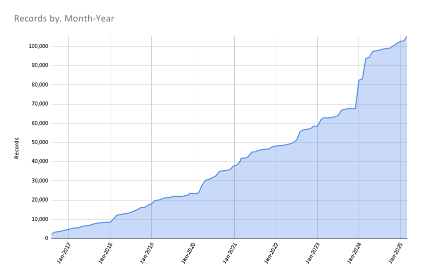

# April 2025 Program Status Update

## Monthly Highlight: Big Ten GIS Conference 2025 Sees Strong Growth

{ width="300"; align=right }

The fifth annual **Big Ten GIS Conference**, held virtually on April 11, 2025, marked a milestone for BTAA-GIN. With 664 registrants from 113 institutions, the event tripled registration from the previous year and drew participants from academia, libraries, government, and research communities.
 <!-- more -->
Keynote speaker Dr. Emily Fairfax (UMN) delivered a widely praised talk on beavers and climate resilience. Three themed sessions and a lightning talk block showcased diverse work from students, professionals, and faculty.
 <!-- more -->
A twofold increase in presentation proposals led to a new formal review process, including anonymous evaluation and attention to balance across institutions and topics.
 <!-- more -->
This year, the conference moved from its traditional November date to April to avoid conflicts with GIS Day. The record-breaking turnout suggests April is far more accessible. **Save the date—April 2026**—and look for faculty outreach to begin in fall 2025.
 <!-- more -->
The success of the 2025 conference reflects BTAA-GIN’s growing visibility and influence in shaping shared geospatial infrastructure and collaboration across the Big Ten and beyond.

### Launch of _Coordinates_
BTAA-GIN also launched its new quarterly newsletter, _Coordinates_, in April. The first issue was sent to 700 recipients, including conference participants, GIN members, and key stakeholders. The newsletter provides regular updates, highlights member contributions, and promotes collaboration across the network. <a href="https://mailchi.mp/d146395039e5/coordinates-from-btaa-gin-signup-page">**Sign-up here to receive _Coordinates_**</a>.

## Program Activities

### Committees

=== "TECHnology"

	* Discussed outcomes of FAST Subject Headings Workgroup.
	* Updated documentation and metadata template to reflect the latest metadata profile fields (B1G custom elements).

=== "Community Engagement"

	* Reviewed the first draft of new Geoportal tutorial videos for feedback and held a debrief on the 2025 GIS Conference.
	* Published Collections Story: _Building the Historical Maps of New Jersey_ with Michael Siegel, Staff Cartographer at Rutgers–New Brunswick.	

=== "Knowledge"

	* Continued planning the upcoming geodata rescue sprint, coordinating logistics for dataset review, download, and upload via UMN Box, and developing tools to prioritize at-risk federal and state data for preservation.

=== "Coordination"

	* Did not meet due to the Association of College and Research Libraries (ACRL) Conference.

### Workgroups

=== "FAST for Subject Terms Workgroup"

	* Drafted and shared with GIN a set of initial guidelines for using FAST subject headings, which offer easier maintenance than traditional Library of Congress terms.
	* Identified the need for a shared template, consistent cleanup practices, and potential automation strategies.

=== "Service Model Collaboration Workgroup"

	* Finalized and distributed a survey to GIN members to assess how GIS services are structured and delivered across BTAA institutions, with results to inform a forthcoming report on service models, strategic planning, and best practices.

=== "Geospatial Data Citation Workgroup"

	* First meeting took place with new members. Planned development of a shared LibGuide on how to cite geospatial data including user testing.
	

## BTAA Geoportal 

### Analytics Statistics

!!! example inline end "This month by the numbers"

	* Visitors: 7,043
	* Visits: 7,908
	* Downloads: 560
	* Visits with download: 7.08%
	* Outlinks: 1,937
	* Visits with outlink: 24.49%
	* Num. searches: 1,651
	* Search keywords: 608
	* Pageviews: 18,238

**Unique visitors by month**

{ width="600" }

!!! tip inline end "More stats"

    See full statistics on our [Analytics Dashboard](https://tableau.umn.edu/t/UL/views/BTAAGeoportalusageMatomo/Monthlycharts?%3Aembed=y&%3AisGuestRedirectFromVizportal=y)

**What Users are Looking for**

-   Top Google searches leading to the Geoportal
	
	1. btaa geoportal	
	2. ohio school district map	
	3. south bend city limits	
	4. 1937 aerial photographs wisconsin
	5. outagamie county gis
	6. milwaukee voting wards	
	7. evansville city limits	
	8. school district map ohio
	9. sanborn maps michigan
	10. wetlands map nj

-   Top internal keyword searches

	1. Sanborn
	1. Ukraine
	1. Indexed
	1. Aerial photos
	1. Services
	1. Landcover
	1. Uses
	1. Indiana Gary
	1. 1972 New Jersey aerial maps
	1. Uganda

 

---

### Collections

**:material-folder-multiple: Total records as of April 1, 2025:** ==105,296== 

<figure markdown="span">
  { width="800" }
  <figcaption>BTAA Geoportal Records from 2016 to 
April 1, 2025</figcaption>
</figure>

### January Harvesting Activities

| [Title](http://URL) | Records added | Records retired |
| :---- | ----- | ----- |
| [Reharvest geodata@wisc for new parcel links](https://github.com/geobtaa/metadata/issues/846) | 740 | 1059 |
| [Reharvest geodata@wisc 2025-03](https://github.com/geobtaa/metadata/issues/813) | 20 | 0 |
| [Ann Arbor Data Catalog](https://github.com/geobtaa/metadata/issues/798) | 5 | 10 |
| [State of Washington Geospatial Open Data Portal](https://github.com/geobtaa/metadata/issues/808) | 960 | 0 |
| [Counties in Washington Hubs](https://github.com/geobtaa/metadata/issues/810) | 3 | 0 |
| [2025-03-04 Scan ArcGIS Hubs](https://github.com/geobtaa/metadata/issues/812) | 1232 | 214 |
| [MDL UMN Duluth maps](https://github.com/geobtaa/metadata/issues/817) | 15 | 0 |
| [2025-03-11 Scan ArcGIS Hubs](https://github.com/geobtaa/metadata/issues/818) | 69 | 0 |
| [MDL Soudan Mine maps](https://github.com/geobtaa/metadata/issues/819) | 32 | 0 |
| [2025-03-18 Scan ArcGIS Hubs](https://github.com/geobtaa/metadata/issues/829) | 116 | 45 |
| [Reharvest Humanitarian Data Exchange Q1 2025](https://github.com/geobtaa/metadata/issues/831) | 637 | 0 |
| [Reharvest HUD ArcGIS Hub](https://github.com/geobtaa/metadata/issues/834) | 108 | 93 |
| [2025-03-25 Scan ArcGIS Hubs](https://github.com/geobtaa/metadata/issues/835) | 89 | 70 |
| [Socrata Harvest Q1 2025](https://github.com/geobtaa/metadata/issues/841) | 0 | 0 |

### Web Development

**New Features or Enhancements**

* April efforts prioritized documentation and knowledge sharing over new feature development, in preparation for upcoming conferences.
* Developed presentation materials on the planned transition of the BTAA Geoportal to a data API service, as well as two upcoming Geo4LibCamp workshops: one on AI-assisted coding tools and another on deploying GeoBlacklight via GitHub Pages.
* Released a minor BTAA Geoportal update with improved labeling throughout the GBL Admin interface to enhance usability.

!!! tip "More development details"

	[Read the most recent development report for more details](https://docs.google.com/document/d/19sSRPXlRzI-dF-fMAbF44S1NBFgVYX23F-gS6-Ikuqc/edit?usp=sharing)

---

## Priority Projects Update

[Refer to our Priority Projects board](https://github.com/orgs/geobtaa/projects/22/views/6).

