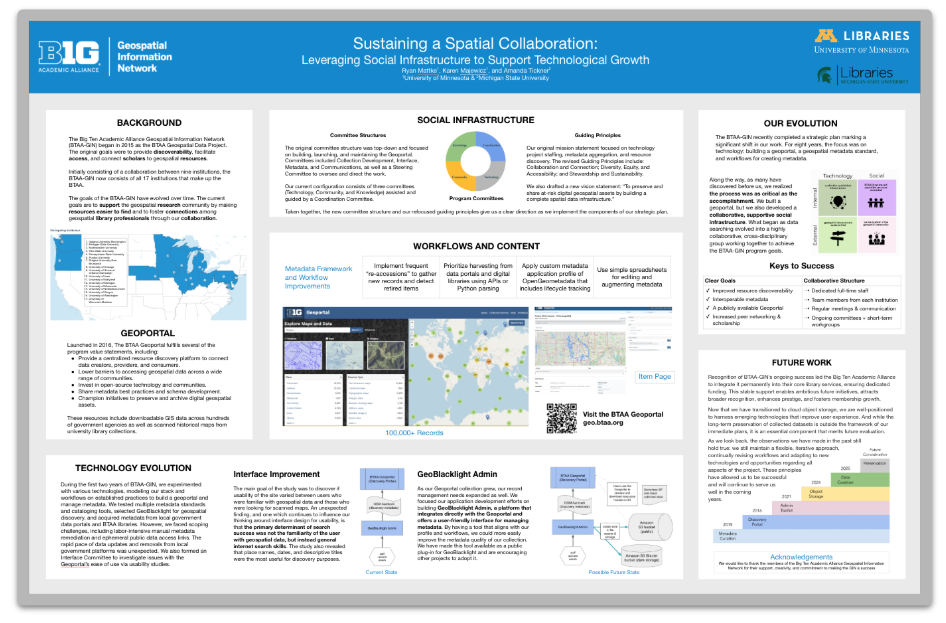

# May 2025 Program Status Update

## Monthly Highlight: BTAA-GIN Poster Presented at ACRL 2025: Sustaining a Spatial Collaboration

{ width="450"; align=right }

At the 2025 Association of College and Research Libraries (ACRL) Conference in Minneapolis, BTAA-GIN members Ryan Mattke, Karen Majewicz, and Amanda Tickner presented a poster highlighting the program’s evolution and the social infrastructure that underpins its long-term success.
 <!-- more -->
 Titled _Sustaining a Spatial Collaboration: Leveraging Social Infrastructure to Support Technological Growth__, the poster traces the development of BTAA-GIN from an informal network into a nationally recognized initiative. It emphasizes that while technological innovation—such as the BTAA Geoportal—has been critical, the program’s staying power lies in the strong, collaborative community built across institutions.
 <!-- more -->
**Key Themes**
 *Trust, shared governance, and cross-institutional relationships as foundations for sustainable growth
 *Real-world lessons from maintaining open-source infrastructure across diverse academic environments
 *The evolving role of libraries in advancing geospatial research and discovery
 <!-- more -->
**Next Steps**
The themes explored in the poster are shaping current priorities as BTAA-GIN prepares to launch a rebuilt geoportal and move into its next strategic phase. These insights will help ensure that both the technology and the community supporting it continue to grow together.

## Program Activities

### Committees

=== "TECHnology"

	* Held retrospective discussion on April Data Rescue sprint with Tech and Knowledge Cmtes.
	* Next steps: Working to get the BTAA-GIN listed as a “maintainer” in the Data Rescue Project and to add three records to their dataset tracker: NOAA Heat Watch, NCES Edge Hub site, HUD Hub site.

=== "Community Engagement"

	* Completed a series of video walkthroughs of the Geoportal for discovering and opening resources that demonstrates all of the search features and filters. Next step is sharing them with the full GIN.
	* Summer plan is to update slides for introducing the Geoportal to classes.

=== "Knowledge"

	* Collaborated to draft a transition document to provide to incoming co-chairs and members on key priorities: Knowledge Committee as a whole, Services Models group, and Geospatial Data Citation group.

=== "Coordination"

	* Planned committee membership transition (current commitments through June 2025).
	* Reviewed Geodata Curation Plan working group charge and timeline.
	* Considered Quarterly newsletter, _Coordinates__, editorial calendar and process for committees to showcase work.

### Workgroups

=== "FAST for Subject Terms Workgroup"

	* Reviewed charge and made a call for additional members in May Program Mtg
	* Kick-off planned for late June

=== "Service Model Collaboration Workgroup"

	* Launched survey and conducting ongoing data analysis with a report due this summer
 	* Members will determine the future of the group and open a call for additional interest

=== "Geospatial Data Citation Workgroup"

	* Did not meet
	

## BTAA Geoportal 

### Analytics Statistics

!!! example inline end "This month by the numbers"

	* Visitors: 6,911
	* Visits: 7,789
	* Downloads: 538
	* Visits with download: 6.91%
	* Outlinks: 1,684
	* Visits with outlink: 21.62%
	* Num. searches: 2,210
	* Search keywords: 648
	* Pageviews: 17,817

**Unique visitors by month**

{ width="600" }

!!! tip inline end "More stats"

    See full statistics on our [Analytics Dashboard](https://tableau.umn.edu/t/UL/views/BTAAGeoportalusageMatomo/Monthlycharts?%3Aembed=y&%3AisGuestRedirectFromVizportal=y)

**What Users are Looking for**

-   Top Google searches leading to the Geoportal
	
	1. btaa geoportal	
	1. sanborn maps
	1. india subnational administrative boundaries
	1. franklin county school district map
	1. chester county parcel search
	1. nj school district map
	1. fire insurance map
	1. oakland county mi parcel viewer
	1. evansville city limits
	1. milwaukee school district map

-   Top internal keyword searches

	1. Sanborn
	1. Forest
	1. Agriculture
	1. Salmon
	1. Geology
	1. Iowa
	1. Landcover
	1. Bass
	1. Yemen
	1. Fire

 

---

### Collections

**:material-folder-multiple: Total records as of June 1, 2025:** ==106,316== 

### January Harvesting Activities

| [Title](http://URL) | Records added | Records retired |
| :---- | ----- | ----- |
| [2025-04-29 Scan ArcGIS Hubs](https://github.com/geobtaa/metadata/issues/855) | 194 | 222 |
| [2025-04-08 Scan ArcGIS Hubs](https://github.com/geobtaa/metadata/issues/860) | 123 | 124 |
| [2025-05-13 Scan ArcGIS Hubs](https://github.com/geobtaa/metadata/issues/862) | 223 | 235 |
| [2025-05-20 Scan ArcGIS Hubs](https://github.com/geobtaa/metadata/issues/872) | 687 | 174 |
| [2025-05-27 Scan ArcGIS Hubs](https://github.com/geobtaa/metadata/issues/880) | 1490 | 47 |
| [Hoosier Data (01d-04) 2025](https://github.com/geobtaa/metadata/issues/539) | 0 | 0 |
| [Minnesota Geospatial Commons (05a-01) March 2025](https://github.com/geobtaa/metadata/issues/830) | 14 | 0 |
| [New Oregon open data portals](https://github.com/geobtaa/metadata/issues/861) | 4 | 0 |
| [New Washington state open data portals](https://github.com/geobtaa/metadata/issues/863) | 19 | 0 |
| [PASDA (08a-01) Q2 2025](https://github.com/geobtaa/metadata/issues/826) | 23 | 46 |
| [Reaccession UW Milwaukee OpenGeoMetadata repository](https://github.com/geobtaa/metadata/issues/876) | 79 | 0 |
| [Reharvest edu.wisc 5c87a0e commit](https://github.com/geobtaa/metadata/issues/865) | 27 | 0 |
| [Reharvest Humanitarian Data Exchange (99-1400) Q2 2025](https://github.com/geobtaa/metadata/issues/845) | 472 | 1982 |
| [Socrata portals harvest Q2 2025](https://github.com/geobtaa/metadata/issues/842) | 0 | 0 |
| [Unpublish Covid-19 dashboard collection](https://github.com/geobtaa/metadata/issues/873) | 0 | 16 |
| Total | 3355 | 2846 |

### Web Development

**New Features or Enhancements**

* GeoBlacklight v4.4.3 published to RubyGems, including minor fixes and maintenance updates.
* Refactored BTAA OpenGeoMetadata API to support a service-based search model.
* Began reviewing IIIF APIs to inform the development of a formal v1 API specification.
* At Geo4LibCamp, presented a well-received talk on the OGM API and led an interactive workshop on AI-powered coding tools.

!!! tip "More development details"

	[Read the most recent development report for more details](https://docs.google.com/document/d/19sSRPXlRzI-dF-fMAbF44S1NBFgVYX23F-gS6-Ikuqc/edit?usp=sharing)

---

## Priority Projects Update

[Refer to our Priority Projects board](https://github.com/orgs/geobtaa/projects/22/views/6).

