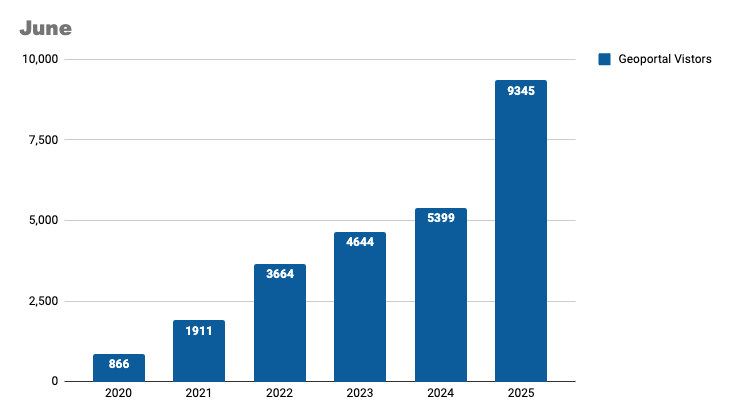

# June 2025 Program Status Update

## Geo4LibCamp 2025: Reimagining Community and Technology in Geospatial Libraries

{ width="550"; align=right }

Held in May at the University of Minnesota, Geo4LibCamp 2025 convened over 20 software developers, librarians, curators, researchers, and administrators to share strategies and tools shaping the future of geospatial data services. This year marked a turning point—not just in technology, but in redefining the community’s scope, structure, and identity.
 <!-- more -->
 The event centered on key questions: Who is this community for? How should it evolve? And how do we better support geospatial librarians and adjacent roles? The answer: broaden participation and build sustainability from the ground up.
 <!-- more -->
**Key Highlights** 
<ul>
<li>launched a plan to rebrand the GeoBlacklight community as Geo4Lib, reflecting wider participation across libraries, archives, museums, academia, and industry</li>
<li>affirmed Geo4LibCamp as a learning hub with hands-on workshops, lightning talks, and collaborative sessions</li>
<li>explored scalable, low-maintenance alternatives to traditional geoportals, including modular APIs and static site deployments—with a focus on data archiving, system resilience, and long-term sustainability</li>
<li>discussed AI-powered search, multilingual discovery, and LLM-generated metadata, alongside efforts to improve accessibility, onboarding, and usability for all user levels</li>
<li>showcased <em>Mapping Prejudice</em>, highlighting how geospatial tools can uncover and address racial covenants in housing—advancing historical research and racial justice</li>
<li>demonstrated <em>AllMaps</em>, a platform that connects historical maps with modern spatial data to support cultural heritage and archival research</li>
<li>emphasized inclusive governance through rotating leadership, quarterly topical meetings, and cross-community collaboration</li></ul>
 <!-- more -->

## Program Activities

### Committees

=== "TECHnology"

	* Met to note what has been completed (i.e., updated policy & disclaimer, place names, etc.), wrap up current work, and brainstorm what the Committee might work on next.

=== "Community Engagement"

	* The group dedicated most of the meeting to reviewing the published tutorials on the BTAA-GIN website and suggesting updates to improve clarity and usefulness.

=== "Knowledge"

	* Final meeting was canceled. Working asynchronously to complete the transition document for the incoming co-chairs and members.

=== "Coordination"

	* The July Coordinating Committee and Program Team meeting was canceled due to vacations.

### Workgroups

=== "Geodata Collection Workgroup"

	* Held kick-off meeting for the Foundation Phase of the BTAA-GIN Geodata Collection initiative by aligning on scope, priorities, roles, and next steps.

=== "Service Model Collaboration Workgroup"

	* Coordinated section assignments for the GIS Service Model report, with members drafting content, identifying key takeaways, and preparing for an editorial review and executive summary, aiming for a full draft by the end of June.

=== "Geospatial Data Citation Workgroup"

	* Did not meet
	

## BTAA Geoportal 

### Analytics Statistics

!!! example inline end "This month by the numbers"

	* Visitors: 9,345
	* Visits: 10,127
	* Downloads: 392
	* Outlinks: 1,537

<!-- COMMENTED OUT UNTIL WE HAVE FINAL MATOMO NUMBERS
	* Visitors: 9,345
	* Visits: 10,127
	* Downloads: 392
	* Visits with download: 0%
	* Outlinks: 1,537
	* Visits with outlink: 0%
	* Num. searches: 0
	* Pageviews: 241,418
-->

**Unique visitors by month**

{ width="600" }

!!! tip inline end "More stats"

    See full statistics on our [Analytics Dashboard](https://tableau.umn.edu/t/UL/views/BTAAGeoportalusageMatomo/Monthlycharts?%3Aembed=y&%3AisGuestRedirectFromVizportal=y)

**What Users are Looking for**

-   Top Google searches leading to the Geoportal
	
	1. btaa geoportal
	1. sanborn maps
	1. oakland county mi parcel search
	1. franklin county ohio school district map
	1. franklin county line map
	1. fire insurance maps california
	1. geoportal
	1. purdue campus map
	1. oakland county parcel viewer

-   Top internal keyword searches

	1. Sanborn
	1. soil
	1. geology
	1. aerial photos
	1. ukraine

 

---

### Collections

**:material-folder-multiple: Total records as of July 1, 2025:** ==106,669== 

### Harvesting Activities

| [Title](http://URL) | Records added | Records retired |
| :---- | ----- | ----- |
| 05a-01 MN Geospatial Commons June 2025 | 0 | 6 |
| Create website record for Corvallis OR | 1 | 0 |
| 2025-06-03 Scan ArcGIS Hubs | 427 | 126 |
| 2025-06-10 Scan ArcGIS Hubs | 169 | 165 |
| 2025-06-24 Scan ArcGIS Hubs | 104 | 122 |
| Reharvest all edu.wisc OGM | 75 | 805 |
| Total | 776 | 1224 |

### Web Development

**New Features or Enhancements**

* Upgraded our servers to Ubuntu 24.04 for long term support
* Added new Time Period buckets 2020-2024; 2025-present
* Enable publication state to be changed via CSV imports

!!! tip "More development details"

	[Read the most recent development report for more details](https://docs.google.com/document/d/19sSRPXlRzI-dF-fMAbF44S1NBFgVYX23F-gS6-Ikuqc/edit?usp=sharing)

---

## Priority Projects Update

[Refer to our Priority Projects board](https://github.com/orgs/geobtaa/projects/22/views/6).

