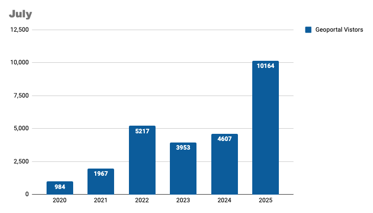

# July 2025 Program Status Update

## Introducing Our New Strategic Technology Plan

{ width="550"; align=right }

As the [BTAA Geoportal](https://geo.btaa.org/) continues to grow, so do the demands on our technology. With the recent expansion of the Big Ten and the addition of new geospatial resources from the West Coast, we saw an opportunity to explore more modern and flexible ways to manage our collections. The result is a new Strategic Technology Plan: a roadmap for building a technology stack that is modular, resilient, and future-ready.
 <!-- more -->
The most exciting feature of this new approach is a central metadata API. This feature will make it easier than ever to access and reuse our geospatial records. The API will support multiple discovery portals and access points, and we are even using it to develop a QGIS data discovery plugin!
 <!-- more -->
 As part of this shift, we are moving away from a large, all-in-one geoportal application toward a more flexible, modular framework built on open-source Python tools. This new structure makes it easier to update individual components and empowers us to think bigger: to prioritize data over tools, to collaborate better across institutions, and to build infrastructure that can adapt and grow over time. 
 <!-- more -->
Our [2025-26 roadmap](https://gin.btaa.org/technology/tech-plan-2025) encompasses four projects that will put this plan into action. Development is already underway, with full rollout planned by mid-2026. Stay tuned as we share updates!
 <!-- more -->

## Program Activities

### Committees

=== "TECHnology"

	* Did not meet as all committee work was wrapped in June.

=== "Community Engagement"

	* Held a working meeting to review and note updates to the Geoportal tutorials.

=== "Knowledge"

	* Did not meet as all committee work was wrapped in June.

=== "Coordination"

	* The July Coordinating Committee and Program Team meeting were canceled due to vacations.

### Workgroups

=== "Geodata Collection Workgroup"

	* Aligned on the Urban Base Layers initiative, identifying seven foundational city-scale datasets shared across major metro areas in Big Ten states—a focused strategy that supports both high-quality curation and regional scalability.
	* Confirmed Minneapolis as the first data provider partner to approach, paving the way for partnership-based data collection and future collaboration with additional cities.

=== "Service Model Collaboration Workgroup"

	* Work on the final report continued asynchronously with the plan of finalizing the report in time to share at the August program team meeting.

=== "Geospatial Data Citation Workgroup"

	* Did not meet
	

## BTAA Geoportal 

### Analytics Statistics

!!! example inline end "This month by the numbers"

	* Visitors: 10,164
	* Visits: 10,995
	* Downloads: 10,758
	* Visits with download: 5.5%
	* Outlinks: 1,975
	* Visits with outlink: 17.96%
	* Num. searches: 1,724
	* Search keywords: 470

**Unique visitors by month**

{ width="600" }

!!! tip inline end "More stats"

    See full statistics on our [Analytics Dashboard](https://tableau.umn.edu/t/UL/views/BTAAGeoportalusageMatomo/Monthlycharts?%3Aembed=y&%3AisGuestRedirectFromVizportal=y)

**What Users are Looking for**

-   Top Google searches leading to the Geoportal
	
	1. kuwait sex
	1. btaa geoportal
	1. sanborn maps
	1. oakland county mi parcel search
	1. franklin county ohio school district map
	1. franklin county line map
	1. fire insurance maps california
	1. geoportal
	1. purdue campus map
	1. oakland county parcel viewer
	1. nj wetlands map

-   Top internal keyword searches

	1. PLSS
	1. Geology
	1. Sanborn
	1. ArcGIS hubs
	1. Address
	1. Parks
	1. Parcel
	1. La habra
	1. Turkey
	1. Puerto Rico

 

---

### Collections

**:material-folder-multiple: Total records as of August 1, 2025:** ==107,805== 

### Harvesting Activities

| [Title](http://URL) | Records added | Records retired |
| :---- | ----- | ----- |
| 2025-07-01 Scan ArcGIS Hubs | 92 | 108 |
| 2025-07-22 Scan ArcGIS Hubs | 53 | 109 |
| edu.wisc new WI DOT scanned maps | 42 | 0 |
| PASDA 08a-01 Q3 2025 | 10 | 0 |
| Add multiple ArcGIS Hubs for cities | 8 | 0 |
| Harvest records for new city ArcGIS Hubs | 967 | 0 |
| MN GeoCommons 05a-01 July 2025 | 2 | 0 |
| CKAN scan Q3 2025 | 0 | 0 |
| Socrata Harvest Q3 2025 | 0 | 0 |
| Total | 1174 | 217  |

### Web Development

**New Features or Enhancements**

* **Strengthened Geoportal Stability & Performance** Implemented a bot mitigation solution using Cloudflare Turnstile and Samvera tools, dramatically improving site reliability and reducing server load following disruptive bot traffic spikes.
* **Advanced OpenGeoMetadata API Development** Published a comprehensive draft specification for a new geospatial API designed to support BTAA and broader discovery efforts, laying the groundwork for future adoption across the OpenGeoMetadata community.
* **Explored Budget-Friendly Hosting Solutions** Successfully tested Kamal deployment on a low-cost physical server, offering a promising option for hosting BTAA’s GeoData API with minimal infrastructure overhead.

!!! tip "More development details"

	[Read the most recent development report for more details](https://docs.google.com/document/d/19sSRPXlRzI-dF-fMAbF44S1NBFgVYX23F-gS6-Ikuqc/edit?usp=sharing)

---

## Priority Projects Update

[Refer to our Priority Projects board](https://github.com/orgs/geobtaa/projects/22/views/6).

