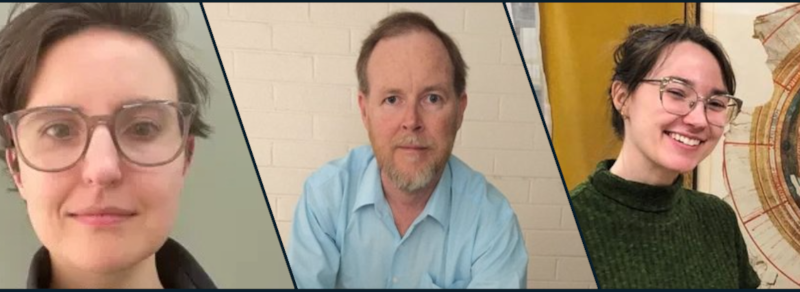
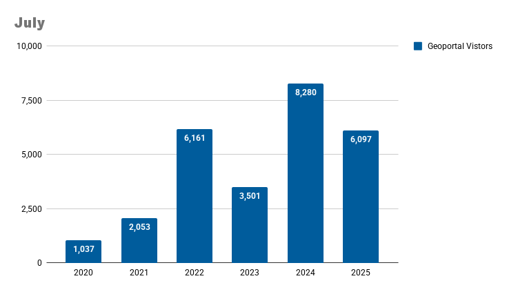

# August 2025 Program Status Update

## Welcome to Our New GIN Members!

We’re excited to welcome three new members to the Big Ten Academic Alliance Geospatial Information Network.

 <!-- more -->

**Chelsea Nestel**, GIS Librarian at the University of Oregon, brings expertise in cartography, geospatial education, and design. With a PhD from UW–Madison, Chelsea offers workshops, consultations, and contributes actively to international cartographic communities.

**Brendan Whyte** joins the University of Chicago as Map Curator and Head of the Map Collection. Formerly with the National Library of Australia, Brendan supports campus-wide use of maps in research and instruction, promoting geospatial thinking across disciplines.

**Anna Rohl** is the new Map Curator at the University of Michigan’s Clark Library. She supports collection development, research, instruction, and public outreach, drawing on her background in history and library science.

Please join us in welcoming Anna, Chelsea, and Brendan. We’re thrilled to have them on board and look forward to their contributions to the GIN community!

{ width="600" }

[caption: Left: Chelsea Nestel, GIS Librarian at the University of Oregon; Center: Brendan Whyte, Map Curator, University of Chicago; Right: Anna Rohl, Map Curator, University of Michigan]

## Program Activities

### Committees

=== "TECHnology"

	* Did not meet as all committee work was wrapped in June.

=== "Community Engagement"

	* New committee members met to confirm date/time, determine representative for Coordination Cmte, and finalize posting of Geoportal demo playlist.

=== "Knowledge"

	* New committee members met to confirm date/time, determine representative for Coordination Cmte, and to review the charter.

=== "Coordination"

	* Did not meet.

### Workgroups

=== "Geodata Collection Workgroup"

	* Reviewed draft data provider partnership agreement
	* Consulted GIN members for city contacts and have set a prioritized list of partner cities to approach first.

=== "Service Model Collaboration Workgroup"

	* Shared the final GIS Service Model Survey Report with all GIN members.
	* In Sept Program Team meeting, will share highlights with the goal of sparking a group conversation about opportunities and next steps.

=== "Data Citation Workgroup"

	* Conducted a literature review in preparation for research and publication.
	

## BTAA Geoportal 

### Analytics Statistics

!!! example inline end "This month by the numbers"

	* Visitors: 6,097
	* Visits: 7,067
	* Downloads: 442
	* Visits with download: 6.25%
	* Outlinks: 1,790
	* Visits with outlink: 25.33%
	* Num. searches: 1,365
	* Search keywords: 467

**Unique visitors by month**

{ width="600" }

!!! tip inline end "More stats"

    See full statistics on our [Analytics Dashboard](https://tableau.umn.edu/t/UL/views/BTAAGeoportalusageMatomo/Monthlycharts?%3Aembed=y&%3AisGuestRedirectFromVizportal=y)

**What Users are Looking for**

-   Top internal keyword searches

	1. Sanborn
	2. Yemen
	3. Georgia USA
	4. aerial photos
	5. south Carolina USA
	6. conservation
	7. pennsylvania

 

---

### Collections

**:material-folder-multiple: Total records as of August 1, 2025:** ==107,805== 

### Harvesting Activities

| Title| Records added | Records retired |
| :---- | ----- | ----- |
| Humanitarian Data Exchange | 2398 | 143 |
| MN GeoCommons | 2 | 3 |
| Static sites | 0 | 950 |
| Socrata portals | 491 | 450 |
| Total | 2891 | 1556  |

### Web Development

**New Features or Enhancements**

- Created new BTAA GIN subsite to document our development of the new API and our Linked Data profiles: https://gin.btaa.org/ld/
- Geoportal: Improved facet order for GBL Admin workflows, streamlined data exports for Tableau, and added GeoJSON support to asset uploads and to the ItemViewer.

!!! tip "More development details"

	[Read the most recent development report for more details](https://docs.google.com/document/d/1e9DiZ--1qOdbxT9ukTxidUteCMcVUPV03jgFWmuf5oU/edit?usp=sharing)

---
