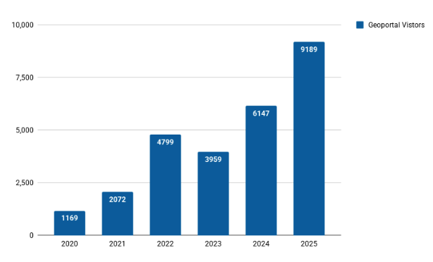

# September 2025 Program Status Update

## BTAA Geoportal Video Tutorials: Step-by-Step Search Walkthroughs

To make the BTAA Geoportal even easier to use, we’ve launched a new series of video tutorials demonstrating common BTAA Geoportal search strategies applied to real datasets. These short walkthroughs show practical techniques for combining keywords, filters, and map-based searches to quickly locate the data you need.

**Watch the full series on [our YouTube Channel: @GeoBTAA](https://www.youtube.com/watch?v=RbFjvVNI4-M&list=PLNMgmHMZCEbc-QJZP12rKa1YtFjgD-7Vh)**
<!-- more -->
<ul>The tutorial series includes:
<li><em>Intro to the Geoportal</em> – What it is and how to get started</li>
<li><em>Vector Dataset Search</em> – Finding redlining maps for Pennsylvania cities</li>
<li><em>Historic Map Search</em> – Exploring digitized campus maps from Big Ten universities</li>
<li><em>LiDAR Land Cover Search</em> – Using Iowa’s 2009 dataset as an example</li></ul>
 <!-- more -->
Designed for researchers, students, and librarians alike, these tutorials help users navigate the Geoportal more effectively and discover datasets with confidence.

<!-- Responsive YouTube embed -->

  

    <iframe
      src="https://www.youtube-nocookie.com/embed/RbFjvVNI4-M?modestbranding=1&rel=0&cc_load_policy=1"
      title="Descriptive title of this video"
      style="position:absolute; inset:0; width:100%; height:100%; border:0;"
      allow="accelerometer; autoplay; clipboard-write; encrypted-media; gyroscope; picture-in-picture; web-share"
      loading="lazy"
      allowfullscreen>
    </iframe>
  

## Program Activities

### Committees

=== "TECHnology"

	* Held kickoff meeting in September
	* Lead developer gave presentation on new technology stack goals and progress

=== "Community Engagement"

	* Held open discussion of charter language, outreach priorities, and content strategies (Collection Blog; LibGuides best practices)
	* Next: Plan to review charter and goals for the coming year

=== "Knowledge"

	* Discussed indexing geospatial data from open-access ETDs in the Geoportal

=== "Coordination"

	* Did not meet

### Workgroups

=== "Geodata Collection Workgroup"

	* Held a successful meeting with Minneapolis, who agreed to serve as our first data provider partner.

=== "Service Model Collaboration Workgroup"

	* Shared highlights at the Program Team meeting that sparked a group conversation about opportunities and next steps

=== "Geospatial Data Citation Workgroup"

	* Developed a prototype for a data citation tool hosted on the GIN website
	* Discussed key elements of a data citations and reviewed best practices from other guides

	

## BTAA Geoportal 

### Analytics Statistics

!!! example inline end "This month by the numbers"

	* Visitors: 9,189
	* Visits: 10,703
	* Downloads: 536
	* Visits with download: 5.01%
	* Outlinks: 2,247
	* Visits with outlink: 20.99%
	* Num. searches: 1,204
	* Search keywords: 454
	* Pageviews: 24,510

**Unique visitors by month**

{ width="600" }

!!! tip inline end "More stats"

    See full statistics on our [Analytics Dashboard](https://tableau.umn.edu/t/UL/views/BTAAGeoportalusageMatomo/Monthlycharts?%3Aembed=y&%3AisGuestRedirectFromVizportal=y)

**What Users are Looking for**

-   Top internal keyword searches

	1. Sanborn
	1. relief
	1. Middle East
	1. pennsylvania
	1. cairo
	1. trail
	1. baltimore county
	1. allegheny county
	1. Tacoma
	1. Egypt

 

---

### Collections

**:material-folder-multiple: Total records as of October 1, 2025:** ==116,953== 

### Harvesting Activities

| [Title](http://URL) | Records added | Records retired |
| :---- | ----- | ----- |
| 2025-09-02 Scan ArcGIS Hubs | 219 | 31 |
| 2025-09-09 Scan ArcGIS Hubs | 45 | 61 |
| 2025-09-16 Scan ArcGIS Hubs | 49 | 73 |
| Reharvest Mapping Inequality | 314 | 538 |
| Reharvest Newberry Library | 0 | 0 |
| Datasets (USA and international | 8012 | 2 |
| Total | 8639 | 705 |

### Web Development

**New Features or Enhancements**

* GeoBTAA API development in progress 
-- established a test suite (pytest) 
-- enhanced documentation (https://gin.btaa.org/ld/) 
-- Developing spatial facets 
* React user interface development in progress 
-- Added links and web services previews 
-- established test suite vitest) 
-- new admin view of test fixture records 

!!! tip "More development details"

	[Read the most recent development report for more details](https://docs.google.com/document/d/1drJsQhDEa5bTuNh3a4MvhGRimahqAP5DzpzQ5z0JCTg/edit?usp=sharing)

