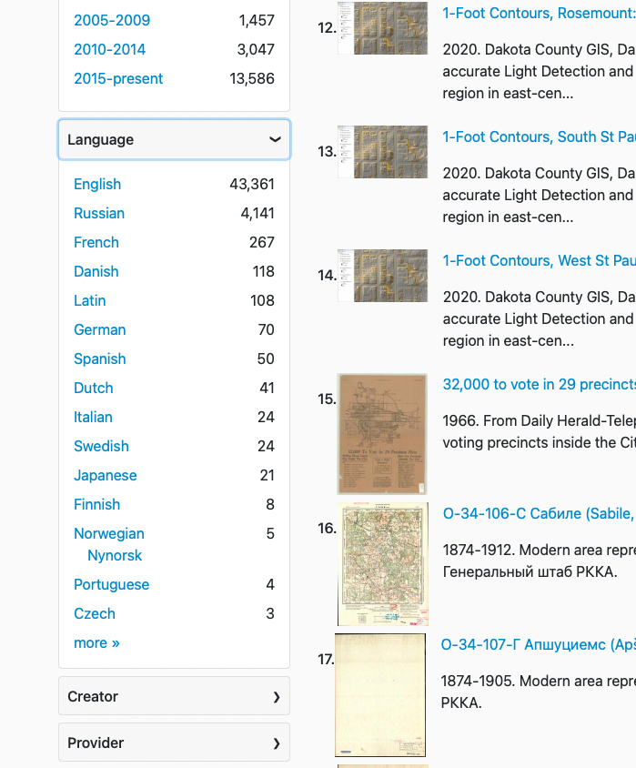

# Project Highlight: Revealing each resource’s  language

:fontawesome-solid-user: By Karen Majewicz

Last year, the Diverse Collections Working Group assessed the diversity of our collections using a number of different metrics. One effort was around the topic of  Language.

<!-- more -->

Language has long been an optional field in the GeoBlacklight metadata schema, but was not being displayed in the interface anywhere. The Working Group recommended that the project ensure a language was assigned to each resource and to display it as a browseable facet.

The Metadata Committee held a sprint that included attention on filling in missing language values. The Interface Committee determined if and where to place the facet. Finally, the Project Manager worked with the Application Developer to implement this change. Since the Language field uses a nonliteral 3-letter code, we added a translation file to derive a plain text value that is displayed in the facet.

Although the vast majority of the resources are in English, this facet reveals the maps that are not. More than one project team member commented that using the facet brings a sense of fun to the discovery process.
