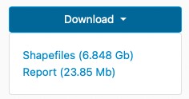

# Project Highlight: Multiple Downloads

:fontawesome-solid-user: By Karen Majewicz

We were recently able to incorporate a long-standing feature request into the BTAA Geoportal interface:  multiple downloads per item. <!-- more --> When GeoBlacklight was originally created, each item page was intended to correspond to a single web service with a single download. Over time, the application has become more flexible and item pages can represent complex resources. However, without having the option of presenting multiple downloads, we always needed to send users back to the original site to access the files.

With the new functionality, we  are able to add multiple downloads per page and attach custom labels that clarify the content and indicate file sizes.

This new feature has been especially useful when adding  research data , which often includes multiple, but related files.

