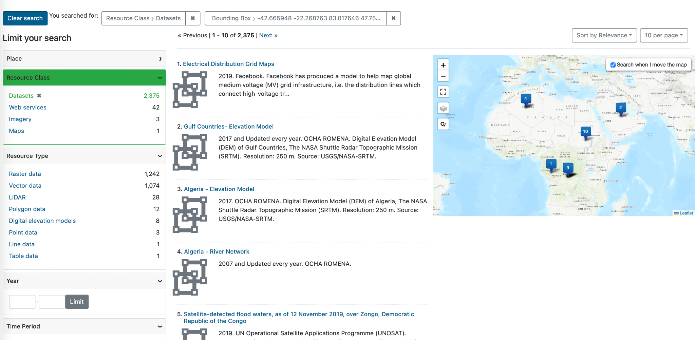

# Monthly Highlight: Redesigned Search Results Page

:fontawesome-solid-user: By Karen Majewicz

We redesigned the search results page to emphasize the map and simplify the layout.

<!-- more -->

__Problem #1__ : The map search was somewhat hidden, because users needed to click a toggle to turn it on.

__Solution__ : We removed the toggle and combined the list & map search views to the same page.

__Problem #2__ : The map search returned up to 1000 items and displayed the results using map clusters. This caused user confusion as this did not match the text results list.

__Solution__ : We removed the clustering and added numbers to each markers that match the item in the result list.

