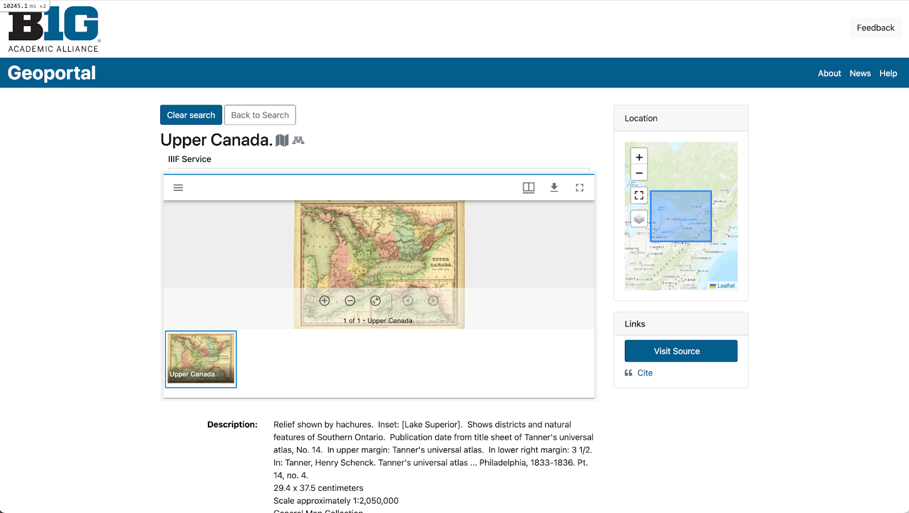

# Monthly Highlight: Item Page Layout Redesign

:fontawesome-solid-user: By Karen Majewicz

We tackled a long standing design wish to utilize full page widths and reduce the white space on item pages. This layout prioritizes item previews, such as a geospatial web service or a IIIF viewer, and provides more options for further adjusting location of the metadata and the access links.

<!-- more -->

BEFORE

AFTER

