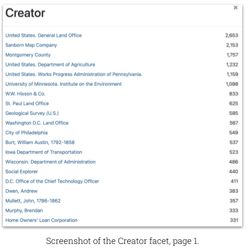

# Monthly Highlight: Creator Normalization

:fontawesome-solid-user: By Karen Majewicz

The Creator Standardization Working Group recently sunsetted after producing a [Best Practices Guide](https://geobtaa.github.io/metadata/recipes/standardize-creators/) and coordinating with the Metadata Committee to normalize the “Creator” metadata field for all Geoportal records. The new workflow involves using [FAST Subject Headings](http://fast.oclc.org/searchfast/). FAST (Faceted Application of Subject Terminology) terms, developed by OCLC and the Library of Congress, are simpler versions of the Library of Congress Subject Authorities.

<!-- more -->

We added a metadata field to capture the FAST IDs, and normalized tens of thousands of records. The Creator field is now more useful for browsing and filtering records. One of our team members, Laura McElfresh, is writing a scholarly article about the process that is scheduled to be published later this year.

