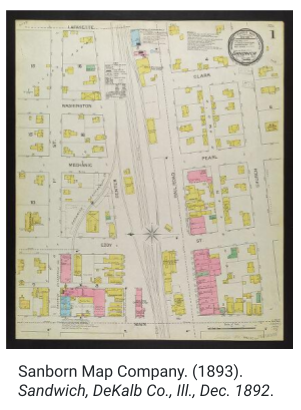

# Monthly Highlight: Sanborn Fire Insurance Maps of Illinois

:fontawesome-solid-user: By Karen Majewicz

The most searched-for type of resource in the BTAA Geoportal is Sanborn Fire Insurance maps. A challenge for users is that many of these maps are still under copyright and only available by accessing them through a licensed database.

<!-- more -->

However, some institutions have scanned Sanborn maps with expired copyrights and have published them via their digital libraries. The BTAA Geoportal contains previews and [links to over 2000 of these maps from Pennsylvania State University](https://geo.btaa.org/catalog/08d-02). In February 2023, we added [1787 Sanborn maps from the Illinois at Urbana-Champaign](https://geo.btaa.org/catalog/02d-02) covering the state of Illinois spanning 1883-1928. These freely available resources feature zoomable image previews with high-resolution file downloads and are searchable by place name.

